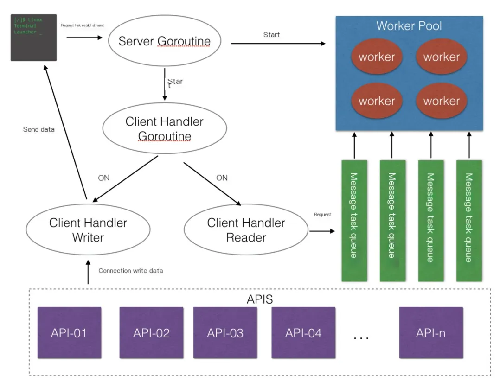
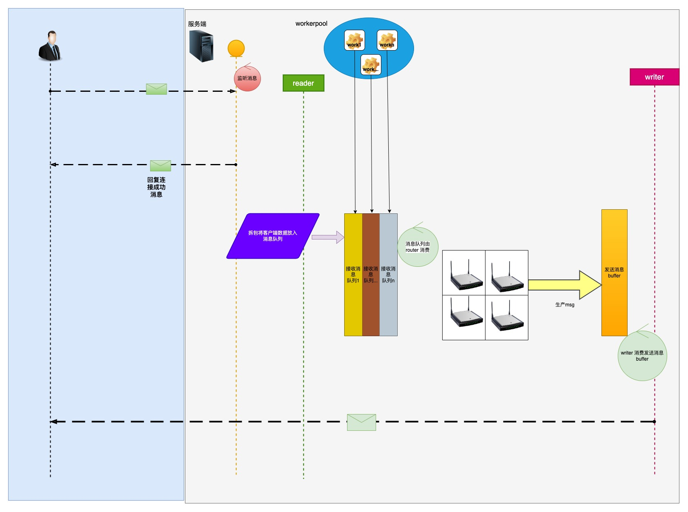

# zinx

## 简介

zinx 是一个基于 Go 语言开发的高性能、易扩展的 TCP 服务器框架，它具有以下特点：

- 高性能：zinx 采用事件驱动模型，能够高效地处理大量并发连接。
- 易扩展：zinx 提供了丰富的接口和组件，可以方便地扩展功能，例如添加新的协议、处理新的消息类型等。

`https://github.com/aceld/zinx`

## Zinx架构




## 代码量

```bash
 root@u24  /opt/code/go_study/zinx   master v1.2.6 ●  cloc --exclude-dir=examples,zinx_app_demo --not-match-f=_test.go .
      73 text files.
      68 unique files.                              
      11 files ignored.

github.com/AlDanial/cloc v 1.98  T=0.06 s (1051.9 files/s, 150759.5 lines/s)
-------------------------------------------------------------------------------
Language                     files          blank        comment           code
-------------------------------------------------------------------------------
Go                              61           1412           2198           5323
Markdown                         2            191              0            474
SVG                              1              0              1             53
YAML                             3              4              8             49
make                             1             10              0             23
-------------------------------------------------------------------------------
SUM:                            68           1617           2207           5922
-------------------------------------------------------------------------------
```

## 代码结构

```bash
├── go.mod
├── go.sum
├── Makefile
├── zasync_op
│   ├── async_op.go
│   ├── async_op_result.go
│   └── async_worker.go
├── zconf
│   ├── env.go
│   ├── globalobj.go
│   └── userconf.go
├── zdecoder
│   ├── crc.go
│   ├── htlvcrcdecoder.go
│   ├── ltvdecoder_little.go
│   └── tlvdecoder.go
├── ziface
│   ├── iclient.go
│   ├── iconnection.go
│   ├── iconnmanager.go
│   ├── idatapack.go
│   ├── idecoder.go
│   ├── iheartbeat.go
│   ├── iinterceptor.go
│   ├── ilengthfield.go
│   ├── ilogger.go
│   ├── imessage.go
│   ├── imsghandler.go
│   ├── inotify.go
│   ├── irequest.go
│   ├── irouter.go
│   └── iserver.go
├── zinterceptor
│   ├── chain.go
│   ├── framedecoder.go
│   └── interceptor.go
├── zlog
│   ├── default.go
│   ├── log
│   ├── logger_core.go
│   ├── stdzlog.go
├── znet
│   ├── acceptdelay.go
│   ├── callbacks.go
│   ├── chainbuilder.go
│   ├── client.go
│   ├── connection.go
│   ├── connmanager.go
│   ├── defaultrouterfunc.go
│   ├── heartbeat.go
│   ├── kcp_connection.go
│   ├── msghandler.go
│   ├── options.go
│   ├── request_func.go
│   ├── request.go
│   ├── router.go
│   ├── routerSilces_test.go
│   ├── server.go
│   ├── server_test.go
│   └── ws_connection.go
├── znotify
│   ├── notify.go 通知系统，主要用于在网络应用中管理用户连接和发送消息。
├── zpack
│   ├── datapack_ltv_littleendian.go
│   ├── datapack_tlv_bigendian.go
│   ├── datapack_tlv_bigendian_test.go
│   ├── message.go
│   └── packfactory.go
├── ztimer
│   ├── delayfunc.go
│   ├── timer.go
│   ├── timerscheduler.go
│   ├── timewheel.go
└── zutils
    ├── hash.go  FNV-1a是一种简单的、分布均匀的哈希算法，常用于快速查找和数据处理。
    ├── shard_lock_map.go 实现了一个并发安全的字符串到任意类型的映射（map），通过将映射分割成多个分片（shard）来减少锁的争用，从而提高并发性能。
    ├── snowflake_uuid.go 分布式id生成器，类似snowflake算法，它可以在分布式系统中生成唯一的、趋势递增的ID。
    └── witer.go 日志文件的写入和管理。它支持按天和文件大小进行日志文件的切割，并在文件切割时自动压缩旧日志文件
```
