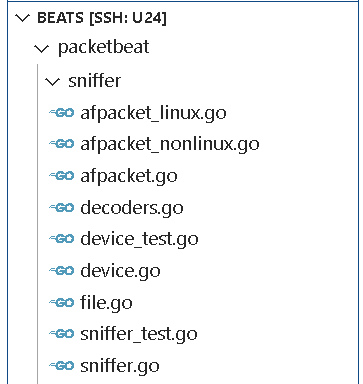

# packetbeat

## 介绍

Packetbeat 是一款能够监测和分析 HTTP、DNS、MySQL 等网络协议的工具，能够将数据发送至 Logstash 或 Elasticsearch。

## 流量捕获

使用的是gopacket（libpcap的go语言封装），实现了两种抓包的模式pcap与af_packet。

> <https://www.elastic.co/guide/en/beats/packetbeat/current/configuration-interfaces.html>

相关代码在sniffer目录下



```go
- sniffer.go
    - Sniffer
        - New()
        - Run()
            - pollDefaultRoute() 轮询默认路由
            - sniffStatic() 在单个静态接口上执行嗅探工作
            - sniffDynamic() 对来自defaultRoute的动态接口流执行嗅探工作
                - sniffOneDynamic()
                - open()
                    - openPcap()
                    - openAFPacket()
                - decoders()
                - sniffHandle()
                    - Dumpfile 保存到pcap文件
                    - ReadPacketData() （gopacket库的函数）
```

## decoder

## protos

## 整体流程

```shell
- main
    - rootCmd
        - MakeDefaultSupport
            - processors.New
            - newBuilder

- processorFactory.Create()
    - processor.Start()
        - p.sniffer.Run()


- beater.New()
    - newProcessorFactory()
    - processorFactory.Create()
        - setupSniffer()
            - sniffer.New()

```
