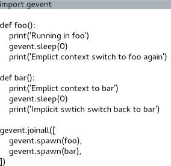

# gevent

- [1. Python协程](#1-python协程)
  - [1.1. yield 简单实现协程](#11-yield-简单实现协程)
  - [1.2. greenlet例子](#12-greenlet例子)
- [2. Gevent介绍](#2-gevent介绍)
  - [2.1. echo server](#21-echo-server)
- [3. 同步和异步执行](#3-同步和异步执行)
- [4. 决定论](#4-决定论)
- [5. 产卵的小绿海龟](#5-产卵的小绿海龟)
- [6. 格林利特州](#6-格林利特州)
- [7. 程序关闭](#7-程序关闭)
- [8. 超时设定](#8-超时设定)
- [9. 猴子补丁](#9-猴子补丁)
- [10. 事件](#10-事件)
- [11. 行列](#11-行列)
- [12. 组和池](#12-组和池)
- [13. 锁和信号量](#13-锁和信号量)
- [14. 线程局部变量](#14-线程局部变量)
- [15. Subprocess](#15-subprocess)
- [16. Actors](#16-actors)
  - [16.1. 在Gevent中实现演员模型](#161-在gevent中实现演员模型)
  - [16.2. 示例：使用演员模型实现简单的Pinger/Ponger](#162-示例使用演员模型实现简单的pingerponger)
- [17. 实际应用中的Gevent和ZeroMQ](#17-实际应用中的gevent和zeromq)
- [18. WSGI Servers](#18-wsgi-servers)
- [19. Long Polling](#19-long-polling)
- [20. Websockets](#20-websockets)
- [21. Chat Server](#21-chat-server)
- [22. 参考](#22-参考)

## 1. Python协程

### 1.1. yield 简单实现协程

```python
import time
 
def work1():
    while True:
        print("----work1---")
        yield
        time.sleep(0.5)
 
def work2():
    while True:
        print("----work2---")
        yield
        time.sleep(0.5)
 
def main():
    w1 = work1()
    w2 = work2()
    while True:
        next(w1)
        next(w2)
 
if __name__ == "__main__":
    main()
```

### 1.2. greenlet例子

```python
from greenlet import greenlet
import time
 
def ttest1():
    while True:
        print ("---A--")
        gr2.switch()      # 切换到另一个函数
        time.sleep(0.5)
 
def ttest2():
    while True:
        print ("---B--")
        gr1.switch()     # 切换到另一个函数
        time.sleep(0.5)
 
# 创建greenlet对象
gr1 = greenlet(ttest1)
gr2 = greenlet(ttest2)
 
## 起始执行的函数,切换到gr1中运行
gr1.switch()
```

## 2. Gevent介绍

`https://www.gevent.org/intro.html`

gevent中使用的主要模式是greenlet作为C扩展模块提供给Python的轻量级协程。Greenlets都在主程序的操作系统进程中运行，但被协同调度。

> 在任何给定时间只有一个greenlet在运行。

这不同于提供的任何真正的并行结构 `multiprocessing`或者 `threading`运行由操作系统调度的进程和POSIX线程的库，它们是真正并行的。

**如何并发运行任务**

```python
>>> import gevent
>>> from gevent import socket
>>> urls = ['www.google.com', 'www.example.com', 'www.python.org']
>>> jobs = [gevent.spawn(socket.gethostbyname, url) for url in urls]
>>> _ = gevent.joinall(jobs, timeout=2)
>>> [job.value for job in jobs]
['74.125.79.106', '208.77.188.166', '82.94.164.162']
```

**Monkey Patch**

```python
from gevent import monkey; monkey.patch_socket()
>>> import requests # it's usable from multiple greenlets now
```

### 2.1. echo server

```python
#!/usr/bin/env python
"""Simple server that listens on port 16000 and echos back every input to the client.

Connect to it with:
  telnet 127.0.0.1 16000

Terminate the connection by terminating telnet (typically Ctrl-] and then 'quit').
"""
from __future__ import print_function
from gevent.server import StreamServer


# this handler will be run for each incoming connection in a dedicated greenlet
def echo(socket, address):
    print('New connection from %s:%s' % address)
    socket.sendall(b'Welcome to the echo server! Type quit to exit.\r\n')
    # using a makefile because we want to use readline()
    rfileobj = socket.makefile(mode='rb')
    while True:
        line = rfileobj.readline()
        if not line:
            print("client disconnected")
            break
        if line.strip().lower() == b'quit':
            print("client quit")
            break
        socket.sendall(line)
        print("echoed %r" % line)
    rfileobj.close()

if __name__ == '__main__':
    # to make the server use SSL, pass certfile and keyfile arguments to the constructor
    server = StreamServer(('127.0.0.1', 16000), echo)
    # to start the server asynchronously, use its start() method;
    # we use blocking serve_forever() here because we have no other jobs
    print('Starting echo server on port 16000')
    server.serve_forever()
```

## 3. 同步和异步执行

- 并发的核心思想是一个较大的任务可以被分解成一组子任务，这些子任务被安排同时运行或者异步，而不是一次一个，或者同步地。这两个子任务之间的切换称为关联转换.
- gevent中的上下文切换是通过生产的。在这个例子中，我们有两个通过调用相互让步的上下文 `gevent.sleep(0)`.

```
import gevent

def foo():
    print('Running in foo')
    gevent.sleep(0)
    print('Explicit context switch to foo again')

def bar():
    print('Explicit context to bar')
    gevent.sleep(0)
    print('Implicit context switch back to bar')

gevent.joinall([
    gevent.spawn(foo),
    gevent.spawn(bar),
])
```

```

Running in foo
Explicit context to bar
Explicit context switch to foo again
Implicit context switch back to bar
```

可视化程序的控制流或者用调试器遍历它来查看发生的上下文切换是很有启发性的。



当我们将gevent用于可以协作调度的网络和IO绑定功能时，它的真正威力就显现出来了。Gevent已经注意到了所有的细节，以确保您的网络库将尽可能隐式地生成它们的greenlet上下文。这是一个多么强大的习语，我怎么强调都不为过。但也许有个例子可以说明。

在这种情况下 `select()`函数通常是一个阻塞调用，轮询各种文件描述符。

```

import time
import gevent
from gevent import select

start = time.time()
tic = lambda: 'at %1.1f seconds' % (time.time() - start)

def gr1():
    # Busy waits for a second, but we don't want to stick around...
    print('Started Polling: %s' % tic())
    select.select([], [], [], 2)
    print('Ended Polling: %s' % tic())

def gr2():
    # Busy waits for a second, but we don't want to stick around...
    print('Started Polling: %s' % tic())
    select.select([], [], [], 2)
    print('Ended Polling: %s' % tic())

def gr3():
    print("Hey lets do some stuff while the greenlets poll, %s" % tic())
    gevent.sleep(1)

gevent.joinall([
    gevent.spawn(gr1),
    gevent.spawn(gr2),
    gevent.spawn(gr3),
])
```

```

Started Polling: at 0.0 seconds
Started Polling: at 0.0 seconds
Hey lets do some stuff while the greenlets poll, at 0.0 seconds
Ended Polling: at 2.0 seconds
Ended Polling: at 2.0 seconds
```

 另一个有些合成的例子定义了一个 `task`哪个函数非确定的(即不保证其输出对相同的输入给出相同的结果)。在这种情况下，运行该函数的副作用是任务暂停执行任意秒数。

```

import gevent
import random

def task(pid):
    """
    Some non-deterministic task
    """
    gevent.sleep(random.randint(0,2)*0.001)
    print('Task %s done' % pid)

def synchronous():
    for i in range(1,10):
        task(i)

def asynchronous():
    threads = [gevent.spawn(task, i) for i in xrange(10)]
    gevent.joinall(threads)

print('Synchronous:')
synchronous()

print('Asynchronous:')
asynchronous()
```

```

Synchronous:
Task 1 done
Task 2 done
Task 3 done
Task 4 done
Task 5 done
Task 6 done
Task 7 done
Task 8 done
Task 9 done
Asynchronous:
Task 1 done
Task 5 done
Task 6 done
Task 2 done
Task 4 done
Task 7 done
Task 8 done
Task 9 done
Task 0 done
Task 3 done
```

 在同步的情况下，所有的任务都是顺序运行的，这就产生了主程序阻塞(即暂停主程序的执行)同时执行每个任务。

 该计划的重要部分是 `gevent.spawn`它将给定的函数包装在一个Greenlet线程中。初始化的greenlets列表存储在数组中 `threads`它被传递给 `gevent.joinall`阻止当前程序运行所有给定greenlets的函数。只有当所有greenlets都终止时，执行才会向前推进。

需要注意的重要事实是，异步情况下的执行顺序基本上是随机的，并且异步情况下的总执行时间比同步情况下少得多。事实上，同步案例完成的最大时间是每个任务暂停0.002秒，导致整个队列暂停0.02秒。在异步情况下，最大运行时间大约为0.002秒，因为没有一个任务会阻塞其他任务的执行。

在一个更常见的用例中，从服务器异步获取数据时 `fetch()`会因请求而异，这取决于请求时远程服务器上的负载。

```
import gevent.monkey
gevent.monkey.patch_socket()

import gevent
import urllib2
import simplejson as json

def fetch(pid):
    response = urllib2.urlopen('http://json-time.appspot.com/time.json')
    result = response.read()
    json_result = json.loads(result)
    datetime = json_result['datetime']

    print('Process %s: %s' % (pid, datetime))
    return json_result['datetime']

def synchronous():
    for i in range(1,10):
        fetch(i)

def asynchronous():
    threads = []
    for i in range(1,10):
        threads.append(gevent.spawn(fetch, i))
    gevent.joinall(threads)

print('Synchronous:')
synchronous()

print('Asynchronous:')
asynchronous()

```

## 4. 决定论

如前所述，greenlets是确定性的。给定相同的greenlets配置和相同的输入集，它们总是产生相同的输出。例如，让我们将一个任务分布在一个多进程池中，并将其结果与一个gevent池的结果进行比较。

```

import time

def echo(i):
    time.sleep(0.001)
    return i

# Non Deterministic Process Pool

from multiprocessing.pool import Pool

p = Pool(10)
run1 = [a for a in p.imap_unordered(echo, xrange(10))]
run2 = [a for a in p.imap_unordered(echo, xrange(10))]
run3 = [a for a in p.imap_unordered(echo, xrange(10))]
run4 = [a for a in p.imap_unordered(echo, xrange(10))]

print(run1 == run2 == run3 == run4)

# Deterministic Gevent Pool

from gevent.pool import Pool

p = Pool(10)
run1 = [a for a in p.imap_unordered(echo, xrange(10))]
run2 = [a for a in p.imap_unordered(echo, xrange(10))]
run3 = [a for a in p.imap_unordered(echo, xrange(10))]
run4 = [a for a in p.imap_unordered(echo, xrange(10))]

print(run1 == run2 == run3 == run4)

```

```
False
True
```

尽管gevent通常是确定性的，但当您开始与外部服务(如套接字和文件)进行交互时，不确定性的来源可能会潜入您的程序。因此，即使绿色线程是“确定性并发”的一种形式，它们仍然会遇到POSIX线程和进程遇到的一些相同的问题。

 与并发性相关的长期问题被称为竞态条件。简而言之，当两个并发线程/进程依赖于某个共享资源，但又试图修改该值时，就会发生争用情况。这导致资源的值变得依赖于执行顺序的时间。这是一个问题，通常应该尽量避免竞争条件，因为它们会导致全局不确定的程序行为。

 最好的方法是在任何时候都避免全局状态。全局状态和导入时的副作用总是会回来咬你！

## 5. 产卵的小绿海龟

gevent提供了一些关于Greenlet初始化的包装器。一些最常见的模式是:

```

import gevent
from gevent import Greenlet

def foo(message, n):
    """
    Each thread will be passed the message, and n arguments
    in its initialization.
    """
    gevent.sleep(n)
    print(message)

# Initialize a new Greenlet instance running the named function
# foo
thread1 = Greenlet.spawn(foo, "Hello", 1)

# Wrapper for creating and running a new Greenlet from the named
# function foo, with the passed arguments
thread2 = gevent.spawn(foo, "I live!", 2)

# Lambda expressions
thread3 = gevent.spawn(lambda x: (x+1), 2)

threads = [thread1, thread2, thread3]

# Block until all threads complete.
gevent.joinall(threads)
```

```

Hello
I live!
```

除了使用Greenlet基类之外，您还可以子类化Greenlet类并覆盖 `_run`方法。

```

import gevent
from gevent import Greenlet

class MyGreenlet(Greenlet):

    def __init__(self, message, n):
        Greenlet.__init__(self)
        self.message = message
        self.n = n

    def _run(self):
        print(self.message)
        gevent.sleep(self.n)

g = MyGreenlet("Hi there!", 3)
g.start()
g.join()
```

```

Hi there!
```

## 6. 格林利特州

像任何其他代码段一样，Greenlets可能以各种方式失败。greenlet可能无法抛出异常、无法停止或消耗太多系统资源。

greenlet的内部状态通常是时间相关的参数。greenlets上有许多标志，可以让您监视线程的状态:

* `started`- Boolean，表示Greenlet是否已经启动
* `ready()`- Boolean，表示Greenlet是否已经停止
* `successful()`- Boolean，指示Greenlet是否已暂停且未引发异常
* `value`-任意，Greenlet返回的值
* `exception`- exception，在greenlet内部抛出未捕获的异常实例

```

import gevent

def win():
    return 'You win!'

def fail():
    raise Exception('You fail at failing.')

winner = gevent.spawn(win)
loser = gevent.spawn(fail)

print(winner.started) # True
print(loser.started)  # True

# Exceptions raised in the Greenlet, stay inside the Greenlet.
try:
    gevent.joinall([winner, loser])
except Exception as e:
    print('This will never be reached')

print(winner.value) # 'You win!'
print(loser.value)  # None

print(winner.ready()) # True
print(loser.ready())  # True

print(winner.successful()) # True
print(loser.successful())  # False

# The exception raised in fail, will not propagate outside the
# greenlet. A stack trace will be printed to stdout but it
# will not unwind the stack of the parent.

print(loser.exception)

# It is possible though to raise the exception again outside
# raise loser.exception
# or with
# loser.get()
```

```

True
True
You win!
None
True
True
True
False
You fail at failing.
```

## 7. 程序关闭

当主程序接收到SIGQUIT时未能让步的Greenlets可能会使程序的执行时间比预期的长。这导致了所谓的“僵尸进程”,需要从Python解释器之外将其杀死。

一种常见的模式是监听主程序上的SIGQUIT事件并调用 `gevent.shutdown`退出前。

```
import gevent
import signal

def run_forever():
    gevent.sleep(1000)

if __name__ == '__main__':
    gevent.signal(signal.SIGQUIT, gevent.kill)
    thread = gevent.spawn(run_forever)
    thread.join()

```

## 8. 超时设定

超时是对代码块或Greenlet的运行时的约束。

```

import gevent
from gevent import Timeout

seconds = 10

timeout = Timeout(seconds)
timeout.start()

def wait():
    gevent.sleep(10)

try:
    gevent.spawn(wait).join()
except Timeout:
    print('Could not complete')


```

它们也可以与上下文管理器一起使用 `with`声明。

```
import gevent
from gevent import Timeout

time_to_wait = 5 # seconds

class TooLong(Exception):
    pass

with Timeout(time_to_wait, TooLong):
    gevent.sleep(10)

```

此外，gevent还为各种与Greenlet和数据结构相关的调用提供超时参数。例如:

```

import gevent
from gevent import Timeout

def wait():
    gevent.sleep(2)

timer = Timeout(1).start()
thread1 = gevent.spawn(wait)

try:
    thread1.join(timeout=timer)
except Timeout:
    print('Thread 1 timed out')

# --

timer = Timeout.start_new(1)
thread2 = gevent.spawn(wait)

try:
    thread2.get(timeout=timer)
except Timeout:
    print('Thread 2 timed out')

# --

try:
    gevent.with_timeout(1, wait)
except Timeout:
    print('Thread 3 timed out')

```

```

Thread 1 timed out
Thread 2 timed out
Thread 3 timed out
```

## 9. 猴子补丁

唉，我们来到了Gevent的黑暗角落。到目前为止，我一直避免提及猴子修补，试图激发强大的协程模式，但现在是时候讨论猴子修补的黑暗艺术了。如果您注意到上面我们调用了命令 `monkey.patch_socket()`。这是一个纯粹的副作用命令，用于修改标准库的套接字库。

```
import socket
print(socket.socket)

print("After monkey patch")
from gevent import monkey
monkey.patch_socket()
print(socket.socket)

import select
print(select.select)
monkey.patch_select()
print("After monkey patch")
print(select.select)

```

```
class 'socket.socket'
After monkey patch
class 'gevent.socket.socket'

built-in function select
After monkey patch
function select at 0x1924de8

```

Python的运行时允许在运行时修改大多数对象，包括模块、类甚至函数。这通常是一个非常糟糕的想法，因为它产生了一个“隐含的副作用”,如果出现问题，这通常非常难以调试，然而在极端情况下，当库需要改变Python本身的基本行为时，可以使用monkey补丁。在这种情况下，gevent能够修补标准库中的大多数阻塞系统调用，包括 `socket`, `ssl`, `threading`和 `select`模块改为协同工作。

例如，Redis python绑定通常使用常规的tcp套接字与 `redis-server`实例。只需调用 `gevent.monkey.patch_all()`我们可以让redis绑定协同调度请求，并与gevent堆栈的其余部分一起工作。

这让我们无需编写一行代码就可以集成通常无法与gevent一起工作的库。虽然猴子补丁仍然是邪恶的，但在这种情况下，它是一种“有用的邪恶”。

# 数据结构

## 10. 事件

事件是Greenlets之间异步通信的一种形式。

```
import gevent
from gevent.event import Event

'''
Illustrates the use of events
'''


evt = Event()

def setter():
    '''After 3 seconds, wake all threads waiting on the value of evt'''
    print('A: Hey wait for me, I have to do something')
    gevent.sleep(3)
    print("Ok, I'm done")
    evt.set()


def waiter():
    '''After 3 seconds the get call will unblock'''
    print("I'll wait for you")
    evt.wait()  # blocking
    print("It's about time")

def main():
    gevent.joinall([
        gevent.spawn(setter),
        gevent.spawn(waiter),
        gevent.spawn(waiter),
        gevent.spawn(waiter),
        gevent.spawn(waiter),
        gevent.spawn(waiter)
    ])

if __name__ == '__main__': main()


```

事件对象的一个扩展是AsyncResult，它允许您随唤醒呼叫一起发送一个值。这有时被称为未来值或延期值，因为它引用了可以在任意时间表上设置的未来值。

```
import gevent
from gevent.event import AsyncResult
a = AsyncResult()

def setter():
    """
    After 3 seconds set the result of a.
    """
    gevent.sleep(3)
    a.set('Hello!')

def waiter():
    """
    After 3 seconds the get call will unblock after the setter
    puts a value into the AsyncResult.
    """
    print(a.get())

gevent.joinall([
    gevent.spawn(setter),
    gevent.spawn(waiter),
])


```

## 11. 行列

队列是有序的数据集，具有通常的 `put` / `get`操作，但是以一种可以跨Greenlets安全操作的方式编写。

例如，如果一个Greenlet从队列中抓取了一个项目，同一项目将不会被同时执行的另一个Greenlet抓取。

```

import gevent
from gevent.queue import Queue

tasks = Queue()

def worker(n):
    while not tasks.empty():
        task = tasks.get()
        print('Worker %s got task %s' % (n, task))
        gevent.sleep(0)

    print('Quitting time!')

def boss():
    for i in xrange(1,25):
        tasks.put_nowait(i)

gevent.spawn(boss).join()

gevent.joinall([
    gevent.spawn(worker, 'steve'),
    gevent.spawn(worker, 'john'),
    gevent.spawn(worker, 'nancy'),
])
```

```

Worker steve got task 1
Worker john got task 2
Worker nancy got task 3
Worker steve got task 4
Worker john got task 5
Worker nancy got task 6
Worker steve got task 7
Worker john got task 8
Worker nancy got task 9
Worker steve got task 10
Worker john got task 11
Worker nancy got task 12
Worker steve got task 13
Worker john got task 14
Worker nancy got task 15
Worker steve got task 16
Worker john got task 17
Worker nancy got task 18
Worker steve got task 19
Worker john got task 20
Worker nancy got task 21
Worker steve got task 22
Worker john got task 23
Worker nancy got task 24
Quitting time!
Quitting time!
Quitting time!
```

队列也可能阻塞 `put`或者 `get`随着需要的增加。

每一个 `put`和 `get`操作有一个非阻塞的对应物，`put_nowait`和 `get_nowait`它不会阻塞，而是引发 `gevent.queue.Empty`或者 `gevent.queue.Full`如果手术是不可能的。

在这个例子中，我们让boss与workers同时运行，并对队列进行了限制，防止它包含三个以上的元素。这种限制意味着 `put`操作将一直阻塞，直到队列上有空间为止。相反地 `get`如果队列中没有要提取的元素，操作将会阻塞，它还需要一个超时参数来允许队列退出并出现异常 `gevent.queue.Empty`如果在超时的时间范围内找不到工作。

```

import gevent
from gevent.queue import Queue, Empty

tasks = Queue(maxsize=3)

def worker(name):
    try:
        while True:
            task = tasks.get(timeout=1) # decrements queue size by 1
            print('Worker %s got task %s' % (name, task))
            gevent.sleep(0)
    except Empty:
        print('Quitting time!')

def boss():
    """
    Boss will wait to hand out work until a individual worker is
    free since the maxsize of the task queue is 3.
    """

    for i in xrange(1,10):
        tasks.put(i)
    print('Assigned all work in iteration 1')

    for i in xrange(10,20):
        tasks.put(i)
    print('Assigned all work in iteration 2')

gevent.joinall([
    gevent.spawn(boss),
    gevent.spawn(worker, 'steve'),
    gevent.spawn(worker, 'john'),
    gevent.spawn(worker, 'bob'),
])
```

```

Worker steve got task 1
Worker john got task 2
Worker bob got task 3
Worker steve got task 4
Worker john got task 5
Worker bob got task 6
Assigned all work in iteration 1
Worker steve got task 7
Worker john got task 8
Worker bob got task 9
Worker steve got task 10
Worker john got task 11
Worker bob got task 12
Worker steve got task 13
Worker john got task 14
Worker bob got task 15
Worker steve got task 16
Worker john got task 17
Worker bob got task 18
Assigned all work in iteration 2
Worker steve got task 19
Quitting time!
Quitting time!
Quitting time!
```

## 12. 组和池

组是作为组一起管理和调度的正在运行的greenlets的集合。它还兼作镜像Python的并行调度程序 `multiprocessing`图书馆。

```

import gevent
from gevent.pool import Group

def talk(msg):
    for i in xrange(3):
        print(msg)

g1 = gevent.spawn(talk, 'bar')
g2 = gevent.spawn(talk, 'foo')
g3 = gevent.spawn(talk, 'fizz')

group = Group()
group.add(g1)
group.add(g2)
group.join()

group.add(g3)
group.join()
```

```

bar
bar
bar
foo
foo
foo
fizz
fizz
fizz
```

这对于管理异步任务组非常有用。

如上所述，`Group`还提供了一个API，用于将作业分派给分组的greenlets，并以各种方式收集它们的结果。

```

import gevent
from gevent import getcurrent
from gevent.pool import Group

group = Group()

def hello_from(n):
    print('Size of group %s' % len(group))
    print('Hello from Greenlet %s' % id(getcurrent()))

group.map(hello_from, xrange(3))


def intensive(n):
    gevent.sleep(3 - n)
    return 'task', n

print('Ordered')

ogroup = Group()
for i in ogroup.imap(intensive, xrange(3)):
    print(i)

print('Unordered')

igroup = Group()
for i in igroup.imap_unordered(intensive, xrange(3)):
    print(i)

```

```

Size of group 3
Hello from Greenlet 4340152592
Size of group 3
Hello from Greenlet 4340928912
Size of group 3
Hello from Greenlet 4340928592
Ordered
('task', 0)
('task', 1)
('task', 2)
Unordered
('task', 2)
('task', 1)
('task', 0)
```

池是为处理需要限制并发性的动态数量的greenlets而设计的结构。在想要并行执行许多网络或IO绑定任务的情况下，这通常是可取的。

```

import gevent
from gevent.pool import Pool

pool = Pool(2)

def hello_from(n):
    print('Size of pool %s' % len(pool))

pool.map(hello_from, xrange(3))
```

```

Size of pool 2
Size of pool 2
Size of pool 1
```

通常在构建gevent驱动的服务时，人们会将整个服务集中在一个池结构上。一个例子可能是在各种套接字上轮询的类。

```
from gevent.pool import Pool

class SocketPool(object):

    def __init__(self):
        self.pool = Pool(1000)
        self.pool.start()

    def listen(self, socket):
        while True:
            socket.recv()

    def add_handler(self, socket):
        if self.pool.full():
            raise Exception("At maximum pool size")
        else:
            self.pool.spawn(self.listen, socket)

    def shutdown(self):
        self.pool.kill()


```

## 13. 锁和信号量

信号量是一种低级同步原语，它允许greenlets协调和限制并发访问或执行。信号量公开了两种方法，`acquire`和 `release`信号量被获取和释放的次数之差称为信号量的界限。如果信号量界限达到0，它将阻塞，直到另一个greenlet释放它的获取。

```

from gevent import sleep
from gevent.pool import Pool
from gevent.coros import BoundedSemaphore

sem = BoundedSemaphore(2)

def worker1(n):
    sem.acquire()
    print('Worker %i acquired semaphore' % n)
    sleep(0)
    sem.release()
    print('Worker %i released semaphore' % n)

def worker2(n):
    with sem:
        print('Worker %i acquired semaphore' % n)
        sleep(0)
    print('Worker %i released semaphore' % n)

pool = Pool()
pool.map(worker1, xrange(0,2))
pool.map(worker2, xrange(3,6))
```

```

Worker 0 acquired semaphore
Worker 1 acquired semaphore
Worker 0 released semaphore
Worker 1 released semaphore
Worker 3 acquired semaphore
Worker 4 acquired semaphore
Worker 3 released semaphore
Worker 4 released semaphore
Worker 5 acquired semaphore
Worker 5 released semaphore
```

界限为1的信号量称为锁。它向一个greenlet提供独占执行。它们通常用于确保资源在一个程序的上下文中只在一个时间被使用。

## 14. 线程局部变量

Gevent还允许您指定greenlet上下文本地的数据。在内部，这被实现为一个全局查找，它寻址一个由greenlet的 `getcurrent()`价值。

```

import gevent
from gevent.local import local

stash = local()

def f1():
    stash.x = 1
    print(stash.x)

def f2():
    stash.y = 2
    print(stash.y)

    try:
        stash.x
    except AttributeError:
        print("x is not local to f2")

g1 = gevent.spawn(f1)
g2 = gevent.spawn(f2)

gevent.joinall([g1, g2])
```

```

1
2
x is not local to f2
```

- 许多使用 gevent 的 Web 框架存储 HTTP 会话 gevent 线程局部变量中的对象。例如，使用 我们可以创建的 Werkzeug 实用程序库及其代理对象 Flask 样式的请求对象。

```python
from gevent.local import local
from werkzeug.local import LocalProxy
from werkzeug.wrappers import Request
from contextlib import contextmanager

from gevent.wsgi import WSGIServer

_requests = local()
request = LocalProxy(lambda: _requests.request)

@contextmanager
def sessionmanager(environ):
    _requests.request = Request(environ)
    yield
    _requests.request = None

def logic():
    return "Hello " + request.remote_addr

def application(environ, start_response):
    status = '200 OK'

    with sessionmanager(environ):
        body = logic()

    headers = [
        ('Content-Type', 'text/html')
    ]

    start_response(status, headers)
    return [body]

WSGIServer(('', 8000), application).serve_forever()
```

Flask比这个例子稍微复杂一些，但使用线程本地器作为本地会话存储的想法仍然是一样的。

## 15. Subprocess

子进程的协作

```python
import gevent
from gevent.subprocess import Popen, PIPE

def cron():
    while True:
        print("cron")
        gevent.sleep(0.2)

g = gevent.spawn(cron)
sub = Popen(['sleep 1; uname'], stdout=PIPE, shell=True)
out, err = sub.communicate()
g.kill()
print(out.rstrip())
```

- 许多人也想同时使用gevent和multiprocessing。其中最明显的挑战是，multiprocessing提供的进程间通信默认不是协作式的。由于multiprocessing基于Connection的对象（如Pipe）暴露了它们的底层文件描述符，因此可以使用gevent.socket.wait_read和wait_write来在真正读/写之前协作式地等待就绪读/就绪写事件.

```python
import gevent
from multiprocessing import Process, Pipe
from gevent.socket import wait_read, wait_write

# To Process
a, b = Pipe()

# From Process
c, d = Pipe()

def relay():
    for i in xrange(10):
        msg = b.recv()
        c.send(msg + " in " + str(i))

def put_msg():
    for i in xrange(10):
        wait_write(a.fileno())
        a.send('hi')

def get_msg():
    for i in xrange(10):
        wait_read(d.fileno())
        print(d.recv())

if __name__ == '__main__':
    proc = Process(target=relay)
    proc.start()

    g1 = gevent.spawn(get_msg)
    g2 = gevent.spawn(put_msg)
    gevent.joinall([g1, g2], timeout=1)
```

## 16. Actors

演员模型（Actor Model）是一种高层次的并发模型，最初由Erlang语言推广。其主要思想是将系统中的并发单元抽象为一系列独立的 **演员** （Actors）。每个演员都有一个 **邮箱** （inbox），用于接收来自其他演员的消息。演员内部的主循环不断迭代其邮箱中的消息，并根据预定义的行为模式对每条消息做出响应。

### 16.1. 在Gevent中实现演员模型

虽然Gevent本身没有提供原生的演员类型，但我们可以通过在子类化的Greenlet中使用Queue来轻松实现演员模型。以下是如何在Gevent中定义和使用演员的一个简单示例：

```python
python复制import gevent
from gevent.queue import Queue

class Actor(gevent.Greenlet):
    def __init__(self):
        super().__init__()
        self.inbox = Queue()  # 创建一个邮箱用于接收消息

    def receive(self, message):
        """处理接收到的消息。这个方法需要在子类中实现具体的逻辑。"""
        raise NotImplementedError("子类必须实现receive方法")

    def _run(self):
        """演员的主循环，负责从邮箱中取出消息并调用receive方法处理。"""
        self.running = True
        while self.running:
            message = self.inbox.get()  # 阻塞直到有消息到达
            self.receive(message)  # 处理消息
```

### 16.2. 示例：使用演员模型实现简单的Pinger/Ponger

下面是一个使用上述演员模型的简单示例，其中定义了两个演员：`Pinger`和 `Ponger`。`Pinger`发送 `ping`消息给 `Ponger`，而 `Ponger`回复 `pong`消息。

```python
python复制class Pinger(Actor):
    def receive(self, message):
        print(f"Pinger received: {message}")
        self.inbox.put('ping')  # 发送ping消息给Ponger
        gevent.sleep(0)  # 让出CPU时间片

class Ponger(Actor):
    def receive(self, message):
        print(f"Ponger received: {message}")
        self.inbox.put('pong')  # 发送pong消息给Pinger
        gevent.sleep(0)  # 让出CPU时间片

# 创建演员实例
ping = Pinger()
pong = Ponger()

# 启动演员
ping.start()
pong.start()

# 开始通信
ping.inbox.put('start')  # Pinger开始发送ping消息

# 等待所有演员完成
gevent.joinall([ping, pong])
```

## 17. 实际应用中的Gevent和ZeroMQ

ZeroMQ被其作者描述为“一个作为并发框架的套接字库”。它是构建并发和分布式应用程序的一个非常强大的消息层。

ZeroMQ提供了多种套接字原语，其中最简单的是请求-响应套接字对。一个套接字有两种感兴趣的方法：send和recv，这两种方法通常都是阻塞操作。但是，这个问题通过Travis Cline编写的一个出色库（现在是pyzmq的一部分）得到了解决，该库使用gevent.socket以非阻塞的方式轮询ZeroMQ套接字。

注意：记住要使用 `pip install pyzmq`来安装pyzmq库。

接下来是一个使用gevent和ZeroMQ的简单示例：

```python
python复制import gevent
import zmq.green as zmq

context = zmq.Context()

def server():
    server_socket = context.socket(zmq.REQ)
    server_socket.bind("tcp://127.0.0.1:5000")

    for request in range(1,10):
        server_socket.send("Hello")
        print('切换到服务器进行 %s' % request)
        server_socket.recv()

def client():
    client_socket = context.socket(zmq.REP)
    client_socket.connect("tcp://127.0.0.1:5000")

    for request in range(1,10):
        client_socket.recv()
        print('切换到客户端进行 %s' % request)
        client_socket.send("World")

publisher = gevent.spawn(server)
client = gevent.spawn(client)

gevent.joinall([publisher, client])
```

上述代码展示了如何使用gevent和ZeroMQ创建一个简单的请求-响应服务器和客户端。服务器和客户端交替发送和接收消息。

此外，还可以使用gevent创建简单的服务器：

```python
python复制from gevent.server import StreamServer

def handle(socket, address):
    socket.send("来自telnet的问候！\n")
    for i in range(5):
        socket.send(str(i) + '\n')
    socket.close()

server = StreamServer(('127.0.0.1', 5000), handle)
server.serve_forever()
```

这个简单的服务器使用gevent的StreamServer类监听127.0.0.1的5000端口，并对每个连接发送一条问候消息和一系列数字。

## 18. WSGI Servers

- WSGI服务器 Gevent提供了两个用于通过HTTP提供内容的WSGI服务器，分别称为gevent.wsgi.WSGIServer和gevent.pywsgi.WSGIServer。
- 在gevent 1.0.x版本之前的早期版本中，gevent使用的是libevent库，而不是libev。Libevent库包含了一个快速的HTTP服务器，gevent的wsgi服务器就是基于这个HTTP服务器构建的。
- 然而，在gevent 1.0.x版本中，gevent不再包含内置的HTTP服务器。取而代之的是，gevent.wsgi现在成为了gevent.pywsgi中纯Python实现的服务器的别名。这意味着，如果你使用gevent 1.0.x或更高版本，你应该使用gevent.pywsgi模块中的WSGIServer类来创建和管理你的WSGI应用程序。
- 这种变化反映了gevent项目的发展和演进，它逐渐转向使用更现代、更灵活的库（如libev），并提供了更简洁、更Pythonic的API。这也使得gevent与其他Python Web框架和工具的集成更加容易和自然。

```python
from gevent.wsgi import WSGIServer

def application(environ, start_response):
    status = '200 OK'
    body = '<p>Hello World</p>'

    headers = [
        ('Content-Type', 'text/html')
    ]

    start_response(status, headers)
    return [body]

WSGIServer(('', 8000), application).serve_forever()
```

```python
from gevent.pywsgi import WSGIServer

def application(environ, start_response):
    status = '200 OK'

    headers = [
        ('Content-Type', 'text/html')
    ]

    start_response(status, headers)
    yield "<p>Hello"
    yield "World</p>"

WSGIServer(('', 8000), application).serve_forever()


# ab -n 10000 -c 100 http://127.0.0.1:8000/
```

## 19. Long Polling

```python
import gevent
from gevent.queue import Queue, Empty
from gevent.pywsgi import WSGIServer
import simplejson as json

data_source = Queue()

def producer():
    while True:
        data_source.put_nowait('Hello World')
        gevent.sleep(1)

def ajax_endpoint(environ, start_response):
    status = '200 OK'
    headers = [
        ('Content-Type', 'application/json')
    ]

    start_response(status, headers)

    while True:
        try:
            datum = data_source.get(timeout=5)
            yield json.dumps(datum) + '\n'
        except Empty:
            pass


gevent.spawn(producer)

WSGIServer(('', 8000), ajax_endpoint).serve_forever()
```

## 20. Websockets

```python
# Simple gevent-websocket server
import json
import random

from gevent import pywsgi, sleep
from geventwebsocket.handler import WebSocketHandler

class WebSocketApp(object):
    '''Send random data to the websocket'''

    def __call__(self, environ, start_response):
        ws = environ['wsgi.websocket']
        x = 0
        while True:
            data = json.dumps({'x': x, 'y': random.randint(1, 5)})
            ws.send(data)
            x += 1
            sleep(0.5)

server = pywsgi.WSGIServer(("", 10000), WebSocketApp(),
    handler_class=WebSocketHandler)
server.serve_forever()

```

```html
<html>
    <head>
        <title>Minimal websocket application</title>
        <script type="text/javascript" src="jquery.min.js"></script>
        <script type="text/javascript">
        $(function() {
            // Open up a connection to our server
            var ws = new WebSocket("ws://localhost:10000/");

            // What do we do when we get a message?
            ws.onmessage = function(evt) {
                $("#placeholder").append('<p>' + evt.data + '</p>')
            }
            // Just update our conn_status field with the connection status
            ws.onopen = function(evt) {
                $('#conn_status').html('<b>Connected</b>');
            }
            ws.onerror = function(evt) {
                $('#conn_status').html('<b>Error</b>');
            }
            ws.onclose = function(evt) {
                $('#conn_status').html('<b>Closed</b>');
            }
        });
    </script>
    </head>
    <body>
        <h1>WebSocket Example</h1>
        <div id="conn_status">Not Connected</div>
        <div id="placeholder" style="width:600px;height:300px;"></div>
    </body>
</html>
```

## 21. Chat Server

- 实时聊天室

```python
# Micro gevent chatroom.
# ----------------------

from flask import Flask, render_template, request

from gevent import queue
from gevent.pywsgi import WSGIServer

import simplejson as json

app = Flask(__name__)
app.debug = True

rooms = {
    'topic1': Room(),
    'topic2': Room(),
}

users = {}

class Room(object):

    def __init__(self):
        self.users = set()
        self.messages = []

    def backlog(self, size=25):
        return self.messages[-size:]

    def subscribe(self, user):
        self.users.add(user)

    def add(self, message):
        for user in self.users:
            print(user)
            user.queue.put_nowait(message)
        self.messages.append(message)

class User(object):

    def __init__(self):
        self.queue = queue.Queue()

@app.route('/')
def choose_name():
    return render_template('choose.html')

@app.route('/<uid>')
def main(uid):
    return render_template('main.html',
        uid=uid,
        rooms=rooms.keys()
    )

@app.route('/<room>/<uid>')
def join(room, uid):
    user = users.get(uid, None)

    if not user:
        users[uid] = user = User()

    active_room = rooms[room]
    active_room.subscribe(user)
    print('subscribe %s %s' % (active_room, user))

    messages = active_room.backlog()

    return render_template('room.html',
        room=room, uid=uid, messages=messages)

@app.route("/put/<room>/<uid>", methods=["POST"])
def put(room, uid):
    user = users[uid]
    room = rooms[room]

    message = request.form['message']
    room.add(':'.join([uid, message]))

    return ''

@app.route("/poll/<uid>", methods=["POST"])
def poll(uid):
    try:
        msg = users[uid].queue.get(timeout=10)
    except queue.Empty:
        msg = []
    return json.dumps(msg)

if __name__ == "__main__":
    http = WSGIServer(('', 5000), app)
    http.serve_forever()
```

## 22. 参考

> http://sdiehl.github.io/gevent-tutorial/
