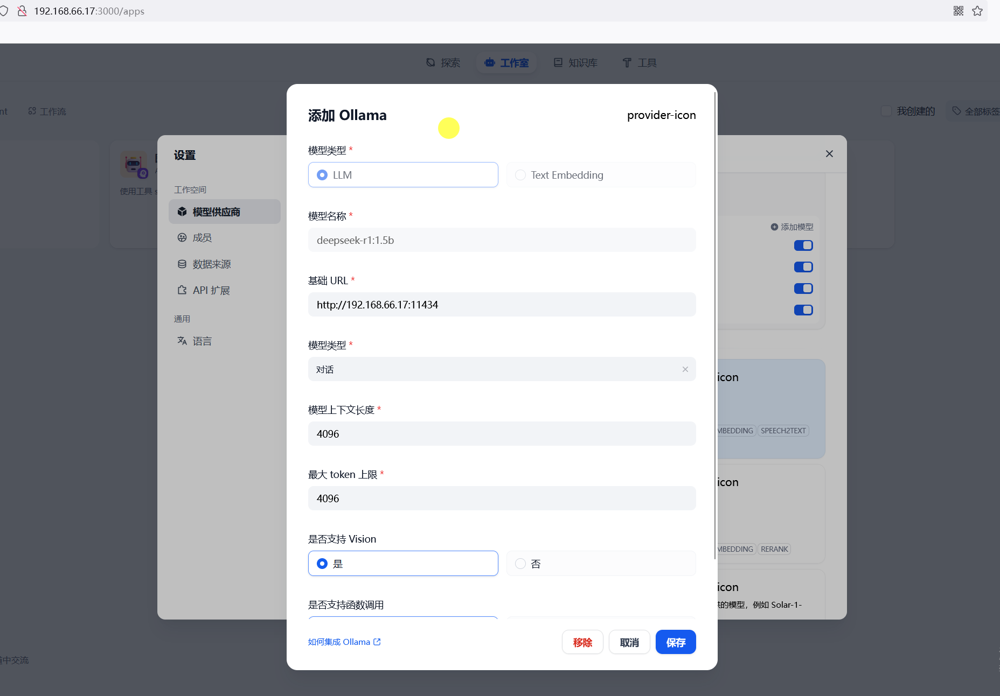

# dify学习笔记


- [1. 介绍](#1-介绍)
- [2. 部署](#2-部署)
  - [2.1. docker compose部署](#21-docker-compose部署)
  - [2.2. 源码部署](#22-源码部署)
- [3. 连接ollama](#3-连接ollama)
- [4. 目录结构](#4-目录结构)
  - [4.1. API](#41-api)
- [5. .vscode](#5-vscode)
- [6. 项目依赖](#6-项目依赖)
- [7. configs](#7-configs)
- [8. constants](#8-constants)
- [9. contexts](#9-contexts)
- [10. controllers](#10-controllers)
  - [10.1. common](#101-common)
  - [10.2. console](#102-console)
  - [10.3. fields](#103-fields)
  - [10.4. inner\_api](#104-inner_api)
  - [10.5. service\_api](#105-service_api)
  - [10.6. web](#106-web)
- [11. core](#11-core)
- [12. services](#12-services)
- [13. events](#13-events)
- [14. extensions](#14-extensions)
- [15. factories](#15-factories)
- [16. fields](#16-fields)
- [17. libs](#17-libs)
- [18. migrations](#18-migrations)
- [19. models](#19-models)
- [20. schedule](#20-schedule)
- [21. services](#21-services)
- [22. tasks](#22-tasks)
- [23. templates](#23-templates)
- [24. 小结](#24-小结)

## 1. 介绍

Dify 是一个开源的 LLM 应用开发平台。其直观的界面结合了 AI 工作流、RAG 管道、Agent、模型管理、可观测性功能等，让您可以快速从原型到生产。

1. 工作流: 在画布上构建和测试功能强大的 AI 工作流程，利用以下所有功能以及更多功能。
2. 全面的模型支持: 与数百种专有/开源 LLMs 以及数十种推理提供商和自托管解决方案无缝集成，涵盖 GPT、Mistral、Llama3 以及任何与 OpenAI API 兼容的模型。完整的支持模型提供商列表可在此处找到。
3. Prompt IDE: 用于制作提示、比较模型性能以及向基于聊天的应用程序添加其他功能（如文本转语音）的直观界面。
4. RAG Pipeline: 广泛的 RAG 功能，涵盖从文档摄入到检索的所有内容，支持从 PDF、PPT 和其他常见文档格式中提取文本的开箱即用的支持。
5. Agent 智能体: 您可以基于 LLM 函数调用或 ReAct 定义 Agent，并为 Agent 添加预构建或自定义工具。Dify 为 AI Agent 提供了50多种内置工具，如谷歌搜索、DALL·E、Stable Diffusion 和 WolframAlpha 等。
6. LLMOps: 随时间监视和分析应用程序日志和性能。您可以根据生产数据和标注持续改进提示、数据集和模型。
7. 后端即服务: 所有 Dify 的功能都带有相应的 API，因此您可以轻松地将 Dify 集成到自己的业务逻辑中。

## 2. 部署

### 2.1. docker compose部署

```bash
git clone https://github.com/langgenius/dify.git
cd docker
cp .env.example .env
docker compose up -d
```

### 2.2. 源码部署

```bash
git clone https://github.com/langgenius/dify.git

# 启动pg、redis、weaviate
cd docker
cp middleware.env.example middleware.env
docker compose --env-file middleware.env -f docker-compose.middleware.yaml -p dify up -d

# pyenv install 3.12
# pyenv global 3.12
# 或者
# export UV_PYTHON_INSTALL_MIRROR="https://registry.npmmirror.com/-/binary/python-build-standalone/"
# uv python install 3.12


cd api
cp .env.example .env
awk -v key="$(openssl rand -base64 42)" '/^SECRET_KEY=/ {sub(/=.*/, "=" key)} 1' .env > temp_env && mv temp_env .env

# 推荐使用清华源
echo 'export UV_DEFAULT_INDEX="https://pypi.tuna.tsinghua.edu.cn/simple"'>> ~/.bashrc
export UV_DEFAULT_INDEX="https://pypi.tuna.tsinghua.edu.cn/simple"

uv sync

uv run flask db upgrade
uv run flask run --host 0.0.0.0 --port 5001 --debug

uv run celery -A app.celery worker -P gevent -c 1 -Q dataset,generation,mail,ops_trace --loglevel INFO


# cd web 
# npm install
# cp .env.example .env.local
# npm run build
# npm run start 

npm -i -g pnpm 
pnpm install
cp .env.example .env.local
pnpm run dev
```

## 3. 连接ollama



## 4. 目录结构

```bash
api 后端服务代码
web 前端
docker 容器相关
```

### 4.1. API

这是一个后端项目，主要用的是flask+celery，

```bash
.
├── Dockerfile
├── README.md
├── app.py  入口文件
├── app_factory.py
├── commands.py
├── configs  存放项目的配置文件
├── constants 定义项目中使用的常量
├── contexts 包含与请求上下文相关的代码，如请求处理、上下文管理器等。
├── controllers 包含控制器代码，处理HTTP请求和响应。
├── core 核心功能模块，包括各种业务逻辑、工具、错误处理等。
├── dify_app.py 
├── docker 
├── events  包含事件处理相关的代码，如应用事件、数据集事件等。
├── extensions 包含项目的扩展模块，如数据库扩展、日志扩展等。
├── factories 包含工厂模式相关的代码，用于创建对象实例。
├── fields 定义项目中使用的字段，如数据库字段、表单字段等。
├── libs 外部库和工具的封装，提供一些通用的功能。
├── migrations  数据库迁移脚本
├── models 数据库模型定义，包括ORM模型和数据库操作。
├── mypy.ini
├── poetry.lock
├── poetry.toml
├── pyproject.toml
├── schedule 定时任务和调度相关的代码。
├── services 业务逻辑服务，处理具体的业务操作。
├── storage
├── tasks 异步任务和后台任务相关的代码。
├── templates jinja2模板

```

## 5. .vscode

launch.json 定义了vscode调试的配置项，方便F5进行调试。

## 6. 项目依赖

- poetry
  - python的项目管理工具
- flask
  - web框架
- celery
  - 异步任务队列
- gevent
  - python的并发库
- flask-compress
- flask-cors
  - 跨域资源共享
- flask_sqlalchemy
  - ORM框架
- flask_migrate
  - 数据库迁移工具
- flask_jwt_extended
  - JWT认证
- flask_bcrypt
  - 密码加密
- flask_marshmallow
  - 数据序列化
- flask_restful
  - RESTful API框架
- redis
- pydantic
- pytest
- mypy
- faker
- coverage
- openpyxl
- authlib
- httpx
- numpy
- pandas
- pyjwt
- pypdfium2
- transformers

## 7. configs

configs目录通过定义配置类和实例化配置对象，实现了项目的配置管理。

- 定义了 `DifyConfig`类。
- 在configs/__init__.py文件中，实例化了DifyConfig类，生成了dify_config对象。
  DifyConfig类会自动从环境变量和.env文件中加载配置。
- 在app_factory.py文件中，通过dify_config.model_dump()方法将配置项加载到Flask应用中。
- 在extensions/ext_hosting_provider.py文件中，使用hosting_configuration对象加载了HostingConfiguration。
- DifyConfig()

## 8. constants

存储项目中使用的常量

constants/languages.py 文件中定义了一个字典 language_timezone_mapping,用于将语言代码映射到对应的时区。
例如，"en-US" 映射到 "America/New_York","zh-Hans" 映射到 "Asia/Shanghai"。

## 9. contexts

定义和管理应用程序中的上下文变量

使用了python标准库中contextvars.ContextVar类来创建上下文变量。

- tenant_id: 这个上下文变量用于存储当前租户的 ID
- workflow_variable_pool: 这个上下文变量用于存储当前工作流的变量池。这可以用于在工作流的不同节点之间共享和传递变量。

## 10. controllers

controllers 目录是应用程序的控制器部分,它负责处理来自客户端的HTTP请求,调用相应的服务层逻辑,并返回响应.

### 10.1. common

common 目录包含了一些通用的控制器,这些控制器可以在多个地方使用。

- fields.py 定义了一些通用的字段 parameters__system_parameters、parameters_fields。
- helpers.py 定义了一些通用的帮助函数,这些函数可以在多个控制器中使用。
- errors.py 定义了RemoteFileUploadError与FilenameNotExistsError两个自定义异常类。

### 10.2. console

console目录的作用是提供与控制台交互相关的功能

### 10.3. fields

### 10.4. inner_api

- 要是处理内部API请求

controllers/inner_api/:
__init__.py: 初始化模块。
workspace.py: 包含处理工作区相关操作的资源类。

- 访问控制：使用@setup_required和@inner_api_only装饰器来控制访问权限，确保只有经过设置和具有内部API权限的请求才能访问这些资源。
- `inner_api_only` 装饰器
  - 确保只有当 `dify_config.INNER_API` 配置为 `True` 时，才能访问被装饰的视图函数。否则，会返回 404 错误。
  - 使用 `@wraps` 装饰器来保持原视图函数的元数据。
  - 检查 `dify_config.INNER_API` 是否为 `True`，如果不是，则返回 404 错误。
  - 从请求头中获取 `X-Inner-Api-Key`，如果不存在或与配置中的 `INNER_API_KEY` 不匹配，则返回 401 错误。
  - 如果验证通过，则调用原视图函数。
- `inner_api_user_auth` 装饰器
  - 对内部 API 的用户进行认证。它首先检查 `dify_config.INNER_API` 是否为 `True`，如果不是，则直接调用原视图函数。如果配置为 `True`，则进行进一步的认证。
  - 使用 `@wraps` 装饰器来保持原视图函数的元数据。
  - 从请求头中获取 `Authorization` 字段，如果不存在，则直接调用原视图函数。
  - 将 `Authorization` 字段按冒号分割成两部分：`user_id` 和 `token`。
  - 如果 `user_id` 中包含空格，则取空格后的部分作为 `user_id`。
  - 从请求头中获取 `X-Inner-Api-Key`。
  - 使用 HMAC-SHA1 算法对 `data_to_sign`（格式为 "DIFY {user_id}"）进行签名，并将签名结果进行 Base64 编码。
  - 比较签名结果与 `token` 是否一致，如果不一致，则直接调用原视图函数。
  - 如果验证通过，则从数据库中查询用户信息，并将其作为关键字参数传递给原视图函数。

### 10.5. service_api

service_api 是一个基于 Flask 的蓝图（Blueprint），用于定义和管理一组与特定功能相关的路由和视图函数。在提供的代码信息中，service_api 主要用于处理与以下功能模块相关的 API 请求：

- app: 应用相关的 API 端点。
  - audio: 音频处理相关的 API 端点。
  - completion: 自动补全或完成相关的 API 端点。
  - conversation: 对话管理相关的 API 端点。
  - file: 文件管理相关的 API 端点。
  - message: 消息处理相关的 API 端点。
  - workflow: 工作流管理相关的 API 端点。
- dataset: 数据集管理相关的 API 端点。
  - document: 文档管理相关的 API 端点。
  - hit_testing: 命中测试相关的 API 端点。
  - segment: 数据分段或片段处理相关的 API 端点。
  - upload_file: 文件上传相关的 API 端点。
- wraps.py 一些装饰器和辅助函数，用于在 Flask 应用中处理 API 请求的验证和权限检查

### 10.6. web

理与Web相关的HTTP请求，并将这些请求路由到相应的处理函数

## 11. core

核心功能目录，包含业务逻辑和工具。

- agent：代理相关的功能。
- app：应用相关的功能。
- callback_handler：回调处理相关的功能。
- entities：实体定义相关的功能。
- errors：错误处理相关的功能。
- extension：扩展相关的功能。
- external_data_tool：外部数据工具相关的功能。
- file：文件处理相关的功能。
- helper：辅助函数相关的功能。
- hosting_configuration.py：托管配置相关的功能。
- indexing_runner.py：索引运行器相关的功能。
- llm_generator：语言模型生成器相关的功能。
- memory：内存管理相关的功能。
- model_manager.py：模型管理相关的功能。
- model_runtime：模型运行时相关的功能。
- moderation：内容审核相关的功能。
- ops：操作相关的功能。
- prompt：提示相关的功能。
- provider_manager.py：提供者管理相关的功能。
- rag：检索增强生成相关的功能。
- tools：工具相关的功能。
- variables：变量相关的功能。
- workflow：工作流相关的功能。

## 12. services

服务层目录，包含业务逻辑的实现。

- account_service.py：账户相关的服务。
- advanced_prompt_template_service.py：高级提示模板相关的服务。
- agent_service.py：代理相关的服务。
- annotation_service.py：注释相关的服务。
- api_based_extension_service.py：基于API的扩展相关的服务。
- app_dsl_service.py：应用DSL相关的服务。
- app_generate_service.py：应用生成相关的服务。
- app_model_config_service.py：应用模型配置相关的服务。
- app_service.py：应用相关的服务。
- audio_service.py：音频相关的服务。
- auth：认证相关的服务。
- billing_service.py：计费相关的服务。
- code_based_extension_service.py：基于代码的扩展相关的服务。
- conversation_service.py：对话相关的服务。
- dataset_service.py：数据集相关的服务。
- enterprise：企业相关的服务。
- external_knowledge_service.py：外部知识相关的服务。
- feature_service.py：特性相关的服务。
- file_service.py：文件相关的服务。
- hit_testing_service.py：命中测试相关的服务。
- knowledge_service.py：知识相关的服务。
- message_service.py：消息相关的服务。
- model_load_balancing_service.py：模型负载均衡相关的服务。
- model_provider_service.py：模型提供者相关的服务。
- moderation_service.py：内容审核相关的服务。
- operation_service.py：操作相关的服务。
- ops_service.py：操作相关的服务。
- recommend_app：推荐应用相关的服务。
- recommended_app_service.py：推荐应用相关的服务。
- saved_message_service.py：保存消息相关的服务。
- tag_service.py：标签相关的服务。
- tools：工具相关的服务。
- vector_service.py：向量相关的服务。
- web_conversation_service.py：Web对话相关的服务。
- website_service.py：网站相关的服务。
- workflow：工作流相关的服务。
- workflow_app_service.py：工作流应用相关的服务。
- workflow_run_service.py：工作流运行相关的服务。
- workflow_service.py：工作流相关的服务。
- workspace_service.py：工作空间相关的服务。

## 13. events

一个使用blinker的事件处理部分，处理各种与文档、数据集、应用、消息等相关的操作，并在特定事件发生时执行相应的清理、更新等操作。

## 14. extensions

extensions目录的作用是初始化和管理各种扩展功能。

- ext_sentry.py：初始化Sentry扩展，用于错误跟踪和监控。
- ext_app_metrics.py：初始化应用度量扩展，用于收集和报告应用性能指标。
- ext_commands.py：初始化命令扩展，用于处理应用中的各种命令。
- ext_import_modules.py：初始化模块导入扩展，用于动态导入Python模块。
- ext_database.py：初始化数据库扩展，用于连接和管理数据库。
- ext_storage.py：初始化存储扩展，用于文件上传和下载。
- ext_celery.py：初始化Celery扩展，用于任务调度和异步执行。
- ext_migrate.py：初始化数据库迁移扩展，用于数据库版本控制和迁移。
- ext_set_secretkey.py：初始化设置密钥扩展，用于设置应用的密钥。
- ext_code_based_extension.py：初始化基于代码的扩展，用于动态加载和执行Python代码。
- ext_hosting_provider.py：初始化托管提供商扩展，用于配置和管理应用托管环境。
- ext_compress.py：初始化压缩扩展，用于启用或禁用响应压缩。
- ext_blueprints.py：初始化蓝图扩展，用于注册蓝图路由。
- ext_proxy_fix.py：初始化代理修复扩展，用于处理反向代理服务器的问题。
- ext_warnings.py：初始化警告扩展，用于配置Python警告。
- storage：存储实现目录，包含各种存储服务的实现，如阿里云OSS、百度OBS、腾讯COS等。

## 15. factories

提供各种工厂函数，用于创建和管理应用中的不同组件和对象。

- variable_factory.py：包含用于创建和管理变量的工厂函数。例如，build_conversation_variable_from_mapping函数用于从映射中构建对话变量，build_environment_variable_from_mapping函数用于从映射中构建环境变量。

- file_factory.py：包含用于创建和管理文件的工厂函数。例如，build_from_message_files函数用于从消息文件中构建文件对象，build_from_message_file函数用于从单个消息文件中构建文件对象

## 16. fields

fields目录的作用是定义和存储各种数据字段，用于序列化和反序列化数据对象

- conversation_fields.py：定义了与对话相关的字段，如消息文本字段、反馈字段、注释字段、消息文件字段、代理思考字段、消息详细信息字段等。
- annotation_fields.py：定义了与注释相关的字段，如注释字段、注释列表字段、注释命中历史字段、注释命中历史列表字段等。
- external_dataset_fields.py：定义了与外部数据集相关的字段，如外部知识API查询详细信息字段等。
- end_user_fields.py：定义了与终端用户相关的字段，如简单终端用户字段等。
- conversation_variable_fields.py：定义了与对话变量相关的字段，如对话变量字段、分页对话变量字段等。
- hit_testing_fields.py：定义了与命中测试相关的字段，如文档字段、段落字段、子块字段、命中测试记录字段等。
- raws.py：定义了原始数据字段，如文件包含字段等。
- document_fields.py：定义了与文档相关的字段，如文档字段、带段落的文档字段、数据集和文档字段、文档状态字段等。
- app_fields.py：定义了与应用相关的字段，如应用详细信息内核字段、相关应用列表字段、模型配置字段、应用详细信息字段等。
- dataset_fields.py：定义了与数据集相关的字段，如数据集字段、重排模型字段、关键词设置字段、向量设置字段、加权分数字段等。
- api_based_extension_fields.py：定义了基于API的扩展字段，如隐藏API密钥字段、基于API的扩展字段等。
- message_fields.py：定义了与消息相关的字段，如反馈字段、代理思考字段、检索资源字段、消息字段等。
- installed_app_fields.py：定义了与已安装应用相关的字段，如应用字段、已安装应用字段、已安装应用列表字段等。
- file_fields.py：定义了与文件相关的字段，如上传配置字段、文件字段、远程文件信息字段、带签名URL的文件字段等。
- workflow_run_fields.py：定义了与工作流运行相关的字段，如工作流运行日志字段、工作流运行列表字段、高级聊天工作流运行列表字段等。
- member_fields.py：定义了与成员相关的字段，如简单账户字段、账户字段、带角色账户字段、带角色账户列表字段等。


## 17. libs


提供了一些通用的功能或工具，这些功能或工具可以在整个应用程序中被重复使用。

smtp.py：定义了一个SMTPClient类，用于发送电子邮件。这个类包含了初始化方法和发送邮件的方法。

external_api.py：定义了一个ExternalApi类，继承自Api类，用于处理外部API的调用和错误处理。

rsa.py：提供了一些与RSA加密和解密相关的函数，如生成密钥对、加密、解密等。还定义了一个自定义异常PrivkeyNotFoundError。

oauth_data_source.py：定义了一个OAuthDataSource类，用于处理OAuth认证流程，如获取授权URL、获取访问令牌等。还定义了一个NotionOAuth类，继承自OAuthDataSource，用于处理Notion的OAuth认证。

passport.py：定义了一个PassportService类，用于处理JWT令牌的生成和验证。

oauth.py：定义了一个OAuth类，用于处理OAuth认证流程，如获取授权URL、获取访问令牌、获取用户信息等。还定义了GitHubOAuth和GoogleOAuth类，继承自OAuth，用于处理GitHub和Google的OAuth认证。

exception.py：定义了一个BaseHTTPException类，继承自HTTPException，用于处理HTTP相关的异常。

helper.py：提供了一些辅助函数和类，如运行脚本、生成随机字符串、提取远程IP、生成文本哈希等。

## 18. migrations

## 19. models

提供各种数据库模型，使得应用能够灵活地存储和管理各种数据

account.py：定义了与账户相关的模型，如Account、Tenant、TenantAccountJoin等。

tools.py：定义了与工具相关的模型，如BuiltinToolProvider、PublishedAppTool、ApiToolProvider等。

model.py：定义了与模型相关的模型，如DifySetup、AppModelConfig、RecommendedApp等。

dataset.py：定义了与数据集相关的模型，如Dataset、Document、DocumentSegment等。

api_based_extension.py：定义了与API基于扩展相关的模型，如APIBasedExtension等。

workflow.py：定义了与工作流相关的模型，如Workflow、WorkflowRun、WorkflowNodeExecution等。

provider.py：定义了与提供者相关的模型，如Provider、ProviderModel、TenantDefaultModel等。

source.py：定义了与数据源相关的模型，如DataSourceOauthBinding、DataSourceApiKeyAuthBinding等。

task.py：定义了与任务相关的模型，如CeleryTask、CeleryTaskSet等。

## 20. schedule

celery的定时任务，包括清理缓存、清理消息、清理未使用数据集等。queue用的dataset.

clean_embedding_cache_task.py：定义了一个清理嵌入缓存的任务。这个任务会定期运行，清理不再需要的嵌入缓存数据。

clean_messages.py：定义了一个清理消息的任务。这个任务会定期运行，清理不再需要的消息数据。

clean_unused_datasets_task.py：定义了一个清理未使用数据集的任务。这个任务会定期运行，清理不再使用的数据集。

mail_clean_document_notify_task.py：定义了一个发送文档清理通知的任务。这个任务会在文档清理完成后，发送通知邮件给相关人员。

## 21. services

提供各种服务类，使得应用能够灵活地处理各种业务逻辑。

dataset_service.py：定义了与数据集相关的服务，如DatasetService、DocumentService、SegmentService等。

advanced_prompt_template_service.py：定义了与高级提示模板相关的服务，如AdvancedPromptTemplateService。

api_based_extension_service.py：定义了与API基于扩展相关的服务，如APIBasedExtensionService。

annotation_service.py：定义了与应用注释相关的服务，如AppAnnotationService。

code_based_extension_service.py：定义了与代码基于扩展相关的服务，如CodeBasedExtensionService。

app_service.py：定义了与应用相关的服务，如AppService。

app_model_config_service.py：定义了与应用模型配置相关的服务，如AppModelConfigService。

app_generate_service.py：定义了与应用生成相关的服务，如AppGenerateService。

conversation_service.py：定义了与对话相关的服务，如ConversationService。

agent_service.py：定义了与代理相关的服务，如AgentService。

audio_service.py：定义了与音频相关的服务，如AudioService。


## 22. tasks

提供各种异步任务，使得应用能够灵活地处理各种后台任务

remove_document_from_index_task：异步从索引中删除文档。

add_document_to_index_task：异步将文档添加到索引中。

sync_website_document_indexing_task：异步处理文档。

remove_app_and_related_data_task：异步删除应用及其相关数据。

clean_document_task：异步清理文档。

batch_clean_document_task：异步批量清理文档。

add_annotation_to_index_task：异步将注释添加到索引中。

delete_segment_from_index_task：异步从索引中删除段落。

document_indexing_sync_task：异步更新文档。

clean_notion_document_task：异步清理Notion文档。

batch_create_segment_to_index_task：异步批量创建索引段落。

delete_annotation_index_task：异步删除注释索引任务。

document_indexing_update_task：异步更新文档索引。

external_document_indexing_task：异步处理外部文档。

send_invite_member_mail_task：发送邀请成员邮件任务。

clean_dataset_task：异步清理数据集。

recover_document_indexing_task：异步恢复文档。

duplicate_document_indexing_task：异步处理文档。

disable_segments_from_index_task：异步禁用索引段落。

create_tidb_serverless_task：创建TiDB Serverless任务。

clean_messages：异步清理消息。

enable_segments_to_index_task：异步启用索引段落。

update_annotation_to_index_task：异步更新注释索引任务。

process_trace_tasks：异步处理跟踪任务。

retry_document_indexing_task：异步重试文档索引。

## 23. templates

渲染模板，主要是邮件发送的内容。

## 24. 小结

api是一个典型的flask应用，采用的flask-restful+sqlalchemy+celery。
数据存储在postgres中，通过sqlalchemy进行操作,通过celery进行异步处理。
redis用做celery的broker,pg用做celery的backend。
向量数据库默认用的是weaviate

app -> controllers -> services -> core -> models -> fields 