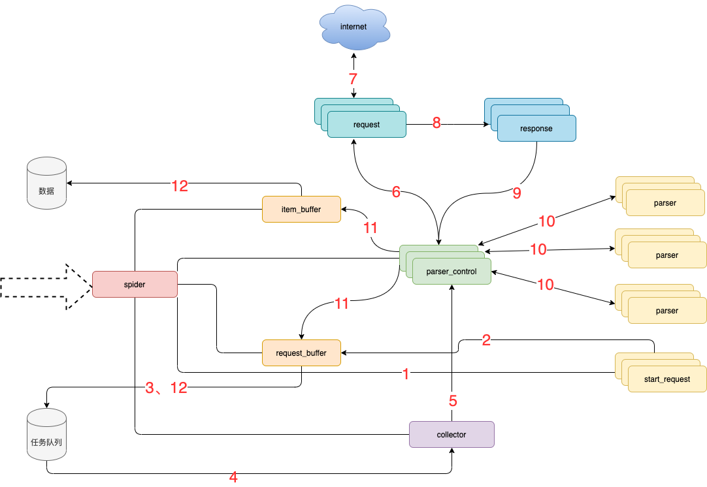

# feapder

## 安装

`pip install "feapder[all]"`

`feapder create -p <project_name>`

```bash
 root@node302  pip install "feapder[all]"
 root@node302  feapder create -p one         

one 项目生成成功
 root@node302  tree one  
one
├── CHECK_DATA.md   数据审核建议
├── items           存放与数据库表映射的item
│   ├── __init__.py
├── main.py         运行入口
├── README.md     
├── setting.py      配置文件
└── spiders         存放爬虫脚本的文件夹
    ├── __init__.py
```




## 模块说明

* spider **框架调度核心**
* parser_control  **模版控制器** ，负责调度parser
* collector  **任务收集器** ，负责从任务队里中批量取任务到内存，以减少爬虫对任务队列数据库的访问频率及并发量
* parser **数据解析器**
* start_request 初始任务下发函数
* item_buffer  **数据缓冲队列** ，批量将数据存储到数据库中
* request_buffer  **请求任务缓冲队列** ，批量将请求任务存储到任务队列中
* request  **数据下载器** ，封装了requests，用于从互联网上下载数据
* response  **请求响应** ，封装了response, 支持xpath、css、re等解析方式，自动处理中文乱码

## 流程说明

1. spider调度**start_request**生产任务
2. **start_request**下发任务到request_buffer中
3. spider调度**request_buffer**批量将任务存储到任务队列数据库中
4. spider调度**collector**从任务队列中批量获取任务到内存队列
5. spider调度**parser_control**从collector的内存队列中获取任务
6. **parser_control**调度**request**请求数据
7. **request**请求与下载数据
8. request将下载后的数据给 **response** ，进一步封装
9. 将封装好的**response**返回给 **parser_control** （图示为多个parser_control，表示多线程）
10. parser_control调度对应的 **parser** ，解析返回的response（图示多组parser表示不同的网站解析器）
11. parser_control将parser解析到的数据item及新产生的request分发到**item_buffer**与**request_buffer**
12. spider调度**item_buffer**与**request_buffer**将数据批量入库


```bash

root@node302  feapder create -h 
usage: feapder [-h] [-p ] [-s ] [-i ] [-t ] [-init] [-j] [-sj] [-c] [--params] [--setting] [--host ] [--port ]
               [--username ] [--password ] [--db ]

生成器

options:
  -h, --help        show this help message and exit
  -p, --project     创建项目 如 feapder create -p <project_name>
  -s, --spider      创建爬虫 如 feapder create -s <spider_name>
  -i, --item        创建item 如 feapder create -i <table_name> 支持模糊匹配 如 feapder create -i %table_name%
  -t, --table       根据json创建表 如 feapder create -t <table_name>
  -init             创建__init__.py 如 feapder create -init
  -j, --json        创建json
  -sj, --sort_json  创建有序json
  -c, --cookies     创建cookie
  --params          解析地址中的参数
  --setting         创建全局配置文件feapder create --setting
  --host            mysql 连接地址
  --port            mysql 端口
  --username        mysql 用户名
  --password        mysql 密码
  --db              mysql 数据库名
```
