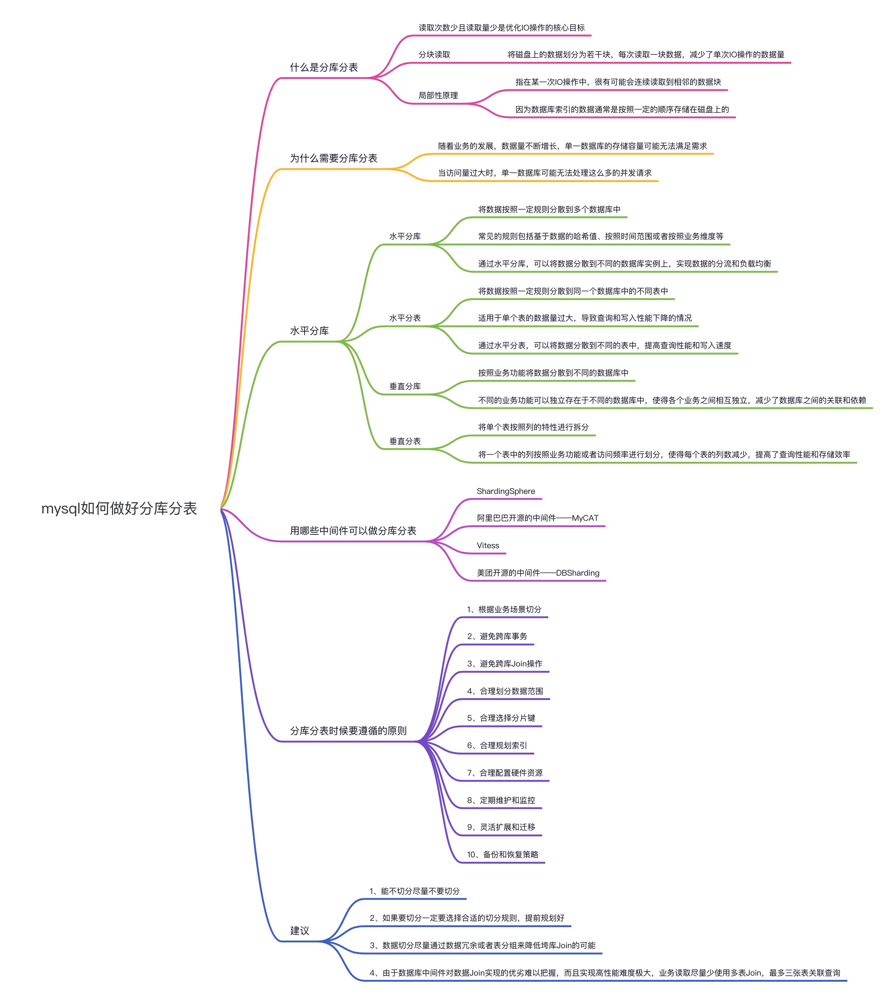
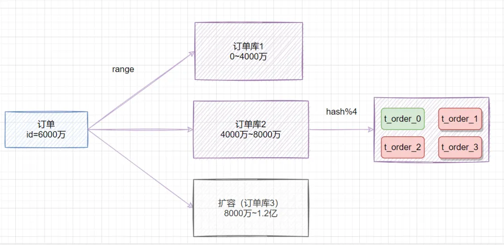

# MySql-分库分表

## 什么是分库分表

**分库分表是指将原本存储在单一数据库中的数据,拆分到多个数据库或者多个数据表中** 。这样做的目的是为了提高数据库的扩展性和性能,解决单一数据库在数据量和并发访问上的瓶颈。

## 为什么需要分库

### 磁盘存储

**随着业务的发展,数据量不断增长,单一数据库的存储容量可能无法满足需求。** 此时,通过分库可以将数据分散到多个数据库中,提高整个系统的存储能力。

业务量剧增,MySQL单机磁盘容量会撑爆,拆成多个数据库,磁盘使用率大大降低。

### 并发连接支撑

**高并发访问也是需要考虑的问题。** 当访问量过大时,单一数据库可能无法处理这么多的并发请求。通过分表,可以将数据按照某种规则拆分到多个表中,实现并发请求的均衡分配,提高系统的并发处理能力。

当前非常火的微服务架构出现,就是为了应对高并发。它把订单、用户、商品等不同模块,拆分成多个应用,并且把单个数据库也拆分成多个不同功能模块的数据库（订单库、用户库、商品库）,以分担读写压力。

## 为什么要分表

### 单表数据量过大

- 一般超过千万就需要分表
- 单表行数超过500w或者单表容量超过2gb
- 索引一般是B+结构,深度超过3层,查询性能会下降。
  - 假设B+树的高度为2的话,即有一个根结点和若干个叶子结点。这棵B+树的存放总记录数为=根结点指针数*单个叶子节点记录行数。
  - 如果一行记录的数据大小为1k,那么单个叶子节点可以存的记录数 =16k/1k =16. 非叶子节点内存放多少指针呢？我们假设主键ID为bigint类型,长度为8字节(面试官问你int类型,一个int就是32位,4字节),而指针大小在InnoDB源码中设置为6字节,所以就是 8+6=14 字节,16k/14B =16*1024B/14B = 1170
  - 因此,一棵高度为2的B+树,能存放1170*16=18720条这样的数据记录。同理一棵高度为3的B+树,能存放1170*1170*16 =21902400,大概可以存放两千万左右的记录。B+树高度一般为1-3层,如果B+到了4层,查询的时候会多查磁盘的次数,SQL就会变慢。

## 水平分库

水平分库是将数据按照一定规则分散到多个数据库中。 常见的规则包括基于数据的哈希值、按照时间范围或者按照业务维度等。通过水平分库,可以将数据分散到不同的数据库实例上,实现数据的分流和负载均衡。

让我们以一个电商项目为例,来说明水平分库的概念。假设我们的电商系统有成千上万个商品,每个商品都有大量的订单数据。我们可以根据商品ID的范围,将不同范围的商品存储在不同的数据库中,比如商品ID以10000为界限,小于10000的商品存储在数据库A中,大于10000的商品存储在数据库B中。这样,每个数据库只需要处理一部分商品数据,**提高了数据库的并发**处理能力。

## 水平分表

水平分表是将数据按照一定规则分散到同一个数据库中的不同表中。这种方式适用于**单个表的数据量过大,导致查询和写入性能下降**的情况。通过水平分表,可以将数据分散到不同的表中,提高查询性能和写入速度。

再来看看水平分表的应用。在电商项目中,我们可以按照时间维度对订单表进行分表。比如,每个月的订单数据存储在一个单独的表中,如order_202101、order_202102等。这样一来,每个表的数据量相对较小,查询和更新操作可以更快速地执行,提高了系统的响应速度。

## 垂直分库

垂直分库是按照业务功能将数据分散到不同的数据库中。不同的业务功能可以独立存在于不同的数据库中,使得各个业务之间**相互独立,减少了数据库之间的关联和依赖**。

除了水平拆分,我们还可以考虑垂直分库。在电商项目中,商品信息和订单信息是两个独立的模块,它们的访问模式和数据特点可能不同。我们可以将商品信息存储在一个独立的数据库中,将订单信息存储在另一个独立的数据库中。这样一来,不同数据库之间的访问不会相互影响,**提高了系统的整体性能**。

## 垂直分表

垂直分表是将单个表按照列的特性进行拆分。将一个表中的列按照业务功能或者访问频率进行划分,使得每个表的列数减少,**提高了查询性能和存储效率**。

在电商项目中,商品信息表可能包含大量的字段,而且某些字段的更新频率较低,而其他字段的更新频率较高。我们可以根据字段的更新频率将表进行垂直拆分,将更新频率较低的字段拆分到独立的表中。例如,将商品的基本信息和描述信息存储在一个表中,将库存信息和价格信息存储在另一个表中。这样一来,可以减少频繁更新的字段对整个表的锁定,提高了系统的并发性能。

## 如何选择分表键

分表键,即用来**分库/分表**的字段,换种说法就是,你以哪个维度来分库分表的。比如你 **按用户ID分表、按时间分表、按地区分表** ,这些**用户ID、时间、地区**就是分表键。

一般数据库表拆分的原则,需要先找到 **业务的主题** 。比如你的数据库表是一张企业客户信息表,就可以考虑用了**客户号**做为 `分表键`。

**为什么考虑用客户号做分表键呢？**

> 这是因为表是基于客户信息的,所以,需要将同一个客户信息的数据,落到一个表中, **避免触发全表路由** 。

## 非分表键如何查询

分库分表后,有时候无法避免一些业务场景, **需要通过非分表键来查询** 。

假设一张用户表,根据 `userId`做分表键,来分库分表。但是用户登录时,需要根据**用户手机号**来登陆。这时候,就需要通过手机号查询用户信息。而 **手机号是非分表键** 。

非分表键查询,一般有这几种方案：

- 遍历：最粗暴的方法,就是遍历所有的表,找出符合条件的手机号记录（不建议）
- 将用户信息冗余同步到ES,同步发送到ES,然后通过ES来查询（推荐）

其实还有 **基因法** ：比如非分表键可以解析出分表键出来,比如常见的,订单号生成时,可以包含客户号进去,通过订单号查询,就可以解析出客户号。但是这个场景除外, **手机号似乎不适合冗余userId** 。

## 分表策略

### range范围

- 范围策略划分表。比如我们可以将表的主键 `order_id`,按照从 `0~300万`的划分为一个表,`300万~600万`划分到另外一个表

  - 也可以按时间范围来划分,如不同年月的订单放到不同的表中。
- 优点：`range`范围分表,有利于扩容。
- 缺点：可能会有热点问题。因为 `订单id`是一直在增大的,也就是说最近一段时间都是汇聚在一张表里面的。比如最近一个月的订单都在 `300万~600万`之间,平时用户一般都查最近一个月的订单比较多,请求都打到 `order_1`表啦。

### hash取模

- 指定的路由key（一般是 `user_id、order_id、customer_no`作为key）对分表总数进行取模,把数据分散到各个表中。
- 一般,我们会取 **哈希值,再做取余** ：

  - `hash(user_id)%N`,N为表的总数。这样,就可以把数据均匀地分散到各个表中。
- 优点：数据分散均匀,不容易出现热点问题。
- 缺点：扩容时,需要迁移数据。

### 一致性hash

- 一致性hash算法,也是一种取模算法。但是,它有一个特点,就是**当增加或减少分表数量时,尽量减少数据迁移**。
- 如果**用hash方式**分表,前期规划不好,需要 **扩容二次分表,表的数量需要增加,所以hash值需要重新计算** ,这时候需要迁移数据了。

## 如何避免热点问题数据倾斜问题

- range范围+hash取模结合的分表策略
  - 在拆分库的时候,我们可以先用range范围方案,比如订单id在0~4000万的区间,划分为订单库1;id在4000万~8000万的数据,划分到订单库2,将来要扩容时,id在8000万~1.2亿的数据,划分到订单库3。然后订单库内,再用hash取模的策略,把不同订单划分到不同的表。
  - 

## 支持分库分表的中间件

在实际应用中,我们可以借助一些中间件来实现分库分表的功能。比较常用的有ShardingSphere、MyCat、Vitess等。这些中间件可以对SQL进行解析和改写,将数据路由到正确的数据库或数据表中,隐藏了分库分表的细节,提供了方便的接口和管理工具。

## 分库后事务问题

- 需要使用分布式事务
  - 两阶段提交
  - 三阶段提交
  - TCC （Try、Confirm、Cancel）
  - 本地消息表
  - 最大努力通知
  - Saga事务

## 跨节点Join关联

- 字段冗余
  - 把需要关联的字段放入主表中，避免关联操作；比如订单表保存了卖家ID（sellerId），你把卖家名字sellerName也保存到订单表，这就不用去关联卖家表了。这是一种空间换时间的思想。
- 全局表
  - 比如系统中所有模块都可能会依赖到的一些基础表（即全局表），在每个数据库中均保存一份。
- 数据抽象同步
  - 比如A库中的a表和B库中的b表有关联，可以定时将指定的表做同步，将数据汇合聚集，生成新的表。一般可以借助ETL工具。
- 应用层代码组装
  - 分开多次查询，调用不同模块服务，获取到数据后，代码层进行字段计算拼装。

## 聚合函数问题

- 跨节点的count,order by,group by以及聚合函数等问题，都是一类的问题，它们一般都需要基于全部数据集合进行计算。
  - 可以分别在各个节点上得到结果后，再在应用程序端进行合并。

## 分库分表或者的分页问题

### 全局视野法

- 原理：在每个分片中查询全部数据，然后在应用层合并和排序。
  - 要在每个表中将前x页的数据全部查询出来，然后在内存中再次重新排序，最后从中取出第x页的数据，这就是全局查询法
- 优点：实现简单。
- 缺点：性能较差，尤其是数据量较大时。

### 禁止跳页查询法

- 在业务上更改，不能跳页查询，由于只返回一页数据，性能较高
- 缺点：不能跳页

### 二次查询法

- 原理：
  1. 第一次查询：在每个分片中查询满足条件的数据 ID 和排序字段。
  2. 在应用层合并、排序，确定目标页的数据 ID。
  3. 第二次查询：根据目标页的数据 ID，去各个分片中查询完整数据。

- 优点：减少数据传输量，性能较好。
- 缺点：需要两次查询，实现较复杂。

### 引入中间表

- 方法：通过维护一个额外的表来存储排序信息或关键数据，提高查询效率。
- 优点：能够快速确定数据排序。
- 缺点：需要额外的维护成本，可能影响数据一致性

## 分布式ID

- uuid
- **雪花算法生成分布式ID**

## 分表不停服怎么做

1. 编写代理层，加个开关（控制访问新的DAO还是老的DAO，或者是都访问），灰度期间，还是访问老的DAO。
2. 发版全量后，开启双写，既在旧表新增和修改，也在新表新增和修改。日志或者临时表记下新表ID起始值，旧表中小于这个值的数据就是存量数据，这批数据就是要迁移的。
3. 通过脚本把旧表的存量数据写入新表。
4. 停读旧表改读新表，此时新表已经承载了所有读写业务，但是这时候不要立刻停写旧表，需要保持双写一段时间。
5. 当读写新表一段时间之后，如果没有业务问题，就可以停写旧表啦

## 分库分表遵循的原则

以电商项目为例：

- 根据业务场景切分。
  - 比如,将商品信息和订单信息划分到不同的数据库中。
- 避免跨库事务。
  - 比如,下单时需要同时操作商品库存和订单表,可以将商品库存信息冗余到订单表中,避免跨库事务的开销。
- 避免跨库Join操作。
  - 比如,在订单查询时,尽量避免多个表之间的Join操作,可以通过冗余数据或表分组来降低跨库Join的可能性。
- 合理划分数据范围。
  - 比如,按照商品ID的范围划分数据库,按照时间维度划分数据表。
- 合理选择分片键。
  - 分片键的选择很关键,需要根据数据的特点和查询模式进行选择,避免数据倾斜和热点问题。
- 合理规划索引。
  - 根据查询场景和数据分布规律,选择合适的索引策略,提高查询效率。
- 合理配置硬件资源。
  - 分库分表会增加系统的硬件资源消耗,需要根据实际情况进行合理配置,保证系统的性能和稳定性。
- 定期维护和监控。
  - 分库分表后需要定期进行维护和监控,及时发现和解决问题,确保系统的稳定运行。
- 灵活扩展和迁移。
  - 根据业务的发展,需要灵活地扩展和迁移数据库和数据表,保证系统的可扩展性。
- 备份和恢复策略。
  - 分库分表后,备份和恢复的策略也需要进行相应调整,确保数据的安全性和可靠性。

## 建议

- **能不切分尽量不要切分。** 分库分表会增加系统的复杂性和维护成本,只有在数据量和并发访问量达到一定程度时才考虑分库分表。
- **如果要切分一定要选择合适的切分规则,提前规划好。** 根据业务特点和需求,选择合适的切分规则,避免后期的调整和改动。
- **数据切分尽量通过数据冗余或者表分组来降低垮库Join的可能。** 避免频繁的跨库Join操作,可以通过冗余数据或者表分组的方式来降低跨库Join的可能性。
- **由于数据库中间件对数据Join实现的优劣难以把握,而且实现高性能难度极大,业务读取尽量少使用多表Join,最多三张表关联查询。** 减少多表Join操作的频率,可以提高系统的查询性能。
