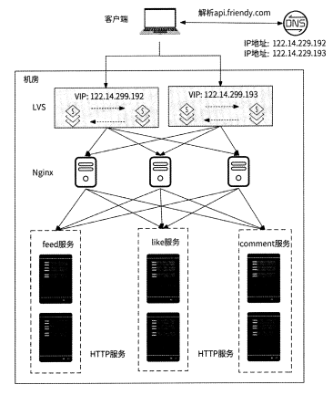
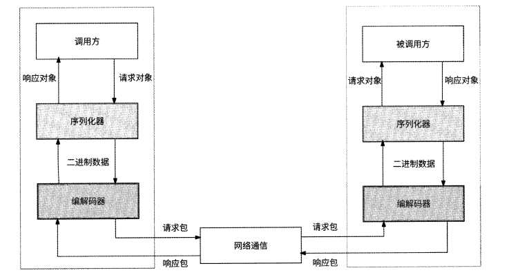
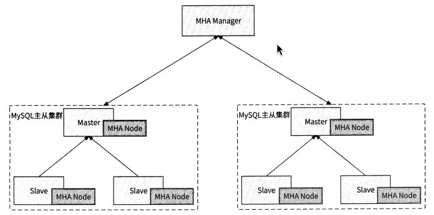
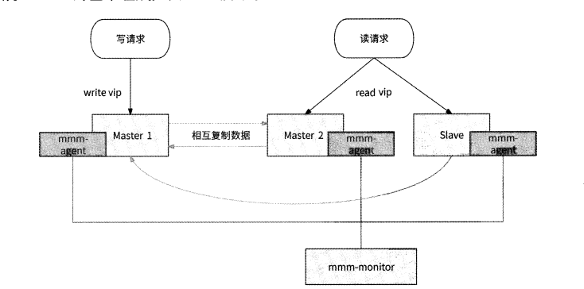
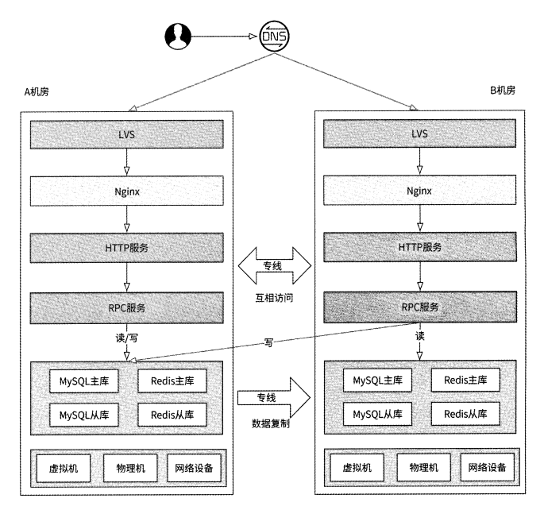
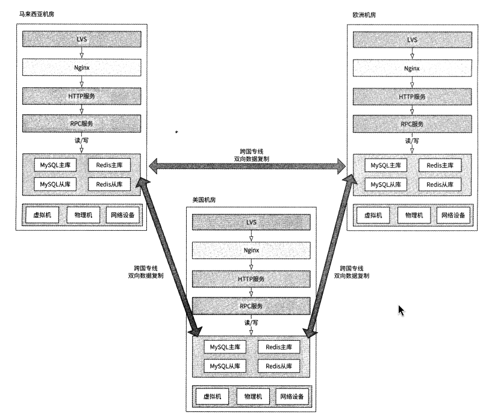

# 基础架构

## 单机房

- 客户端 -> DNS -> 四层负载均衡 -> 七层负载均衡 -> 业务服务层 -> 存储层 -> 其它组件
- DNS -> LVS -> Nginx -> HTTP服务 -> RPC服务 -> 缓存/数据库

### DNS

- http dns原理
  - 将dns协议还成了http
  - `GET http://5.5.5.5/d?dn=go.friendy.com&ip=114.251.192.x`
  - BGP(边界网关协议)
- 优点
  - 降低域名解析延迟
  - 防止域名劫持
  - 调度精准性更高
  - 快速生效
- 常用策略
  - 安全策略
  - IP地址选取策略
  - 批量拉取策略

## nginx

- 负载均衡策略
  - 轮询
  - 权重
  - ip_hash
  - least_conn
  - url_hash
  - fair

- 动态更新服务地址变更
  - ngx_lua + ngx_http_dyups_module
  - 服务发现流程：
    - 定时区服务注册中心获取upstream配置的服务器地址列表
    - 获取成功，生成最新的upstream配置，并通过ngx_http_dyups_module模块将其更新到nginx工作进程中

## LVS

- 转发

- NAT模式
- FULLNAT模式
- TUN(IP隧道)模式
- DR模式
  - 通过改写请求报文的MAC地址，将请求转发到后端服务器，后端服务器直接响应客户端

## 服务发现

- 注册与发现
  - 服务可用性检测
    - 心跳检测
- 地址变更推送

## RPC服务

## mysql

- 主从模式
  - mstser <- slave <- slave
  - 半同步复制模式
- MHA
  
- MMM
  
- MGR mysql组复制

## redis

- 主从模式
- sentinel(哨兵)模式
- cluster(集群)模式
- 中心化集群架构
  - twemproxy代理
  - Codis项目

## LSM Tree

- 在磁盘上用顺序读/写代替随机读写

## kafka

## 主备机房

## 同城双活/同城多活

- 数据一致性、机房调度、跨机房流量控制

## 两地三中心

## 多机房 异地多活

- 跨机房主主复制工具
- DRC

