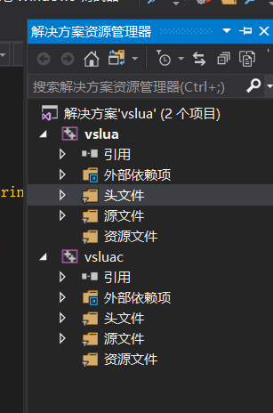
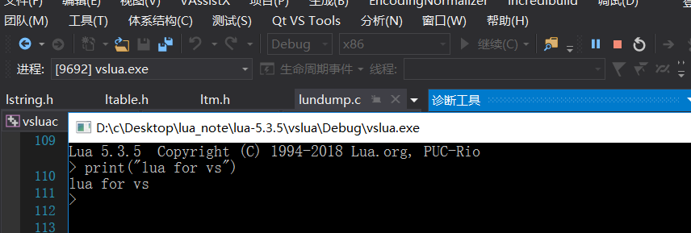
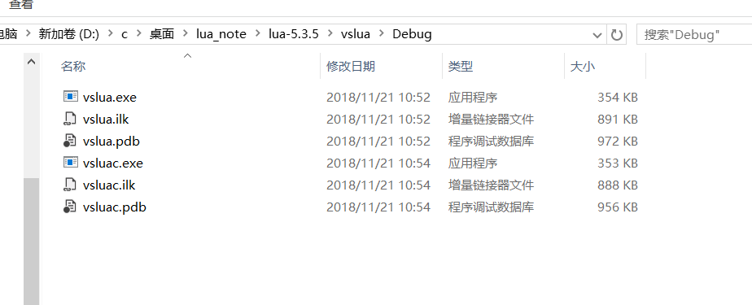

# 01 lua

- [1. lua介绍](#1-lua介绍)
- [2. Lua 特性](#2-lua-特性)
- [3. 特点](#3-特点)
- [4. Lua 应用场景](#4-lua-应用场景)
- [5. 环境搭建](#5-环境搭建)
- [6. VS lua](#6-vs-lua)

## 1. lua介绍

Lua 是一种轻量小巧的脚本语言，用标准C语言编写并以源代码形式开放， 其设计目的是为了嵌入应用程序中，从而为应用程序提供灵活的扩展和定制功能。

Lua 是巴西里约热内卢天主教大学（Pontifical Catholic University of Rio de Janeiro）里的一个研究小组于 1993 年开发的，该小组成员有：Roberto Ierusalimschy、Waldemar Celes 和 Luiz Henrique de Figueiredo。

其设计目的是为了嵌入应用程序中，从而为应用程序提供灵活的扩展和定制功能。

## 2. Lua 特性

- 轻量级: 它用标准C语言编写并以源代码形式开放，编译后仅仅一百余K，可以很方便的嵌入别的程序里。
- 可扩展: Lua提供了非常易于使用的扩展接口和机制：由宿主语言(通常是C或C++)提供这些功能，Lua可以使用它们，就像是本来就内置的功能一样。

- 其它特性:
  - 支持面向过程(procedure-oriented)编程和函数式编程(functional programming)；
  - 自动内存管理；只提供了一种通用类型的表（table），用它可以实现数组，哈希表，集合，对象；
  - 语言内置模式匹配；闭包(closure)；函数也可以看做一个值；提供多线程（协同进程，并非操作系统所支持的线程）支持；
  - 通过闭包和table可以很方便地支持面向对象编程所需要的一些关键机制，比如数据抽象，虚函数，继承和重载等。

## 3. 特点

1. 变量名没有类型，值才有类型，变量名在运行时可与任何类型的值绑定;
2. 语言只提供唯一一种数据结构，称为表(table)，它混合了数组、哈希，可以用任何类型的;值作为key 和va lue。提供了一致且富有表达力的表构造语法，使得Lua 很适合描述复杂的数据;
3. 函数是一等类型，支持匿名函数和正则尾递归(proper tail recursion);
4. 支持词法定界(lexical scoping)和闭包(closure);
5. 提供thread 类型和结构化的协程(coroutine)机制，在此基础上可方便实现协作式多任务;
6. 运行期能编译字符串形式的程序文本并载入虚拟机执行;
7. 通 过 元 表(metatable)和 元 方 法(metamethod)提 供 动 态 元 机 制(dynamic metamechanism)，从而允许程序运行时根据需要改变或扩充语法设施的内定语义;
8. 能方便地利用表和动态元机制实现基于原型(prototype-based)的面向对象模型;
9. 从5.1 版开始提供了完善的模块机制，从而更好地支持开发大型的应用程序

## 4. Lua 应用场景

- 游戏开发
- 独立应用脚本
- Web 应用脚本
- 扩展和数据库插件如：MySQL Proxy 和 MySQL WorkBench
- 安全系统，如入侵检测系统、基于lua + nginx 的waf、wirshark lua脚本、nmap lua扩展脚本等等。

## 5. 环境搭建

lua官网 `http://www.lua.org`

```bash
curl -R -O http://www.lua.org/ftp/lua-5.3.5.tar.gz
tar zxf lua-5.3.5.tar.gz
cd lua-5.3.5
make linux test
```

## 6. VS lua

用vs新建一个vc++的新项目，然后将下载下来源码添加到项目中,lua.c与luac.c这两个文件需要注意，lua.c是编译成lua交互式解析器，luac.c是编译成lua编译器。分别建两个工程一个vslua、一个vsluac。



工程建好之后，直接编译就好，编译速度挺快的。




