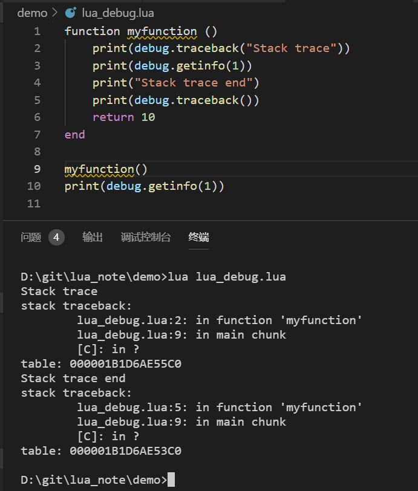

# lua标准库

Lua标准库提供了一组丰富的函数，这些函数直接使用C语言API实现，并使用Lua编程语言构建。这些库提供Lua编程语言中的服务以及文件和数据库操作之外的服务。

这些在官方C语言API中构建的标准库作为单独的C模块提供。它包括以下内容

- base: 最核心的基础库
- package: 管理Lua的模块
- string: 字符串相关函数
- table: 表相关函数
- math: 数学计算相关函数
- io: 文件相关函数
- os: 操作系统相关库
- debug: 调试用的函数

## base: 最核心的基础库

## package: 管理Lua的模块

## string: 字符串相关函数

## table: 表相关函数

## math: 数学计算相关函数

## io: 文件相关函数库

前辈们写的很好了，参考连接如下

> <http://www.lua.org/manual/5.3/manual.html#6.8>
> <https://www.runoob.com/lua/lua-file-io.html>
> <https://www.yiibai.com/lua/lua_file_io.html>

## os: 操作系统相关库

os库包含有操作系统和时间日期相关的函数。

```lua
os.execute("echo os.execute")--阻塞的执行操作系统的命令
-- os.remove(filename) -- 文件删除
-- os.rename(oldname,newname) -- 文件重命名
-- os.date(format,time) -- 格式化时间
print(os.date("%Y-%m-%d %H:%M:%S")) -- 打印当前时间 2019-10-13 20:57:21
```

## debug: 调试用的函数

debug库提供一些调试用的函数，最好不要用在正式的生产代码中。

`debug.trackback()` 输出函数调用栈，当发生错误时可以追踪Lua代码的执行情况。

编号 | 函数声明 | 说明
|- | - | - |
1 | debug() | 进入用于调试的交互模式，该模式保持活动状态，直到用户只输入一行中的cont并按Enter键。 用户可以使用其他功能在此模式下检查变量。
2 | getfenv(object) | 返回对象的环境。
3 | gethook(optional thread) | 返回线程的当前挂钩设置，有三个值 - 当前挂钩函数，当前挂钩掩码和当前挂钩计数。
4 | getinfo(optional thread, function or stack level, optional flag) | 返回一个包含函数信息的表。可以直接给出函数，或者可以给一个数字作为函数的值，在给定线程的调用堆栈的级别函数上运行的函数 - 级别0为当前函数(getinfo本身); 级别1为调用getinfo的函数;等等。 如果function是一个大于活动函数数的数字，则getinfo返回nil。
5 | getlocal(optional thread, stack level, local index)
6 | getmetatable(value) | 返回给定对象的元表，如果没有元表，则返回nil。
7 | getregistry() | 返回注册表表，这是一个预定义的表，任何C语言代码都可以使用它来存储它需要存储的任何Lua值。
8 | getupvalue(function, upvalue index) | 此函数返回upvalue的名称和值，索引为函数func。 如果给定索引没有upvalue，则函数返回nil。
9 | setfenv(function or thread or userdata, environment table) | 将给定对象的环境设置为给定表，返回对象。
10 | sethook(optional thread, hook function, hook mask string with "c" and/or "r" and/or "l", optional instruction count) | 将给定函数设置为钩子。 字符串掩码和数字计数描述了何时调用挂钩。 这里，每次Lua调用，返回并分别输入函数中的每一行代码时，都会调用c，r和l。
11 | setlocal(optional thread, stack level, local index, value) | 使用堆栈级别的函数的索引local将值赋给局部变量。 如果没有具有给定索引的局部变量，则该函数返回nil，并且当使用超出范围的级别调用时引发错误。 否则，它返回局部变量的名称。
12 | setmetatable(value, metatable) | 将给定对象的metatable设置为给定表(可以为nil)。
13 | setupvalue(function, upvalue index, value) | 此函数使用函数func的索引up将值赋给upvalue。 如果给定索引没有upvalue，则函数返回nil。 否则，它返回upvalue的名称。
14 | traceback(optional thread, optional message string, optional level argument) | 使用回溯构建扩展错误消息。


