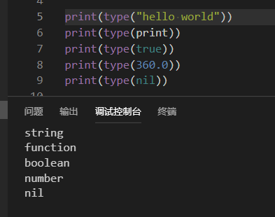
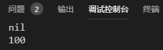
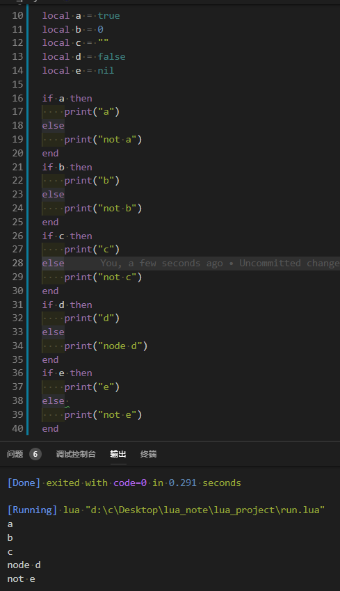
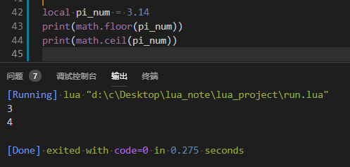
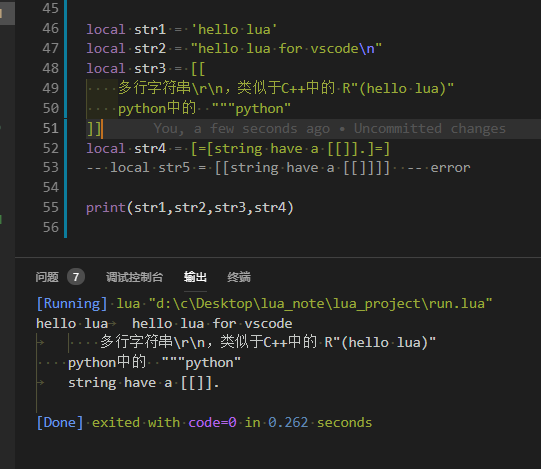
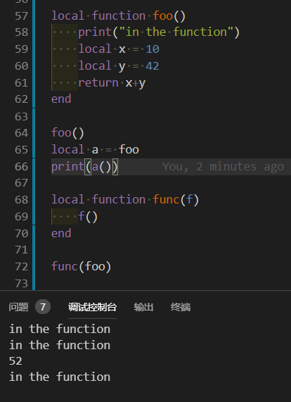
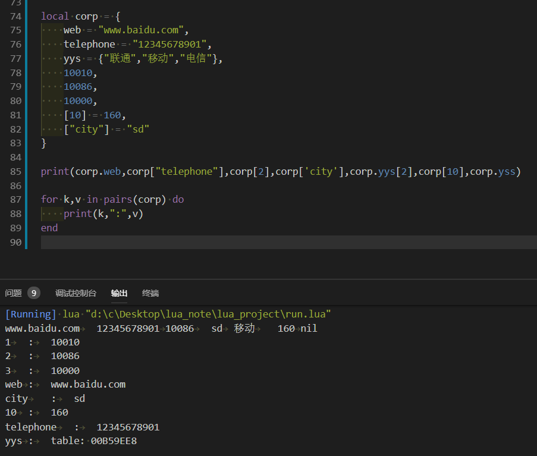

# 02 数据类型与变量

- [1. 数据类型](#1-数据类型)
  - [1.1. nil 空](#11-nil-空)
  - [1.2. boolean 布尔](#12-boolean-布尔)
  - [1.3. number 数值类型](#13-number-数值类型)
  - [1.4. sting 字符串](#14-sting-字符串)
  - [1.5. function 函数](#15-function-函数)
  - [1.6. table 表](#16-table-表)
    - [1.6.1. 数组](#161-数组)
    - [1.6.2. 键值](#162-键值)
    - [1.6.3. 混合](#163-混合)
  - [1.7. thread 线程](#17-thread-线程)
  - [1.8. userdata 自定义类型](#18-userdata-自定义类型)
  - [1.9. 分类](#19-分类)
- [2. 变量](#2-变量)
  - [2.1. 语义](#21-语义)
  - [2.2. 作用域](#22-作用域)
  - [2.3. 解释器](#23-解释器)

## 1. 数据类型

在C和C++中，是有变量类型的，可以采用typeof(int)获取类型大小或变量的大小。在lua中，函数type能够返回一个值或一个变量所属的类型。

```lua
print(type("hello world"))
print(type(print))
print(type(true))
print(type(360.0))
print(type(nil))
```



### 1.1. nil 空

nil是一种类型，nil类型也就只有一种值就是nil。lua将nil用于表示"无效值"。一个变量在第一次赋值前的默认值是nil，将nil赋予给一个全局变量就等同于删除它。

nil类型有点类似于C/C++中的NULL,其主要作用也是起一个标记位的作用。

```lua
local num
print(num)
num = 100
print(num)
```



### 1.2. boolean 布尔

布尔类型，可选值只有true/false; Lua中nil和false为“假”，其他所有值都为“真”。

**注意：真假判断与C++的真假判断有出入**



### 1.3. number 数值类型

数值类型用于表示整数和实数，取值可为任意整数和实数。

可以用math.floor(3.14)和math.ceil(3.14)进行向下或向上取整。

```lua

local pi_num = 3.14
print(math.floor(pi_num))
print(math.ceil(pi_num))
```



一般的，lua的number类型就是C/C++中的long long int或double类型来实现的。

### 1.4. sting 字符串

字符串类型，lua中取值有两种方式。

```lua
local str1 = 'hello lua'
local str2 = "hello lua for vscode\n"
local str3 = [[
    多行字符串\r\n，类似于C++中的 R"(hello lua)"
    python中的  """python"""
]]
local str4 = [=[string have a [[]].]=]  -- [=[]=]等号两侧不可以有空格，主要是为了配对
-- local str5 = [[string have a [[]]]]  -- error

print(str1,str2,str3,str4)
```



### 1.5. function 函数

在lua中，函数也是一种数据类型， first-class, 一等公民

函数可以存储在变量中，可以通过作参数传递给其他函数，还可以作为其他函数的返回值。

```lua
local function foo()
    print("in the function")
    local x = 10
    local y = 42
    return x+y
end

foo()
local a = foo -- 将函数赋值给变量
print(a())

local function func(f)
    f()
end

func(foo)

```



有名函数的定义本质上是匿名函数对变量的赋值。

``` lua
function foo()
end
-- 等价于
foo = function()
end


local function foo()
end
-- 等价于
local foo = function()
end
```

### 1.6. table 表

Table类型基于k-v类型，实现了一种抽象的`"map<k, v>"`。

这是一种具有特殊索引方式的数组。

索引K通常是string或者number类型，但也可以是除了nil以外的任意类型的值。

值v则可以是lua中的任意类型。

> 与STL中的`unordered_map<string/number,any>`有些类似。

#### 1.6.1. 数组

```lua
local arr = {1,2,3,4,5,6,7}
for i = 1,7 do   -- lua的下标从1开始
    print(arr[i])
end
```

#### 1.6.2. 键值

对于无 key 的类型，此时的 key 类型为 number，下标从 1 开始，下标依次累加。

有 key 有则实现为 hash， key 为 string 时有两种表现形式，表内{web = } {["web"] = }
表外，t.web 和 t[ "web" ]。

```lua
local map = {one = "nzhsoft", two = "nzhsoft", first = "nzhsoft"}
print(map.one)
print(map.two)
print(map.first)
for k, v in pairs(map) do
  print(k, v)
end
map.one = "china"
map.two = "china"
map.first = "china"
map.second = "china"
map.third = "china"
for k, v in pairs(map) do
  print(k, v)
end
```

#### 1.6.3. 混合

```lua
local corp = {
    web = "www.baidu.com",
    telephone = "12345678901",
    yys = {"联通","移动","电信"},
    10010,
    10086,
    10000,
    [10] = 160,
    ["city"] = "sd"
}

print(corp.web,corp["telephone"],corp[2],corp['city'],corp.yys[2],corp[10],corp.yss)

for k,v in pairs(corp) do
    print(k,":",v)
end

```



在内部实现上，table通常实现为一个哈希表和一个数组、或两者的混合。具体的实现为何种形式，动态依赖于具体的table的键的分布特点。

### 1.7. thread 线程

### 1.8. userdata 自定义类型

### 1.9. 分类

Lua中总共有8种数据类型，分别是nil，boolen，number，string，function，table，thread，userdata。前4种属于基本数据类型 （传值），后4种属于对象类型（传引用）。

## 2. 变量

变量不过是存储到区域可以操作的名称，即指定内存的别名。

它可以容纳不同类型的值，包括函数和表等。

- 变量名
  - 由字母，数字和下划线组成
  - 它必须以字母或下划线开头
  - 大写和小写字母是敏感的，因为Lua是区分大小写的。

此变量的命令，同C/C++中的语义基本相符。

### 2.1. 语义

命名虽然同C/C++中的基本相符，但就其语义来讲，相去甚远。

lua是弱类型/动态类型的语言，即，变量没有类型，而数值有类型。

变量的类型是由数值决定的。

### 2.2. 作用域

变量的作用范围

- 开始于声明它们之后的第一个语句段，
- 结束于包含这个声明的最内层语句块的最后一个非空语句。

```lua
x = 10 -- 全局变量
do -- 新的语句块
    local x = x -- 新的一个 'x', 它的值现在是 10
    print(x) --> 10
    x = x + 1
    do -- 另一个语句块
        local x = x + 1 -- 又一个 'x'
        print(x) --> 12
    end
    print(x) --> 11
end
print(x) --> 10 （取到的是全局的那一个）
```

域(函数 / do end)以内的local才属于域，域以外的全局依然是全局。

- 全局变量
  - 所有的变量默认是全局，除非显式地声明为local局部。全局变量可以不定义直接使用，默认为nil
- 局部变量
  - 当类型被指定为local局部的一个变量，它的范围是在有限的在自己的范围内使用。需要加local修饰，默认值为nil

### 2.3. 解释器
