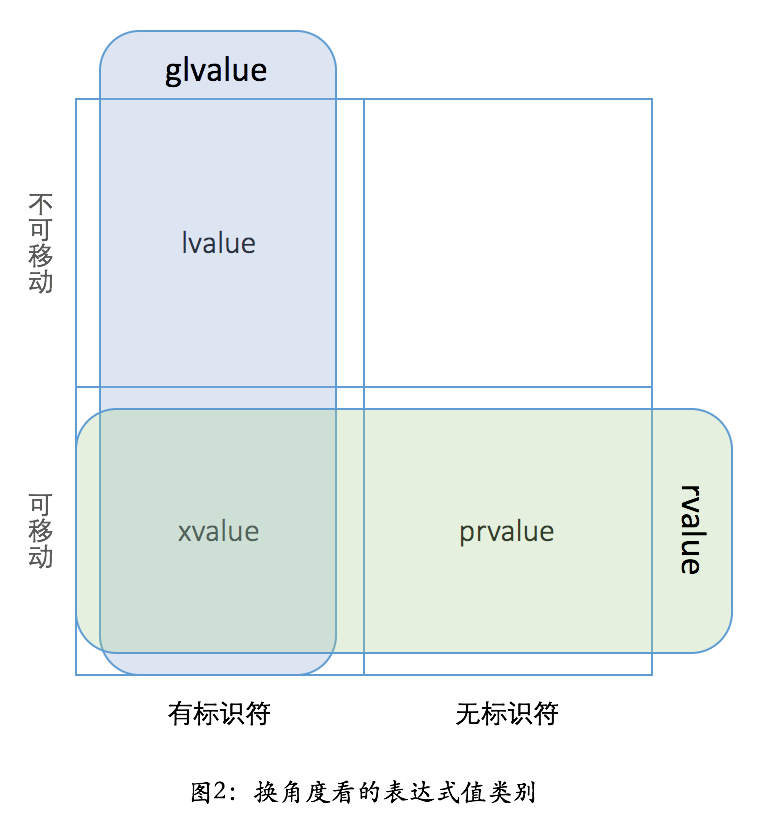

# C++

## 1. 基础

### 1.1. 常变量与数据类型

#### 1.1.1. 变量作用域

- **局部变量**：在函数或代码块内部声明的变量，只能在该函数或代码块内访问
- **全局变量**：在所有函数外部声明的变量，整个程序都可以访问
- **类成员变量**：在类中声明的变量，根据访问修饰符决定访问权限
- **命名空间作用域**：在命名空间中声明的变量，通过命名空间限定符访问

```cpp
int globalVar = 10;  // 全局变量

void func() {
    int localVar = 20;  // 局部变量
    {
        int blockVar = 30;  // 块级作用域变量
    }
    // blockVar 在此处不可访问
}
```

#### 1.1.2. 生命周期

- **自动存储期**：局部变量，在进入作用域时创建，离开作用域时销毁
- **静态存储期**：全局变量和 static 变量，程序开始时创建，程序结束时销毁
- **动态存储期**：通过 new/malloc 分配的内存，需要手动释放
- **线程存储期**：thread_local 变量，线程开始时创建，线程结束时销毁

#### 1.1.3. 修饰符

- auto
- register
- extern
- static

### 1.2. 程序流程控制

#### 1.2.1. 条件语句

- if-else
- switch-case
- 三元运算符 `condition ? expr1 : expr2`

#### 1.2.2. 循环语句

- for
- while
- do-while
- for range（C++11）

```cpp
// for range 示例
std::vector<int> nums = {1, 2, 3, 4, 5};
for (int num : nums) {
    std::cout << num << std::endl;
}

// 使用引用修改元素
for (int& num : nums) {
    num *= 2;
}

// 使用 auto
for (const auto& num : nums) {
    std::cout << num << std::endl;
}
```

#### 1.2.3. 跳转语句

- break：跳出循环
- continue：跳过本次循环
- goto：跳转到标签（不推荐使用）
- return：返回函数

### 1.3. 运算符与表达式

#### 1.3.1. 算术运算符

- `+` 加法
- `-` 减法
- `*` 乘法
- `/` 除法
- `%` 取模
- `++` 自增
- `--` 自减

#### 1.3.2. 关系运算符

- `==` 等于
- `!=` 不等于
- `>` 大于
- `<` 小于
- `>=` 大于等于
- `<=` 小于等于

#### 1.3.3. 逻辑运算符

- `&&` 逻辑与
- `||` 逻辑或
- `!` 逻辑非

#### 1.3.4. 位运算符

- `&` 按位与
- `|` 按位或
- `^` 按位异或
- `~` 按位取反
- `<<` 左移
- `>>` 右移

#### 1.3.5. 赋值运算符

- `=` 赋值
- `+=` `-=` `*=` `/=` `%=` 复合赋值
- `&=` `|=` `^=` `<<=` `>>=` 位运算复合赋值

#### 1.3.6. 其他运算符

- `sizeof` 返回数据大小
- `?:` 三元条件运算符
- `,` 逗号运算符
- `.` 和 `->` 成员访问
- `()` 函数调用
- `[]` 数组下标
- `&` 取地址
- `*` 解引用

### 1.4. 数组  

#### 1.4.1. 一维数组

```cpp
int arr[5] = {1, 2, 3, 4, 5};
int arr[] = {1, 2, 3};  // 自动推断大小
int arr[5] = {0};  // 全部初始化为0
int arr[5];  // 未初始化，值不确定
```

#### 1.4.2. 多维数组

```cpp
int matrix[3][4];  // 3行4列的二维数组
int matrix[2][3] = {
    {1, 2, 3},
    {4, 5, 6}
};
```

#### 1.4.3. 数组与指针

- 数组名是指向数组第一个元素的常量指针
- 数组名不能被赋值（const指针）

```cpp
int arr[5] = {1, 2, 3, 4, 5};
int* p = arr;  // p指向arr[0]
std::cout << *p;  // 输出1
std::cout << *(p + 1);  // 输出2
```

#### 1.4.4. C风格字符串

```cpp
char str[] = "Hello";  // 实际长度为6，包含'\0'
const char* str = "Hello";  // 指向字符串常量
```

### 1.5. 指针

#### 1.5.1. 指针基础

- 指针是一个变量，存储另一个变量的内存地址
- 通过 `&` 获取变量地址，通过 `*` 解引用访问值

```cpp
int a = 10;
int* p = &a;  // p存储a的地址
std::cout << *p;  // 解引用，输出10
```

#### 1.5.2. 指针类型

- **空指针**：不指向任何有效地址
  ```cpp
  int* p = nullptr;  // C++11推荐
  int* p = NULL;     // C风格
  int* p = 0;        // 不推荐
  ```
- **void指针**：可以指向任何类型
  ```cpp
  void* p;
  int a = 10;
  p = &a;
  ```
- **常量指针**：指针本身的值不能改变
  ```cpp
  int a = 10, b = 20;
  int* const p = &a;  // p不能指向其他地址
  ```
- **指向常量的指针**：不能通过指针修改值
  ```cpp
  const int* p = &a;  // *p = 20; 错误
  ```

#### 1.5.3. 指针运算

- 指针加减整数：按类型大小偏移
- 指针相减：得到元素个数差
- 指针比较：比较地址大小

#### 1.5.4. nullptr (C++11)

- `nullptr` 是 C++11 引入的空指针常量
- 类型为 `std::nullptr_t`，可以隐式转换为任何指针类型
- 比 `NULL` 和 `0` 更类型安全

```cpp
void func(int);
void func(int*);

func(NULL);     // 调用 func(int)，有歧义
func(0);        // 调用 func(int)
func(nullptr);  // 调用 func(int*)，明确意图
```

#### 1.5.5. 函数指针

```cpp
int add(int a, int b) { return a + b; }

int (*pFunc)(int, int) = add;
int result = pFunc(1, 2);  // result = 3

// 使用 typedef
typedef int (*FuncType)(int, int);
FuncType pAdd = add;
```

#### 1.5.6. 指针数组与数组指针

```cpp
int* arr[5];      // 指针数组：包含5个int指针的数组
int (*p)[5];      // 数组指针：指向包含5个int的数组的指针
```

### 1.6. 引用

- 引用的本质是 const 类型的指针
- 引用与指针的区别

  1. 引用是对象的别名，指针是对象地址的别名
  2. 引用必须在创建时被初始化，指针可以在任何时候被初始化
  3. 引用一旦初始化，就不能改变引用的对象，指针可以随时改变引用的对象
  4. 引用不能为空，指针可以为空
  5. 引用是类型安全的，指针不是类型安全的
  6. 引用是隐式转换，指针是显式转换

### 1.7. 函数

- 函数重载
  1. 函数名相同
  2. 参数个数不同，参数的类型不同，参数顺序不同
  3. 返回值类型，不作为重载的标准
  4. C++ 允许， int 到 long 和 double， double 到 int 和 float, int 到 short 和 char等隐式类型转换。遇到这种情型，则会引起二义性。
- extern "C"
- 默认参数
- 内联函数

### 1.8. 函数重载

#### 1.8.1. 重载规则

- 函数名相同，参数列表不同（参数个数、类型或顺序）
- 返回值类型不参与重载判定
- const 修饰参数可以构成重载

```cpp
void print(int a);
void print(double a);      // 参数类型不同
void print(int a, int b);  // 参数个数不同
void print(int a, double b);  // 参数顺序不同

// const重载
void func(int& a);         // 接受左值
void func(const int& a);   // 接受常量引用
void func(int&& a);        // 接受右值（C++11）
```

#### 1.8.2. 重载解析

1. 精确匹配
2. 类型提升（如 char → int）
3. 标准转换（如 int → double）
4. 用户定义的转换
5. 省略号匹配

#### 1.8.3. 重载二义性

```cpp
void func(long a);
void func(double a);

func(10);  // 错误：二义性，int可以同时转换为long和double
```

### 1.9. 字符串

#### 1.9.1. C风格字符串

- 以 `\0` 结尾的字符数组
- 使用 `<cstring>` 提供的函数操作

```cpp
#include <cstring>

char str[20] = "Hello";
strlen(str);     // 返回长度（不含'\0'）
strcpy(str, "World");  // 复制
strcat(str, "!");      // 拼接
strcmp(str, "World!"); // 比较
```

#### 1.9.2. std::string

- C++ 标准库提供的字符串类，更安全方便
- 自动管理内存

```cpp
#include <string>

std::string s1 = "Hello";
std::string s2 = "World";
std::string s3 = s1 + " " + s2;  // 拼接
s3.length();       // 长度
s3.empty();        // 是否为空
s3.substr(0, 5);   // 子串
s3.find("World");  // 查找
s3.replace(6, 5, "C++");  // 替换
```

#### 1.9.3. Raw String (C++11)

- 原始字符串，转义字符不生效
- 格式：`R"(内容)"`

```cpp
std::string path1 = "C:\\Program Files\\App";  // 需要转义
std::string path2 = R"(C:\Program Files\App)";  // 原始字符串

// 包含括号的原始字符串
std::string str = R"seq(内容可以包含()括号)seq";
```

#### 1.9.4. 字符串转换 (C++11)

```cpp
// 数值转字符串
std::string s1 = std::to_string(42);
std::string s2 = std::to_string(3.14);

// 字符串转数值
int i = std::stoi("42");
long l = std::stol("123456");
float f = std::stof("3.14");
double d = std::stod("3.14159");
```

### 1.10. 结构体

#### 1.10.1. 基本用法

```cpp
struct Person {
    std::string name;
    int age;
    double height;
};

// C++ 中 struct 默认成员是 public
Person p1;
p1.name = "Alice";
p1.age = 25;

// 初始化
Person p2 = {"Bob", 30, 175.5};
Person p3{"Charlie", 28};  // C++11 统一初始化
```

#### 1.10.2. 结构体与类

- C++ 中 struct 和 class 唯一区别是默认访问权限
- struct 默认 public，class 默认 private
- struct 可以有构造函数、析构函数、成员函数

```cpp
struct Point {
    int x, y;

    Point(int x, int y) : x(x), y(y) {}

    void print() {
        std::cout << "(" << x << ", " << y << ")" << std::endl;
    }
};
```

#### 1.10.3. 结构体对齐

- 结构体大小通常是最大成员大小的整数倍
- 可以使用 `#pragma pack` 或 `alignas` 控制对齐

```cpp
#pragma pack(push, 1)  // 1字节对齐
struct Packed {
    char a;
    int b;
};
#pragma pack(pop)
```

### 1.11. Union共用体

#### 1.11.1. 基本概念

- 所有成员共享同一块内存
- 大小等于最大成员的大小
- 同一时间只能使用一个成员

```cpp
union Data {
    int i;
    float f;
    char str[4];
};

Data d;
d.i = 10;
std::cout << d.i;  // 输出10
d.f = 3.14f;       // 覆盖了i的值
std::cout << d.i;  // 输出不确定的值
```

#### 1.11.2. 用途

- 节省内存
- 实现类型转换
- 网络协议解析

```cpp
// IP地址转换
union IP {
    uint32_t addr;
    uint8_t bytes[4];
};

IP ip;
ip.addr = 0x01020304;
// ip.bytes[0] = 1, ip.bytes[1] = 2, ...
```

#### 1.11.3. C++11 改进

- C++11 允许 union 包含有构造/析构函数的类类型成员
- 需要显式管理生命周期

```cpp
union U {
    std::string s;
    int i;

    U() {}  // 需要显式定义
    ~U() {}
};
```

### 1.12. Enum枚举

#### 1.12.1. C风格枚举

```cpp
enum Color {
    RED,      // 默认 0
    GREEN,    // 默认 1
    BLUE = 5, // 指定值
    YELLOW    // 自动为 6
};

Color c = RED;
c = static_cast<Color>(10);  // 可以强制转换
```

- 问题：枚举值会污染命名空间，不同枚举不能有同名成员

```cpp
enum Color { RED };
enum Fruit { RED };  // 错误：RED重定义
```

#### 1.12.2. 强类型枚举 (C++11)

- 使用 `enum class` 声明
- 作用域限定，类型安全

```cpp
enum class Color {
    RED,
    GREEN,
    BLUE
};

enum class Fruit {
    APPLE,
    ORANGE
};

Color c = Color::RED;     // 需要作用域限定
// c = RED;               // 错误
// c = 0;                 // 错误：不能隐式转换
c = static_cast<Color>(0); // 显式转换

Fruit f = Fruit::APPLE;   // 可以有同名的枚举值
```

#### 1.12.3. 指定底层类型

```cpp
enum class Color : uint8_t {  // 指定底层类型
    RED, GREEN, BLUE
};

enum Size : int {  // C风格枚举也可以指定
    SMALL = 1,
    LARGE = 100
};
```

#### 1.12.4. 枚举用法

```cpp
// 遍历枚举（需要自己实现）
enum class Color { RED, GREEN, BLUE, COUNT };

for (int i = 0; i < static_cast<int>(Color::COUNT); ++i) {
    Color c = static_cast<Color>(i);
}

// switch中使用
Color c = Color::RED;
switch (c) {
    case Color::RED:
        break;
    case Color::GREEN:
        break;
    case Color::BLUE:
        break;
}
```

### 1.13. 类型转换

- static_cast
- reinterpret_cast
- dynamic_cast
- const_cast
  - `const_cast<type-id>(expression)`
    - type-id 必须是一个指针或引用类型，type-id 不能是 void
    - expression 必须是一个指针或引用类型，expression 的类型必须能转换成 type-id 的类型
  - const_cast 可以用来去掉 const 或 volatile 修饰符

### 1.14. 命名空间

#### 1.14.1. 基本用法

```cpp
namespace MyNamespace {
    int value = 10;

    void func() {
        std::cout << "MyNamespace::func" << std::endl;
    }

    namespace Inner {
        int innerValue = 20;
    }
}

// 使用
MyNamespace::value = 20;
MyNamespace::func();
MyNamespace::Inner::innerValue = 30;

using namespace MyNamespace;  // 引入整个命名空间
using MyNamespace::value;     // 引入特定成员
```

#### 1.14.2. 命名空间特性

- 可以分散定义：同一个命名空间可以在多个文件中定义
- 可以嵌套
- 可以使用别名

```cpp
namespace LongNamespace {
    int x;
}

namespace Short = LongNamespace;  // 别名
Short::x = 10;
```

#### 1.14.3. 匿名命名空间

- 作用域仅限于当前文件
- 替代 static 全局变量

```cpp
namespace {
    int internalVar = 10;  // 仅当前文件可见
}
```

#### 1.14.4. using 声明与指令

```cpp
// using 声明：引入单个名称
using std::cout;
cout << "Hello";

// using 指令：引入整个命名空间
using namespace std;
cout << "Hello";

// 注意：不要在头文件中使用 using 指令
```

### 1.15. 文件操作

#### 1.15.1. 文件流类

- `std::ifstream`：输入文件流（读取）
- `std::ofstream`：输出文件流（写入）
- `std::fstream`：输入输出文件流

#### 1.15.2. 文件读写

```cpp
#include <fstream>

// 写文件
std::ofstream outFile("output.txt");
if (outFile.is_open()) {
    outFile << "Hello, World!" << std::endl;
    outFile.close();
}

// 读文件
std::ifstream inFile("input.txt");
if (inFile.is_open()) {
    std::string line;
    while (std::getline(inFile, line)) {
        std::cout << line << std::endl;
    }
    inFile.close();
}

// 读写文件
std::fstream file("data.txt", std::ios::in | std::ios::out);
```

#### 1.15.3. 打开模式

- `std::ios::in`：读模式
- `std::ios::out`：写模式
- `std::ios::app`：追加模式
- `std::ios::ate`：打开时定位到文件末尾
- `std::ios::trunc`：截断文件
- `std::ios::binary`：二进制模式

```cpp
std::ofstream file("log.txt", std::ios::app);  // 追加写入
```

#### 1.15.4. 二进制文件

```cpp
// 写入二进制
std::ofstream binFile("data.bin", std::ios::binary);
int nums[] = {1, 2, 3, 4, 5};
binFile.write(reinterpret_cast<char*>(nums), sizeof(nums));

// 读取二进制
std::ifstream inFile("data.bin", std::ios::binary);
int buffer[5];
inFile.read(reinterpret_cast<char*>(buffer), sizeof(buffer));
```

#### 1.15.5. 文件位置指针

```cpp
std::fstream file("data.txt");
file.seekg(0, std::ios::end);  // 移动读取指针到末尾
file.seekp(0, std::ios::beg);  // 移动写入指针到开头
std::streampos pos = file.tellg();  // 获取当前位置
```

### 1.16. 流

#### 1.16.1. 标准流对象

- `std::cin`：标准输入流
- `std::cout`：标准输出流
- `std::cerr`：标准错误流（无缓冲）
- `std::clog`：标准日志流（有缓冲）

```cpp
int x;
std::cin >> x;
std::cout << "Value: " << x << std::endl;
std::cerr << "Error message" << std::endl;
```

#### 1.16.2. 流操纵符

```cpp
#include <iomanip>

// 格式化输出
int n = 255;
std::cout << std::hex << n << std::endl;     // 十六进制：ff
std::cout << std::oct << n << std::endl;     // 八进制：377
std::cout << std::dec << n << std::endl;     // 十进制：255

// 宽度与填充
std::cout << std::setw(10) << n << std::endl;        // 宽度10
std::cout << std::setfill('0') << std::setw(5) << n; // 00255

// 浮点数
double d = 3.14159265;
std::cout << std::setprecision(3) << d << std::endl;     // 3.14
std::cout << std::fixed << std::setprecision(2) << d;     // 3.14
std::cout << std::scientific << d << std::endl;           // 3.14e+00

// 布尔值
bool b = true;
std::cout << std::boolalpha << b << std::endl;  // true
std::cout << std::noboolalpha << b << std::endl; // 1
```

#### 1.16.3. 字符串流

```cpp
#include <sstream>

std::stringstream ss;
ss << "Value: " << 42;
std::string str = ss.str();  // "Value: 42"

// 字符串解析
std::istringstream iss("1 2 3");
int a, b, c;
iss >> a >> b >> c;  // a=1, b=2, c=3
```

#### 1.16.4. 流状态

- `good()`：正常状态
- `eof()`：到达文件末尾
- `fail()`：读写失败
- `bad()`：严重错误

```cpp
if (std::cin.fail()) {
    std::cin.clear();  // 清除错误状态
    std::cin.ignore(); // 忽略错误输入
}
```

### 1.17. 位运算

#### 1.17.1. 位运算符

- `&` 按位与：两位都为1则结果为1
- `|` 按位或：有一位为1则结果为1
- `^` 按位异或：两位不同则结果为1
- `~` 按位取反：0变1，1变0
- `<<` 左移：高位丢弃，低位补0
- `>>` 右移：低位丢弃，高位补符号位或0

#### 1.17.2. 常用操作

```cpp
int a = 5;  // 0101

// 判断第n位是否为1
bool isSet = (a & (1 << n)) != 0;

// 设置第n位为1
a |= (1 << n);

// 清除第n位（设为0）
a &= ~(1 << n);

// 翻转第n位
a ^= (1 << n);

// 最低位1变成0
a &= (a - 1);

// 获取最低位的1
int lowestBit = a & (-a);

// 交换两个数
int x = 1, y = 2;
x ^= y;
y ^= x;
x ^= y;
```

#### 1.17.3. 位域（Bit Fields）

```cpp
struct Flags {
    unsigned int a : 1;  // 1位
    unsigned int b : 2;  // 2位
    unsigned int c : 3;  // 3位
};

Flags f;
f.a = 1;    // 0或1
f.b = 3;    // 0-3
f.c = 5;    // 0-7
```

#### 1.17.4. 位运算应用

```cpp
// 判断奇偶
bool isOdd = n & 1;

// 乘以/除以2的幂
int doubled = n << 1;    // n * 2
int halved = n >> 1;     // n / 2

// 取模（2的幂）
int mod = n & (m - 1);   // n % m (m是2的幂)

// 判断是否为2的幂
bool isPowerOf2 = (n > 0) && ((n & (n - 1)) == 0);

// 计算绝对值
int abs(int n) {
    int mask = n >> 31;
    return (n + mask) ^ mask;
}
```

### 1.18. 异常处理

#### 1.18.1. 基本语法

```cpp
try {
    // 可能抛出异常的代码
    throw std::runtime_error("Error occurred");
} catch (const std::exception& e) {
    std::cerr << e.what() << std::endl;
} catch (...) {
    // 捕获所有异常
    std::cerr << "Unknown exception" << std::endl;
}
```

#### 1.18.2. 标准异常类

```cpp
#include <stdexcept>

// 逻辑错误
std::logic_error           // 逻辑错误基类
std::invalid_argument      // 无效参数
std::domain_error          // 域错误
std::length_error          // 长度错误
std::out_of_range          // 越界

// 运行时错误
std::runtime_error         // 运行时错误基类
std::range_error           // 范围错误
std::overflow_error        // 上溢
std::underflow_error       // 下溢

// 其他
std::bad_alloc             // 内存分配失败
std::bad_cast              // dynamic_cast失败
std::bad_typeid            // typeid错误
```

#### 1.18.3. 自定义异常

```cpp
class MyException : public std::exception {
private:
    std::string message;

public:
    MyException(const std::string& msg) : message(msg) {}

    const char* what() const noexcept override {
        return message.c_str();
    }
};

throw MyException("Custom error");
```

#### 1.18.4. 异常规范

```cpp
// C++11: noexcept 说明符
void func1() noexcept;           // 保证不抛出异常
void func2() noexcept(true);     // 同上
void func3() noexcept(false);    // 可能抛出异常

// noexcept 运算符
bool b = noexcept(func1());  // 编译期判断

// 弃用的 C++98 异常规范
void oldFunc() throw(std::exception);  // 不推荐使用
```

#### 1.18.5. RAII 与异常安全

```cpp
class Resource {
public:
    Resource() { /* 获取资源 */ }
    ~Resource() { /* 释放资源 */ }
};

void func() {
    Resource r;  // RAII：异常发生时自动调用析构函数
    // ... 可能抛出异常的代码
}
```

#### 1.18.6. 最佳实践

1. 按引用捕获异常：`catch (const std::exception& e)`
2. 异常类型应继承自 `std::exception`
3. 不要在析构函数中抛出异常
4. 使用 RAII 管理资源确保异常安全
5. 避免使用 `catch (...)`，除非必要

### 1.19. 预处理

- 宏

  - `#define PI 3.14159`
  - `#define DEBUG`
  - `#define MIN(a,b) (((a)<(b)) ? a : b)`
- 条件编译

  - ```c++
    #ifdef DEBUG
        cerr <<"Variable x = " << x << endl;
    #endif
    ```
- `#` 运算符会把 replacement-text 令牌转换为用引号引起来的字符串。
- `##` 运算符用于连接两个令牌

  - ```c++
    #include <iostream>
    using namespace std;

    #define concat(a, b) a ## b
    int main()
    {
      int xy = 100;

      cout << concat(x, y);   // 100
      return 0;
    }
    ```
- `#undef` 取消已定义的宏
- 头文件保护
- 预定义宏

  - `__LINE__` 	当前行号
  - `__FILE__` 	当前文件名
  - `__DATE__` 	文件被编译的日期
  - `__TIME__` 	文件被编译的时间
  - `__STDC__` 	如果编译器遵循 ANSI C 标准，其值为 1，否则为 0
  - `__cplusplus` 	如果编译器遵循 C++ 标准，其值为 199711L，如果是 C99 标准，其值为 199901L
  - `__func__` 	当前函数名
  - `__PRETTY_FUNCTION__` 	当前函数的修饰名

### 1.20. 动态库&&静态库

#### 1.20.1. 静态库（Static Library）

- 编译时代码被复制到可执行文件中
- 文件扩展名：`.a` (Linux/Mac) 或 `.lib` (Windows)
- 优点：程序独立运行，无需外部依赖
- 缺点：可执行文件体积大，更新需要重新编译

```bash
# 创建静态库
g++ -c lib.cpp -o lib.o
ar rcs libmylib.a lib.o

# 使用静态库
g++ main.cpp -L. -lmylib -o main
```

#### 1.20.2. 动态库（Dynamic Library）

- 运行时加载，多个程序可共享
- 文件扩展名：`.so` (Linux)、`.dylib` (Mac) 或 `.dll` (Windows)
- 优点：可执行文件小，库可独立更新
- 缺点：需要正确部署库文件

```bash
# 创建动态库
g++ -fPIC -shared lib.cpp -o libmylib.so

# 使用动态库
g++ main.cpp -L. -lmylib -o main
export LD_LIBRARY_PATH=.:$LD_LIBRARY_PATH  # 运行时指定库路径
```

#### 1.20.3. 编译选项

- `-fPIC`：生成位置无关代码（Position Independent Code）
- `-shared`：创建动态库
- `-L`：指定库搜索路径
- `-l`：链接库名（去掉 `lib` 前缀和扩展名）
- `-I`：指定头文件搜索路径

#### 1.20.4. 动态加载

```cpp
#include <dlfcn.h>

void* handle = dlopen("./libmylib.so", RTLD_LAZY);
if (handle) {
    typedef void (*FuncType)();
    FuncType func = (FuncType)dlsym(handle, "myFunction");
    if (func) {
        func();
    }
    dlclose(handle);
}
```

### 1.21. 信号处理

```C++
#include <iostream>
#include <csignal>
#include <unistd.h>
 
using namespace std;
 
void signalHandler( int signum )
{
    cout << "Interrupt signal (" << signum << ") received.\n";
 
    // 清理并关闭
    // 终止程序 
 
   exit(signum);  
 
}
 
int main ()
{
    int i = 0;
    // 注册信号 SIGINT 和信号处理程序
    signal(SIGINT, signalHandler);  
 
    while(++i){
       cout << "Going to sleep...." << endl;
       if( i == 3 ){
          raise( SIGINT);
       }
       sleep(1);
    }
 
    return 0;
}
```

## 2. CGI

### 2.1. CGI 概述

- CGI（Common Gateway Interface）是 Web 服务器与外部程序之间的接口标准
- 每个 CGI 请求会启动一个新进程，性能较低
- 现代已逐渐被 FastCGI、嵌入式脚本等取代

### 2.2. CGI 环境变量

```cpp
// 常用环境变量
const char* method = std::getenv("REQUEST_METHOD");    // 请求方法
const char* query = std::getenv("QUERY_STRING");       // 查询字符串
const char* content = std::getenv("CONTENT_LENGTH");   // POST数据长度
const char* contentType = std::getenv("CONTENT_TYPE"); // 内容类型
```

### 2.3. 简单 CGI 示例

```cpp
#include <iostream>
#include <cstdlib>

int main() {
    // 输出 HTTP 头
    std::cout << "Content-type: text/html\r\n\r\n";

    // 获取请求方法
    const char* method = std::getenv("REQUEST_METHOD");

    std::cout << "<html><body>";
    std::cout << "<h1>CGI Response</h1>";
    std::cout << "<p>Request Method: " << method << "</p>";

    // 处理 GET 请求
    if (method && std::string(method) == "GET") {
        const char* query = std::getenv("QUERY_STRING");
        std::cout << "<p>Query: " << query << "</p>";
    }

    std::cout << "</body></html>";
    return 0;
}
```

### 2.4. FastCGI

- FastCGI 是 CGI 的改进版本，使用持久进程处理多个请求
- 避免了每次请求启动新进程的开销
- 需要使用 FastCGI 库（如 libfcgi）

## 3. 内存管理

### 3.1. 堆

- new/delete
- malloc/free
- new/delete 与 malloc/free 的区别
  1. new/delete 是 C++ 的关键字，malloc/free 是 C 的库函数
  2. new/delete 可以自动计算对象的大小，malloc/free 需要手动计算对象的大小
  3. new/delete 可以自动调用对象的构造函数和析构函数，malloc/free 不能
  4. new/delete 返回的是对象的指针，malloc/free 返回的是 void 指针
  5. new/delete 可以抛出异常，malloc/free 不会抛出异常
- new[]/delete[]

### 3.2. 栈

- 函数内部声明的变量将占用栈内存
- 后进先出 LIFO
- 从高地址到低地址增长

### 3.3. RAII

- Resource Acquisition Is Initialization C++特有的资源管理方式，即资源获取即初始化，在构造函数中申请资源，在析构函数中释放资源，这样就可以保证在对象的生命周期内，资源始终被正确地管理。

## 4. 智能指针

### 4.1. unique_ptr

- 独占所有权，不可拷贝，可移动
- 零开销抽象

```cpp
#include <memory>

// 创建方式
std::unique_ptr<int> p1(new int(10));
auto p2 = std::make_unique<int>(20);  // C++14 推荐

// 移动所有权
std::unique_ptr<int> p3 = std::move(p1);

// 数组支持
auto arr = std::make_unique<int[]>(10);
arr[0] = 1;

// 自定义删除器
auto deleter = [](FILE* f) { fclose(f); };
std::unique_ptr<FILE, decltype(deleter)> file(fopen("test.txt", "r"), deleter);
```

### 4.2. shared_ptr

- 共享所有权，引用计数
- 线程安全的引用计数（但对象访问仍需同步）

```cpp
#include <memory>

// 创建方式
std::shared_ptr<int> p1(new int(10));
auto p2 = std::make_shared<int>(20);  // 推荐（一次内存分配）

// 共享所有权
std::shared_ptr<int> p3 = p1;  // 引用计数 +1

// 检查引用计数
std::cout << p1.use_count();  // 2

// 自定义删除器
auto deleter = [](int* p) {
    std::cout << "Deleting" << std::endl;
    delete p;
};
std::shared_ptr<int> p(new int(10), deleter);
```

### 4.3. weak_ptr

- 不增加引用计数
- 用于打破循环引用
- 需要通过 lock() 获取 shared_ptr

```cpp
std::shared_ptr<int> sp = std::make_shared<int>(10);
std::weak_ptr<int> wp = sp;

// 检查是否过期
if (!wp.expired()) {
    std::shared_ptr<int> sp2 = wp.lock();  // 获取 shared_ptr
    if (sp2) {
        std::cout << *sp2 << std::endl;
    }
}

// 循环引用示例
struct Node {
    std::shared_ptr<Node> next;  // 改为 weak_ptr 避免循环引用
    std::weak_ptr<Node> prev;    // 使用 weak_ptr
};
```

### 4.4. auto_ptr（已废弃）

- C++98 引入，C++11 废弃
- 存在所有权转移语义不明确等问题
- 应迁移到 unique_ptr

### 4.5. 最佳实践

1. 优先使用 `make_unique` 和 `make_shared`
2. 避免裸指针和智能指针混用
3. 使用 weak_ptr 打破循环引用
4. 不要从裸指针创建多个智能指针
5. 单一所有权用 unique_ptr，共享所有权用 shared_ptr

## 5. 移动语义

### 5.1. 左值与右值

#### 5.1.1. 左值 (lvalue)

- 有标识符、可以取地址的表达式

```cpp
int x = 10;        // x 是左值
int* p = &x;       // 可以取地址
int& ref = x;      // 左值引用

// 左值示例
变量名：x, name
返回左值引用的表达式：++x, x = 1, *ptr
字符串字面值："hello"
```

#### 5.1.2. 右值 (rvalue)

- 纯右值 (prvalue)：没有标识符、不可以取地址的临时对象

```cpp
int x = 10 + 20;   // 10 + 20 是纯右值
int&& rref = 42;   // 右值引用

// 纯右值示例
字面值（除字符串）：42, 3.14, true
返回非引用的表达式：x + y, x++, make_shared<int>(42)
临时对象：std::string("hello")
```

- 将亡值 (xvalue)：通过 `std::move` 或 `std::forward` 产生的右值

```cpp
std::string s = "hello";
std::string&& r = std::move(s);  // std::move(s) 是将亡值
```

### 5.2. 右值引用

```cpp
int&& rref = 42;           // 绑定到右值
// int&& rref2 = x;        // 错误：不能绑定到左值
int&& rref3 = std::move(x); // 正确：将左值转为右值

// 延长临时对象生命周期
const std::string& ref1 = std::string("temp");  // const引用延长生命周期
std::string&& ref2 = std::string("temp");        // 右值引用延长生命周期
```

### 5.3. 移动构造与移动赋值

```cpp
class MyString {
public:
    // 移动构造函数
    MyString(MyString&& other) noexcept
        : data(other.data), len(other.len) {
        other.data = nullptr;
        other.len = 0;
    }

    // 移动赋值运算符
    MyString& operator=(MyString&& other) noexcept {
        if (this != &other) {
            delete[] data;
            data = other.data;
            len = other.len;
            other.data = nullptr;
            other.len = 0;
        }
        return *this;
    }

private:
    char* data;
    size_t len;
};

MyString s1 = createString();
MyString s2 = std::move(s1);  // 移动构造，资源转移
```

### 5.4. std::move

- 将左值转换为右值引用
- 本身不移动任何东西，只是类型转换

```cpp
std::string s1 = "hello";
std::string s2 = std::move(s1);  // s1 被转换为右值引用，触发移动语义
// s1 现在处于有效但未定义的状态
```

### 5.5. std::forward

- 完美转发，保持参数的值类别

```cpp
template<typename T>
void wrapper(T&& arg) {
    // arg 始终是左值，需要 forward 恢复原始值类别
    process(std::forward<T>(arg));
}

int x = 10;
wrapper(x);          // T = int&, forward 转发为左值
wrapper(10);         // T = int, forward 转发为右值
```

### 5.6. 参考图



### 5.7. 临时对象生命周期

C++ 的规则是：一个临时对象会在包含这个临时对象的完整表达式估值完成后、按生成顺序的逆序被销毁，除非有生命周期延长发生。

## 6. 函数调用约定

- __stdcall

  - C++的调用约定方式
  - 参数从右向左通过栈传递，被调用的函数在返回前清理栈
- __cdecl

  - C的调用约定方式
  - 参数从右向左通过栈传递，由调用者负责清理栈
  - 主要用在带有可变参数的函数中，如printf
- __fastcall

  - 参数通过寄存器传递，寄存器不足时再通过栈传递，被调用的函数在返回前清理栈
  - 在X64的平台上，会默认使用__ fastcall调用约定。
    - 前4个参数（在Linux 64上是6个寄存器edi，esi）从左向右传入寄存器edx ecx r8d r9d中，后面的参数从右向左入栈。
    - 浮点前4个参数传入XMM0，XMM1，XMM2，XMM3中，其它参数传递到堆栈中。
    - 被调用函数的返回值是整数时，则返回值被存放于RAX；浮点数返回在XMM0中
    - RBX、RBP、R12 - R15被划分为被调用者保存寄存器，是使用前需要push的。
- __thiscall

  - C++成员函数的调用约定方式
  - 将对象的地址传递给ecx寄存器，到达成员函数内部的时候，将ecx存储的值赋给this指针。
- 全局函数或类静态成员函数，若没有指定调用，约定默认是__cdecl。

## 7. 函数名修饰规则

- c语言修饰名约定
  - __stdcall
    - _函数名@参数的字节数
  - __cdecl
    - _函数名
  - __fastcall
    - @函数名@参数的字节数
- c++修饰名约定
  - __stdcall

    - ?函数名@@YG参数表代号@Z
  - __cdecl

    - ?函数名@YA参数表代号@Z
  - __fastcall

    - ?函数名@@YI参数表代号@Z
  - 参数表代号如下：

    - X——void，
    - D——char，
    - E——unsigned char，
    - F——short，
    - H——int，
    - I——unsigned int，
    - J——long，
    - K——unsigned long，
    - M——float，
    - N——double，
    - _N——bool

## 8. 开发环境

### 8.1. vs

### 8.2. vsc

## 9. 类

### 9.1. 构造函数

#### 9.1.1. 默认构造函数

```cpp
class MyClass {
public:
    MyClass() {}  // 默认构造函数
};

// 如果没有定义任何构造函数，编译器会生成默认构造函数
// 如果定义了其他构造函数，需要显式定义默认构造函数或使用 = default
class MyClass {
public:
    MyClass() = default;  // 让编译器生成
    MyClass(int x) : value(x) {}
private:
    int value;
};
```

#### 9.1.2. 参数化构造函数

```cpp
class Person {
public:
    Person(const std::string& n, int a) : name(n), age(a) {}

    // explicit 防止隐式转换
    explicit Person(int a) : age(a) {}
private:
    std::string name;
    int age;
};

Person p1("Alice", 25);
Person p2 = Person("Bob", 30);
// Person p3 = 25;  // 错误：explicit 阻止隐式转换
Person p4(25);       // 正确：显式调用
```

#### 9.1.3. 拷贝构造函数

```cpp
class MyClass {
public:
    MyClass(const MyClass& other) {
        // 深拷贝资源
    }
};

// 调用时机
MyClass a;
MyClass b = a;     // 拷贝构造
MyClass c(a);      // 拷贝构造
func(a);           // 传参时拷贝构造
MyClass d = func(); // 返回值优化可能避免拷贝
```

#### 9.1.4. 移动构造函数 (C++11)

```cpp
class MyClass {
public:
    MyClass(MyClass&& other) noexcept {
        // 转移资源所有权
    }
};

MyClass a;
MyClass b = std::move(a);  // 移动构造
```

#### 9.1.5. 委托构造函数 (C++11)

```cpp
class MyClass {
public:
    MyClass() : MyClass(0) {}  // 委托给另一个构造函数
    MyClass(int x) : value(x) {}
private:
    int value;
};
```

### 9.2. 析构函数

#### 9.2.1. 基本概念

- 对象销毁时自动调用
- 用于释放资源
- 无返回值，无参数
- 可以虚化（多态基类应该有虚析构函数）

```cpp
class Resource {
public:
    Resource() {
        data = new int[100];
    }

    ~Resource() {
        delete[] data;  // 释放资源
    }

private:
    int* data;
};
```

#### 9.2.2. 虚析构函数

```cpp
class Base {
public:
    virtual ~Base() {}  // 虚析构函数
};

class Derived : public Base {
public:
    ~Derived() {
        // 清理派生类资源
    }
};

Base* ptr = new Derived();
delete ptr;  // 正确调用 Derived 的析构函数
```

#### 9.2.3. 析构函数调用顺序

1. 执行析构函数体
2. 销毁成员变量（按声明逆序）
3. 调用父类析构函数

#### 9.2.4. = default 和 = delete

```cpp
class MyClass {
public:
    ~MyClass() = default;  // 使用编译器生成的析构函数
    // ~MyClass() = delete;  // 禁止析构（不推荐）
};
```

### 9.3. 初始化参数列表(initializelist)

类成员初始化的顺序与初始化参数列表的顺序无关，与其声明的顺序有关。

### 9.4. this指针

#### 9.4.1. 基本概念

- 指向调用成员函数的对象的指针
- 每个非静态成员函数都有隐式的 this 指针
- this 是一个常量指针（不能修改指向）

```cpp
class MyClass {
public:
    void setValue(int value) {
        this->value = value;  // 使用 this 区分成员变量和参数
    }

    MyClass& add(int x) {
        this->value += x;
        return *this;  // 返回对象引用，支持链式调用
    }

private:
    int value;
};

MyClass obj;
obj.add(1).add(2).add(3);  // 链式调用
```

#### 9.4.2. const 成员函数中的 this

```cpp
class MyClass {
public:
    int getValue() const {
        // this 的类型是 const MyClass*
        return value;
    }

    void setValue(int v) {
        // this 的类型是 MyClass*
        value = v;
    }

private:
    int value;
};
```

#### 9.4.3. 常见用途

1. 区分同名成员变量和参数
2. 返回对象引用实现链式调用
3. 检查自赋值
4. 传递当前对象指针给其他函数

```cpp
class MyClass {
public:
    MyClass& operator=(const MyClass& other) {
        if (this != &other) {  // 检查自赋值
            // 复制资源
        }
        return *this;
    }
};
```

### 9.5. 返回值优化

(具名)返回值优化((Name)Return Value Optimization，简称(N)RVO)，是这么一种优化机制：当函数需要返回一个对象的时候，如果自己创建一个临时对象用户返回，那么这个临时对象会消耗一个构造函数(Constructor)的调用、一个复制构造函数的调用(CopyConstructor)以及一个析构函数(Destructor)的调用的代价。

### 9.6. 成员函数

#### 9.6.1. 内联成员函数

```cpp
class MyClass {
public:
    // 隐式内联
    int getValue() { return value; }

    // 显式内联
    inline void setValue(int v) { value = v; }

private:
    int value;
};
```

#### 9.6.2. const 成员函数

```cpp
class MyClass {
public:
    int getValue() const {  // 不能修改成员变量
        return value;
    }

private:
    int value;
};

const MyClass obj;
obj.getValue();  // 只能调用 const 成员函数
```

#### 9.6.3. volatile 成员函数

```cpp
class MyClass {
public:
    void func() volatile {
        // 用于 volatile 对象
    }
};

volatile MyClass obj;
obj.func();
```

#### 9.6.4. 引用限定符 (C++11)

```cpp
class MyClass {
public:
    // 只能被左值对象调用
    void func() & {
        std::cout << "lvalue object" << std::endl;
    }

    // 只能被右值对象调用
    void func() && {
        std::cout << "rvalue object" << std::endl;
    }
};

MyClass obj;
obj.func();           // 调用 & 版本
MyClass().func();     // 调用 && 版本
```

#### 9.6.5. 成员函数指针

```cpp
class MyClass {
public:
    void func(int x) { std::cout << x << std::endl; }
};

void (MyClass::*pFunc)(int) = &MyClass::func;

MyClass obj;
(obj.*pFunc)(10);  // 通过对象调用

MyClass* ptr = &obj;
(ptr->*pFunc)(20); // 通过指针调用
```

### 9.7. const修饰类

- const int a; // 常成员变量，只能在初始化列表中赋值
- void func1() const; // 常成员函数，不能修改成员变量
- const A* a; // 指向常对象的指针，不能通过该指针修改对象
- A* const a; // 常指针，指向的对象可以修改，指针不能修改
- const A& a; // 常引用，不能通过该引用修改对象
- const A* const a; // 常指针常量，不能通过该指针修改对象，指针不能修改

### 9.8. static修饰类

- static成员变量
  1. 所有对象共享一个static成员变量
  2. static成员变量在类外定义
  3. static成员变量初始化时不能加const
- static成员函数
  1. 所有对象共享一个static成员函数
  2. static成员函数只能访问static成员变量和static成员函数

### 9.9. 友元friend

- 友元函数
- 友元类
- 友元的作用是提高了程序的运行效率(即减少了类型和安全性检查及调用的时间开销)，它破坏了类的封装性和隐藏性，使得非成员函数可以访问类的私有成员。
- 友元函数终究不是成员函数，成员中有隐参 this 指针，可以直接访问成员，而友元中则没有，必须得通过对象来访问。
- 友元仅是打破了，外部访问中的 private 权限。声明为谁的友元，就可以通过谁的对象，访问谁的私有成员。

### 9.10. 运算符重载

- 不能改变运算符的优先级和结合性
- 不能创建新的运算符
- 重载运算符的函数不能有默认的参数
- 某些运算符不能重载，比如::, ., ?:, sizeof, ?:, typeid, #, ##
- 运算符重载函数不能有默认参数

### 9.11. 继承

#### 9.11.1. 继承方式

- **public 继承**：基类的 public 成员在派生类中仍为 public
- **protected 继承**：基类的 public 成员在派生类中变为 protected
- **private 继承**：基类的 public 成员在派生类中变为 private

```cpp
class Base {
public:
    int publicMember;
protected:
    int protectedMember;
private:
    int privateMember;
};

class Derived : public Base {
    // publicMember 仍为 public
    // protectedMember 仍为 protected
    // privateMember 不可访问
};

class Derived2 : protected Base {
    // publicMember 变为 protected
    // protectedMember 仍为 protected
};

class Derived3 : private Base {
    // publicMember 变为 private
    // protectedMember 变为 private
};
```

#### 9.11.2. 构造与析构顺序

```cpp
// 构造顺序：基类 -> 成员对象 -> 派生类
// 析构顺序：派生类 -> 成员对象 -> 基类

class Base {
public:
    Base() { std::cout << "Base()" << std::endl; }
    ~Base() { std::cout << "~Base()" << std::endl; }
};

class Member {
public:
    Member() { std::cout << "Member()" << std::endl; }
    ~Member() { std::cout << "~Member()" << std::endl; }
};

class Derived : public Base {
    Member m;
public:
    Derived() { std::cout << "Derived()" << std::endl; }
    ~Derived() { std::cout << "~Derived()" << std::endl; }
};

// 输出顺序：
// Base() -> Member() -> Derived()
// ~Derived() -> ~Member() -> ~Base()
```

#### 9.11.3. 虚继承

解决菱形继承问题（多个派生类继承同一个基类，导致基类成员重复）。

```cpp
// 问题：菱形继承
class A {
public:
    int value;
};

class B : public A { };
class C : public A { };

class D : public B, public C {
    // 有两份 A::value，二义性
};

D d;
// d.value = 10;  // 错误：二义性
d.B::value = 10;  // 需要指定路径

// 解决：虚继承
class B : virtual public A { };
class C : virtual public A { };

class D : public B, public C {
    // 只有一份 A::value
};

D d;
d.value = 10;  // 正确
```

#### 9.11.4. 虚继承的构造函数

虚基类由最远派生类直接初始化。

```cpp
class A {
public:
    A(int x) : value(x) {}
    int value;
};

class B : virtual public A {
public:
    B(int x) : A(x) {}
};

class C : virtual public A {
public:
    C(int x) : A(x) {}
};

class D : public B, public C {
public:
    D(int x) : A(x), B(x), C(x) {}  // D 直接初始化 A
};
```

## 10. 多态

1. 父类中有虚函数，即共用接口。
2. 子类 override(覆写)父类中的虚函数。
3. 通过己被子类对象赋值的父类指针，调用共用接口。

### 10.1. 虚函数

1. virtual 是声明虚函数的关键字，它是一个声明型关键字。
2. override 构成的条件，发生在父子类的继承关系中 同名，同参，同返回。
3. 虚函数在派生类中仍然为虚函数，若发生覆写，最好显示的标注 virtual。若无覆写，仍然为虚函数。
4. 子类中的覆写的函数，可以为任意访问类型，依子类需求决定。

### 10.2. 纯虚函数

1. 纯虚函数只有声明，没有实现，被"初始化"为 0。
2. 含有纯虚函数的类，称为 Abstract Base Class(抽象基类)，不可实例化。即不能创建对象，存在的意义就是被继承，提供族类的公共接口，java 中称为 Interface。
3. 如果一个类中声明了纯虚函数，而在派生类中没有该函数的定义，则该虚函数在派生类中仍然为纯虚函数，派生类仍然为纯虚基类。

### 10.3. 编译期多态

## 11. 委托构造

### 11.1. 基本概念

C++11 引入，允许构造函数调用同一类的其他构造函数。

```cpp
class MyClass {
public:
    MyClass() : MyClass(0, 0) {}  // 委托给两个参数的构造函数

    MyClass(int x) : MyClass(x, 0) {}  // 委托给两个参数的构造函数

    MyClass(int x, int y) : a(x), b(y) {
        std::cout << "Main constructor" << std::endl;
    }

private:
    int a, b;
};
```

### 11.2. 注意事项

1. 委托构造函数不能再有成员初始化列表

```cpp
class Bad {
public:
    Bad() : a(0), Bad(0) {}  // 错误：不能同时有初始化列表和委托
    Bad(int x) : a(x) {}

private:
    int a;
};
```

2. 避免循环委托

```cpp
class Bad {
public:
    Bad() : Bad(0) {}    // A委托给B
    Bad(int x) : Bad() {} // B委托给A，造成无限递归

private:
    int a;
};
```

### 11.3. 用途

- 减少构造函数代码重复
- 统一初始化逻辑

## 12. 模板

### 12.1. 模板函数

```c++
#include <iostream>
#include <string>
 
using namespace std;
 
template <typename T>
inline T const& Max (T const& a, T const& b) 
{ 
    return a < b ? b:a; 
} 
int main ()
{
 
    int i = 39;
    int j = 20;
    cout << "Max(i, j): " << Max(i, j) << endl; 
 
    double f1 = 13.5; 
    double f2 = 20.7; 
    cout << "Max(f1, f2): " << Max(f1, f2) << endl; 
 
    string s1 = "Hello"; 
    string s2 = "World"; 
    cout << "Max(s1, s2): " << Max(s1, s2) << endl; 
 
    return 0;
}
```

### 12.2. 模板类

```c++
#include <iostream>
#include <vector>
#include <cstdlib>
#include <string>
#include <stdexcept>
 
using namespace std;
 
template <class T>
class Stack { 
  private: 
    vector<T> elems;     // 元素 
 
  public: 
    void push(T const&);  // 入栈
    void pop();               // 出栈
    T top() const;            // 返回栈顶元素
    bool empty() const{       // 如果为空则返回真。
        return elems.empty(); 
    } 
}; 
 
template <class T>
void Stack<T>::push (T const& elem) 
{ 
    // 追加传入元素的副本
    elems.push_back(elem);  
} 
 
template <class T>
void Stack<T>::pop () 
{ 
    if (elems.empty()) { 
        throw out_of_range("Stack<>::pop(): empty stack"); 
    }
    // 删除最后一个元素
    elems.pop_back();     
} 
 
template <class T>
T Stack<T>::top () const 
{ 
    if (elems.empty()) { 
        throw out_of_range("Stack<>::top(): empty stack"); 
    }
    // 返回最后一个元素的副本 
    return elems.back();  
} 
 
int main() 
{ 
    try { 
        Stack<int>         intStack;  // int 类型的栈 
        Stack<string> stringStack;    // string 类型的栈 
 
        // 操作 int 类型的栈 
        intStack.push(7); 
        cout << intStack.top() <<endl; 
 
        // 操作 string 类型的栈 
        stringStack.push("hello"); 
        cout << stringStack.top() << std::endl; 
        stringStack.pop(); 
        stringStack.pop(); 
    } 
    catch (exception const& ex) { 
        cerr << "Exception: " << ex.what() <<endl; 
        return -1;
    } 
}
```

## 13. 模板元编程

- 把计算过程用编译期的类型推导和类型匹配表达出来

### 13.1. enable_if

- C++11 开始，标准库里有了一个叫 enable_if 的模板（定义在 里），可以用它来选择性地启用某个函数的重载

```c++
template <typename C, typename T>
enable_if_t<has_reserve<C>::value,void>
append(C& container, T* ptr, size_t size)
{
  container.reserve(container.size() + size);
  for (size_t i = 0; i < size; ++i) {
    container.push_back(ptr[i]);
  }
}

template <typename C, typename T>
enable_if_t<!has_reserve<C>::value, void>
append(C& container, T* ptr, size_t size)
{
  for (size_t i = 0; i < size; ++i) {
    container.push_back(ptr[i]);
  }
}
```

### 13.2. void_t

C++17 引入，用于检测类型是否具有某个成员或支持某个操作。

```cpp
// 定义（C++17 标准库已包含）
template<typename...>
using void_t = void;

// 检测成员函数
template<typename T, typename = void>
struct has_size : std::false_type {};

template<typename T>
struct has_size<T, std::void_t<decltype(std::declval<T>().size())>>
    : std::true_type {};

// 使用
static_assert(has_size<std::vector<int>>::value);
static_assert(!has_size<int>::value);

// 检测成员类型
template<typename T, typename = void>
struct has_value_type : std::false_type {};

template<typename T>
struct has_value_type<T, std::void_t<typename T::value_type>>
    : std::true_type {};
```

### 13.3. 函数模板

#### 13.3.1. 模板泛化

```cpp
// 基本函数模板
template<typename T>
T maxValue(T a, T b) {
    return (a > b) ? a : b;
}

// 多个模板参数
template<typename T, typename U>
auto add(T a, U b) -> decltype(a + b) {
    return a + b;
}

// C++14 自动推导返回类型
template<typename T, typename U>
auto add(T a, U b) {
    return a + b;
}

// 非类型模板参数
template<typename T, int N>
T multiply(T value) {
    return value * N;
}
int result = multiply<int, 5>(10);  // result = 50
```

#### 13.3.2. 模板参数推导

```cpp
// C++17 类模板参数推导
std::pair p(1, 2.0);        // 推导为 std::pair<int, double>
std::vector v{1, 2, 3};     // 推导为 std::vector<int>

// 自定义推导指引
template<typename T>
struct Container {
    Container(T value) : val(value) {}
    T val;
};

// 推导指引
template<typename T>
Container(T) -> Container<T>;

Container c(42);  // 推导为 Container<int>
```

### 13.4. 类模板

```cpp
// 基本类模板
template<typename T>
class Container {
public:
    Container(T value) : val(value) {}
    T getValue() const { return val; }

private:
    T val;
};

// 成员函数在类外定义
template<typename T>
T Container<T>::getValue() const {
    return val;
}

// 多个模板参数
template<typename K, typename V>
class Pair {
public:
    Pair(K key, V value) : key(key), value(value) {}
private:
    K key;
    V value;
};

// 模板参数默认值
template<typename T = int>
class Wrapper {
    T value;
};
Wrapper<> w1;      // T = int
Wrapper<double> w2; // T = double
```

### 13.5. 模板特化

#### 13.5.1. 完全特化

```cpp
// 通用模板
template<typename T>
class TypeInfo {
public:
    static void print() { std::cout << "Unknown type" << std::endl; }
};

// 完全特化
template<>
class TypeInfo<int> {
public:
    static void print() { std::cout << "int type" << std::endl; }
};

template<>
class TypeInfo<double> {
public:
    static void print() { std::cout << "double type" << std::endl; }
};

TypeInfo<int>::print();    // "int type"
TypeInfo<char>::print();   // "Unknown type"
```

#### 13.5.2. 偏特化

```cpp
// 通用模板
template<typename T, typename U>
class Pair {
public:
    void print() { std::cout << "General pair" << std::endl; }
};

// 偏特化：两个类型相同
template<typename T>
class Pair<T, T> {
public:
    void print() { std::cout << "Same type pair" << std::endl; }
};

// 偏特化：第二个类型是指针
template<typename T, typename U>
class Pair<T, U*> {
public:
    void print() { std::cout << "Pointer pair" << std::endl; }
};

Pair<int, double> p1;    // General pair
Pair<int, int> p2;       // Same type pair
Pair<int, double*> p3;   // Pointer pair
```

### 13.5. 模板特化

### 13.6. 应用可变模板

- C++11 引入的一项新功能，使我们可以在模板参数里表达不定个数和类型的参数。
- 用于在通用工具模板中转发参数到另外一个函数
- 用于在递归的模板中表达通用的情况（另外会有至少一个模板特化来表达边界情况）

### 13.7. tuple

#### 13.7.1. 基本用法

```cpp
#include <tuple>

// 创建 tuple
std::tuple<int, std::string, double> t1(1, "hello", 3.14);
auto t2 = std::make_tuple(2, "world", 2.71);

// 获取元素
int i = std::get<0>(t1);             // 1
std::string s = std::get<1>(t1);     // "hello"
double d = std::get<2>(t1);          // 3.14

// 获取元素类型
std::tuple_element<1, decltype(t1)>::type str; // std::string

// 获取大小
size_t size = std::tuple_size<decltype(t1)>::value; // 3
```

#### 13.7.2. 解包

```cpp
std::tuple<int, std::string, double> t(1, "hello", 3.14);

// C++11: std::tie
int i;
std::string s;
double d;
std::tie(i, s, d) = t;

// 忽略某些值
std::tie(i, std::ignore, d) = t;

// C++17: 结构化绑定
auto [a, b, c] = t;
// a = 1, b = "hello", c = 3.14

// 函数返回多个值
auto getValues() {
    return std::make_tuple(1, 2.0, "three");
}
auto [x, y, z] = getValues();
```

#### 13.7.3. 拼接与比较

```cpp
auto t1 = std::make_tuple(1, 2);
auto t2 = std::make_tuple(3, 4);

// 拼接
auto t3 = std::tuple_cat(t1, t2);  // (1, 2, 3, 4)

// 比较（字典序）
bool equal = (t1 == t2);
bool less = (t1 < t2);
```

## 14. 常量表达式constexpr

- 一个 constexpr 变量是一个编译时完全确定的常数。
- 一个 constexpr 函数至少对于某一组实参可以在编译期间产生一个编译期常数

## 15. 函数式编程

### 15.1. C++98的函数对象 functor

### 15.2. lambda表达式

#### 15.2.1. 基本语法

```cpp
auto lambda = [捕获列表](参数列表) -> 返回类型 {
    // 函数体
};

// 示例
auto add = [](int a, int b) -> int {
    return a + b;
};
int result = add(1, 2);  // 3

// 自动推导返回类型
auto multiply = [](int a, int b) {
    return a * b;  // 返回类型自动推导为 int
};
```

#### 15.2.2. 捕获方式

```cpp
int x = 10;
int y = 20;

// 值捕获
auto f1 = [x]() { return x; };  // x 的副本

// 引用捕获
auto f2 = [&x]() { x++; };      // x 的引用

// 隐式值捕获所有
auto f3 = [=]() { return x + y; };

// 隐式引用捕获所有
auto f4 = [&]() { x++; y++; };

// 混合捕获
auto f5 = [=, &x]() { x = y; }; // x 引用，y 值
auto f6 = [&, x]() { return x + y; }; // x 值，y 引用

// C++14: 初始化捕获
auto f7 = [z = x + y]() { return z; };
auto f8 = [p = std::move(ptr)]() { /* ... */ };  // 移动捕获
```

#### 15.2.3. mutable lambda

```cpp
int x = 10;
auto f = [x]() mutable {
    x++;  // 修改的是副本
    return x;
};
f();  // 11
f();  // 12
std::cout << x;  // 10（原值未变）
```

#### 15.2.4. 泛型 lambda (C++14)

```cpp
// 参数使用 auto
auto add = [](auto a, auto b) {
    return a + b;
};

add(1, 2);        // int
add(1.0, 2.0);    // double
add(std::string("a"), std::string("b"));  // string
```

### 15.3. 泛型lambda表达式

C++14 支持，允许 lambda 参数使用 auto。

```cpp
// 基本用法
auto print = [](const auto& value) {
    std::cout << value << std::endl;
};
print(42);        // int
print(3.14);      // double
print("hello");   // const char*

// 完美转发 (C++20)
auto wrapper = []<typename T>(T&& arg) {
    process(std::forward<T>(arg));
};

// 模板语法 (C++20)
auto func = []<typename T>(T a, T b) {
    return a + b;
};
```

### 15.4. bind模板

```cpp
#include <functional>

// 绑定函数参数
void print(int a, int b, int c) {
    std::cout << a << " " << b << " " << c << std::endl;
}

auto f1 = std::bind(print, 1, 2, std::placeholders::_1);
f1(3);  // print(1, 2, 3)

auto f2 = std::bind(print, std::placeholders::_2, std::placeholders::_1, 3);
f2(1, 2);  // print(2, 1, 3)

// 绑定成员函数
struct MyClass {
    void func(int x) { std::cout << x << std::endl; }
};

MyClass obj;
auto f3 = std::bind(&MyClass::func, &obj, std::placeholders::_1);
f3(42);  // obj.func(42)

// 绑定成员变量
struct Person {
    std::string name;
};

Person p{"Alice"};
auto getName = std::bind(&Person::name, std::placeholders::_1);
std::cout << getName(p);  // "Alice"
```

### 15.5. function模板

```cpp
#include <functional>

// 存储任意可调用对象
std::function<int(int, int)> func;

// 赋值函数指针
func = [](int a, int b) { return a + b; };

// 赋值 lambda
func = std::bind(std::plus<int>(), std::placeholders::_1, std::placeholders::_2);

// 赋值函数对象
func = std::plus<int>();

int result = func(1, 2);  // 3

// 回调函数
void registerCallback(std::function<void(int)> callback) {
    callback(42);
}

registerCallback([](int x) {
    std::cout << x << std::endl;
});

// 注意：std::function 有开销，性能敏感场景考虑模板或函数指针
```

### 15.5. function模板

### 15.6. 高阶函数

- sort
- transform
  - 把一个范围里的对象转换成相同数量的另外一些对象
- accumulate
  - 在指定的范围里，使用给定的初值和函数对象，从左到右对数值进行归并
- copy_if
  - 把满足条件的元素拷贝到另外一个迭代器里
- partition
  - 根据过滤条件来对范围里的元素进行分组，把满足条件的放在返回值迭代器的前面
- remove_if
  - 通常用于删除满足条件的元素。它确保把不满足条件的元素放在返回值迭代器的前面

## 16. 并发

### 16.1. 线程管理

#### 16.1.1. 启动新线程

```cpp
#include <iostream>
#include <thread>

void threadFunction() {
    std::cout << "Hello from the thread!" << std::endl;
}

int main() {
    std::thread t(threadFunction); // 创建并启动线程

    // 等待线程结束
    t.join();

    return 0;
}
```

```cpp
void threadFunction(int n) {
    std::cout << "Number: " << n << std::endl;
}

int main() {
    std::thread t(threadFunction, 42); // 传递参数42给线程函数
    t.join();
    return 0;
}
```

#### 16.1.2. 线程所有权转移

#### 16.1.3. 线程管理

join()：主线程将等待子线程完成。
detach()：将线程从当前线程分离，使其独立运行。

### 16.2. 线程同步

#### 16.2.1. 互斥量（Mutexes）

- 互斥量是最基本的同步原语，用于确保同一时间只有一个线程可以访问共享资源。
- std::mutex：基本的互斥量类型。
- std::recursive_mutex：允许同一线程多次锁定互斥量。
- std::timed_mutex 和 std::recursive_timed_mutex：提供尝试锁定操作，可以设置超时。
- 使用示例：

```cpp
#include <mutex>

std::mutex mtx;

void shared_print(const std::string& msg, int id) {
    mtx.lock();
    // 临界区
    std::cout << msg << id << std::endl;
    mtx.unlock();
}
```

#### 16.2.2. 锁（Locks）

- 锁是互斥量的包装器，它们提供了更安全的锁定和解锁机制。
- std::lock_guard：构造时自动锁定互斥量，析构时自动解锁。
- std::unique_lock：提供了更多的灵活性，可以随时锁定和解锁。
- 使用示例：

```cpp
void shared_print(const std::string& msg, int id) {
    std::lock_guard<std::mutex> guard(mtx);
    std::cout << msg << id << std::endl;
}
```

#### 16.2.3. 条件变量（Condition Variables）

- 条件变量用于线程间的通知，一个线程可以等待某个条件成立。
- std::condition_variable：需要与互斥量一起使用。
- std::condition_variable_any：可以与任何互斥量兼容。
- 使用示例：

```cpp
#include <condition_variable>

std::mutex mtx;
std::condition_variable cv;
bool ready = false;

void threadFunction() {
    std::unique_lock<std::mutex> lck(mtx);
    cv.wait(lck, []{return ready;});
    // 执行操作
}

void signalFunction() {
    {
        std::lock_guard<std::mutex> lck(mtx);
        ready = true;
    }
    cv.notify_one();
}
```

### 16.3. 读写锁（Read-Write Locks）

- 读写锁允许多个线程同时读取共享资源，但写入时需要独占访问。
- std::shared_mutex：允许多个线程同时读取，但写入时互斥。
- std::shared_timed_mutex：带有超时功能的读写锁。
- 使用示例：

```cpp
#include <shared_mutex>

std::shared_mutex rw_mutex;

void readFunction() {
    std::shared_lock<std::shared_mutex> lck(rw_mutex);
    // 执行读取操作
}

void writeFunction() {
    std::unique_lock<std::shared_mutex> lck(rw_mutex);
    // 执行写入操作
}
```

#### 16.3.1. 原子操作（Atomic Operations）

- 原子操作可以在不使用锁的情况下保证操作的原子性。
- std::atomic：提供了原子类型，如 std::atomic `<int>`, std::atomic_flag。
- 使用示例：

```cpp
#include <atomic>

std::atomic<int> count(0);

void increment() {
    count.fetch_add(1, std::memory_order_relaxed);
}
```

#### 16.3.2. 屏障（Barriers）

- 屏障用于同步多个线程，以便它们在某个点上一起继续执行。
- std::barrier：C++20引入，允许线程在某个点同步。
- 使用示例：

```cpp
#include <barrier>

std::barrier sync_point(3); // 3个线程同步点

void threadFunction() {
    // 执行一些操作
    sync_point.arrive_and_wait();
    // 所有线程都到达同步点后继续执行
}
```

#### 16.3.3. std::latch

- std::latch 允许线程等待直到计数器达到零。它是一种一次性同步机制，一旦计数器达到零，std::latch 就无法再次使用。
- 常用成员函数
  - 构造函数：std::latch(std::ptrdiff_t count)，创建一个计数器为 count 的 latch。
  - count_down()：减少计数器的值。如果计数器变为零，将释放所有等待的线程。
  - count_down_and_wait()：减少计数器的值，并阻塞当前线程，直到计数器达到零。
  - wait()：阻塞当前线程，直到计数器达到零。
  - try_wait()：尝试阻塞当前线程，如果计数器已经为零，则立即返回 true，否则返回 false。
  - get_count()：返回当前计数器的值。

```cpp
#include <iostream>
#include <thread>
#include <latch>

std::latch latch(3); // 创建一个计数器为3的latch

void worker_thread() {
    // 模拟工作
    std::this_thread::sleep_for(std::chrono::seconds(1));
    std::cout << "Worker thread finished work.\n";
    latch.count_down(); // 完成工作，减少计数器
}

int main() {
    std::thread t1(worker_thread);
    std::thread t2(worker_thread);
    std::thread t3(worker_thread);

    // 等待所有线程完成工作
    latch.wait();

    std::cout << "All worker threads have finished.\n";

    t1.join();
    t2.join();
    t3.join();

    return 0;
}
```

#### 16.3.4. Futures和Promises

在 C++ 中，`std::future` 和 `std::promise` 是用于线程间通信的同步原语，它们通常一起使用来在单个或者多个线程之间传递结果或者异常。

##### 16.3.4.1. std::promise

`std::promise` 对象可以存储一个值或者一个异常，这个值或异常可以在将来的某个时刻通过与之关联的 `std::future` 对象获取。当你想要设置一个值或异常，以便另一个线程可以稍后检索它时，`std::promise` 非常有用。

##### 16.3.4.2. 主要成员函数：

* `get_future()`：返回一个与 `promise` 对象共享状态的 `future` 对象。
* `set_value(T value)`：设置共享状态的值。
* `set_exception(std::exception_ptr ex)`：设置共享状态的异常。
* `set_value_at_thread_exit(T value)`：设置共享状态的值，但是直到线程退出时才进行实际的设置操作。

##### 16.3.4.3. std::future

`std::future` 提供了一种访问异步操作结果的机制。它可以用来获取与 `std::promise` 相关联的值或异常。

###### 16.3.4.3.1. 主要成员函数：

* `get()`：阻塞当前线程，直到共享状态的值或异常可用，然后返回设置的值或重新抛出异常。
* `share()`：返回一个 `shared_future` 对象，它可以被多个线程共享。
* `valid()`：检查 `future` 是否有有效的共享状态。
* `wait()`：阻塞当前线程，直到共享状态的值或异常可用。
* `wait_for(duration)`：阻塞当前线程，直到共享状态的值或异常可用，或者超时。
* `wait_until(time_point)`：阻塞当前线程，直到共享状态的值或异常可用，或者到达指定的时间点。

##### 16.3.4.4. 示例

以下是一个使用 `std::promise` 和 `std::future` 的简单示例：

```cpp
#include <iostream>
#include <future>
#include <thread>

void calculateSum(std::promise<int> prom) {
    int sum = 0;
    for (int i = 0; i < 100; ++i) {
        sum += i;
    }
    prom.set_value(sum); // 设置结果
}

int main() {
    std::promise<int> prom;
    std::future<int> fut = prom.get_future();

    std::thread t(calculateSum, std::move(prom));

    // 主线程可以继续执行其他任务...

    // 获取结果
    int sum = fut.get();
    std::cout << "Sum is: " << sum << std::endl;

    t.join(); // 等待线程完成

    return 0;
}
```

在这个例子中，我们创建了一个 `std::promise` 对象，并将其传递给一个新线程。该线程执行计算并将结果通过 `set_value` 方法存储在 `promise` 中。主线程通过与之关联的 `std::future` 对象调用 `get()` 方法来获取结果。

### 16.4. 有锁的并发数据结构

#### 16.4.1. 选择合适的锁类型

C++ 提供了多种锁类型，包括：

* `std::mutex`：基本的互斥量，用于保护共享数据。
* `std::recursive_mutex`：允许同一线程多次锁定和解除锁定的互斥量。
* `std::timed_mutex` 和 `std::recursive_timed_mutex`：提供超时锁定功能。
* `std::shared_mutex`：允许多个读操作同时进行，但写操作需要独占访问。

#### 16.4.2. 确定锁的作用域和粒度

* **细粒度锁** ：每个数据元素都有自己的锁，可以提供更高的并发性，但可能导致复杂的锁管理。
* **粗粒度锁** ：整个数据结构只有一个锁，管理简单，但并发性较低。

#### 16.4.3. 设计原则

* **最小化锁的持有时间** ：尽量减少锁的持有时间，以减少线程等待时间。
* **避免死锁** ：确保锁的获取顺序一致，使用锁层次结构，或者使用 `std::lock` 来同时锁定多个锁。
* **不要在锁内调用未知代码** ：避免在持有锁的情况下调用可能抛出异常或长时间阻塞的函数。
* **提供无锁接口** ：如果可能，提供不需要锁的接口，例如只读操作。

#### 16.4.4. 示例：基于锁的线程安全队列

以下是一个简单的线程安全队列的实现，使用了 `std::mutex` 来保护数据结构：

```cpp
#include <mutex>
#include <queue>
#include <memory>

template<typename T>
class ThreadSafeQueue {
private:
    std::queue<T> queue;
    mutable std::mutex mutex;

public:
    ThreadSafeQueue() {}

    ThreadSafeQueue(const ThreadSafeQueue& other) {
        std::lock_guard<std::mutex> lock(other.mutex);
        queue = other.queue;
    }

    void push(T value) {
        std::lock_guard<std::mutex> lock(mutex);
        queue.push(std::move(value));
    }

    bool try_pop(T& value) {
        std::lock_guard<std::mutex> lock(mutex);
        if (queue.empty()) {
            return false;
        }
        value = std::move(queue.front());
        queue.pop();
        return true;
    }

    std::shared_ptr<T> try_pop() {
        std::lock_guard<std::mutex> lock(mutex);
        if (queue.empty()) {
            return nullptr;
        }
        std::shared_ptr<T> res(std::make_shared<T>(std::move(queue.front())));
        queue.pop();
        return res;
    }

    bool empty() const {
        std::lock_guard<std::mutex> lock(mutex);
        return queue.empty();
    }
};
```

在这个例子中，我们使用了 `std::mutex` 来保护队列的 `push`、`try_pop` 和 `empty` 操作。每个操作都在一个 `std::lock_guard` 的作用域内执行，这确保了在操作执行期间锁是被持有的，并且在作用域结束时自动释放锁。

### 16.5. 无锁的并发数据结构


在 C++ 中实现无锁（lock-free）的并发数据结构是一种高级技术，它依赖于原子操作来确保线程安全，而不需要传统的锁机制。无锁数据结构可以提供更高的并发性能，因为它们减少了线程因等待锁而阻塞的情况。以下是一些实现无锁数据结构的关键概念和示例。

#### 16.5.1. 关键概念

1. **原子操作** ：C++11 及以上版本提供了 `<atomic>` 头文件，其中包含了原子类型和原子操作，如 `std::atomic`、`std::atomic_flag`、`std::atomic_load`、`std::atomic_store`、`std::atomic_exchange` 等。
2. **内存模型** ：C++11 引入了内存模型，定义了多线程程序中的内存访问规则。了解数据依赖、内存顺序和同步操作对于实现无锁数据结构至关重要。
3. **比较并交换（CAS）操作** ：这是实现无锁数据结构的关键操作，通常通过 `std::atomic::compare_exchange_weak` 或 `std::atomic::compare_exchange_strong` 来实现。

#### 16.5.2. 示例：无锁栈

以下是一个简单的无锁栈的实现：

```cpp
#include <atomic>
#include <memory>

template<typename T>
class LockFreeStack {
private:
    struct Node {
        T data;
        std::atomic<Node*> next;
        Node(T data) : data(data), next(nullptr) {}
    };

    std::atomic<Node*> head;

public:
    LockFreeStack() : head(nullptr) {}

    ~LockFreeStack() {
        while (pop());
    }

    void push(T value) {
        Node* new_node = new Node(value);
        new_node->next.store(head.load(std::memory_order_relaxed), std::memory_order_relaxed);
        while (!head.compare_exchange_weak(new_node->next, new_node,
                                           std::memory_order_release,
                                           std::memory_order_relaxed));
    }

    bool pop(T& value) {
        Node* old_head = head.load(std::memory_order_relaxed);
        while (old_head != nullptr &&
               !head.compare_exchange_weak(old_head, old_head->next.load(std::memory_order_relaxed),
                                           std::memory_order_release,
                                           std::memory_order_relaxed));
        if (old_head == nullptr) {
            return false;
        }
        value = old_head->data;
        delete old_head;
        return true;
    }
};

```

在这个无锁栈的实现中，我们使用了 `std::atomic` 来存储栈顶指针。`push` 操作创建一个新节点，并尝试将其设置为新的栈顶，如果栈顶在尝试期间发生变化，它会重新尝试。`pop` 操作尝试移除栈顶节点，并返回其数据，如果栈为空或栈顶在尝试期间发生变化，它会重新尝试。

### 16.6. 注意事项

* **ABA 问题** ：无锁数据结构可能会遇到 ABA 问题，即一个节点被一个线程删除后，另一个线程又创建了一个相同地址的新节点。解决这个问题通常需要使用带有标记的指针（如 `std::atomic<T*>`）。
* **内存回收** ：在无锁数据结构中管理内存回收可能会很复杂，因为删除节点时不能简单地使用 `delete`，可能需要延迟删除或使用垃圾回收机制。
* **性能和复杂性** ：无锁数据结构的实现通常比基于锁的更复杂，并且可能不会在所有情况下都提供更好的性能。正确的实现和测试无锁数据结构需要深入理解并发编程和内存模型。

### 16.7. 并发设计

### 16.8. 线程池

### 16.9. 并行算法

### 16.10. 多线程调试

## 17. 内存模型和atomic

### 17.1. 内存模型

#### 17.1.1. 内存顺序

C++ 定义了 6 种内存顺序：

```cpp
// 从弱到强
std::memory_order_relaxed   // 无顺序保证，只保证原子性
std::memory_order_consume   // 数据依赖顺序（很少使用）
std::memory_order_acquire   // 获取操作，之后的读写不能重排到此之前
std::memory_order_release   // 释放操作，之前的读写不能重排到此之后
std::memory_order_acq_rel   // 获取+释放
std::memory_order_seq_cst   // 顺序一致性（默认，最强保证）
```

#### 17.1.2. Happens-Before 关系

```cpp
// 线程1
data.store(42, std::memory_order_release);
ready.store(true, std::memory_order_release);

// 线程2
while (!ready.load(std::memory_order_acquire));
assert(data.load(std::memory_order_acquire) == 42);  // 保证能看到 data = 42
```

### 17.2. atomic 类型

```cpp
#include <atomic>

std::atomic<int> counter(0);

// 基本操作
counter.store(10);           // 存储
int val = counter.load();    // 加载
int old = counter.exchange(20); // 交换并返回旧值

// 比较并交换（CAS）
int expected = 10;
bool success = counter.compare_exchange_strong(expected, 30);
// 如果 counter == expected，则 counter = 30，返回 true
// 否则 expected = counter，返回 false

// 整数特有操作
counter.fetch_add(5);   // 原子加，返回旧值
counter.fetch_sub(3);   // 原子减
counter.fetch_and(0xFF); // 原子与
counter.fetch_or(0x01);  // 原子或
counter.fetch_xor(0x0F); // 原子异或

// 运算符重载
counter++;              // 等价于 fetch_add(1) + 1
counter += 10;          // 等价于 fetch_add(10) + 10
```

### 17.3. atomic_flag

最简单的原子类型，只能作为布尔标志。

```cpp
std::atomic_flag flag = ATOMIC_FLAG_INIT;  // 或 {}
flag.test_and_set();    // 设置为 true，返回旧值
flag.clear();           // 清除为 false
bool isSet = flag.test(); // C++20: 读取值
```

### 17.4. 自旋锁实现

```cpp
class SpinLock {
public:
    void lock() {
        while (flag.test_and_set(std::memory_order_acquire)) {
            // 自旋等待
        }
    }

    void unlock() {
        flag.clear(std::memory_order_release);
    }

private:
    std::atomic_flag flag = ATOMIC_FLAG_INIT;
};
```

## 18. 工具

### 18.1. 编译器

- **GCC**：GNU Compiler Collection
  ```bash
  g++ -std=c++20 -O2 -Wall main.cpp -o main
  ```

- **Clang**：LLVM 编译器前端
  ```bash
  clang++ -std=c++20 -O2 -Wall main.cpp -o main
  ```

- **MSVC**：Microsoft Visual C++ 编译器
  ```cmd
  cl /std:c++20 /O2 main.cpp
  ```

### 18.2. 构建系统

#### 18.2.1. CMake

```cmake
cmake_minimum_required(VERSION 3.20)
project(MyProject)

set(CMAKE_CXX_STANDARD 20)

add_executable(main main.cpp)

# 添加库
add_library(mylib lib.cpp)
target_link_libraries(main mylib)

# 查找包
find_package(Boost REQUIRED)
target_link_libraries(main Boost::filesystem)
```

#### 18.2.2. Make

```makefile
CXX = g++
CXXFLAGS = -std=c++20 -Wall -O2

main: main.o
	$(CXX) $(CXXFLAGS) -o $@ $^

main.o: main.cpp
	$(CXX) $(CXXFLAGS) -c $<

clean:
	rm -f *.o main
```

### 18.3. 调试工具

- **GDB**：GNU 调试器
  ```bash
  g++ -g main.cpp -o main
  gdb ./main
  # break main, run, next, print var, backtrace
  ```

- **Valgrind**：内存检测
  ```bash
  valgrind --leak-check=full ./main
  ```

- **AddressSanitizer**：内存错误检测
  ```bash
  g++ -fsanitize=address -g main.cpp -o main
  ./main
  ```

### 18.4. 代码分析

- **clang-tidy**：静态分析
  ```bash
  clang-tidy main.cpp -- -std=c++20
  ```

- **cppcheck**：静态分析
  ```bash
  cppcheck --enable=all main.cpp
  ```

### 18.5. 包管理

- **Conan**：C++ 包管理器
- **vcpkg**：Microsoft C++ 包管理器
- **Buckaroo**：去中心化包管理器

## 19. 单元测试

### 19.1. Google Test

```cpp
#include <gtest/gtest.h>

// 简单测试
TEST(MathTest, Addition) {
    EXPECT_EQ(1 + 1, 2);
    EXPECT_NE(1 + 1, 3);
}

// 测试夹具
class VectorTest : public ::testing::Test {
protected:
    void SetUp() override {
        v = {1, 2, 3};
    }

    std::vector<int> v;
};

TEST_F(VectorTest, Size) {
    EXPECT_EQ(v.size(), 3);
}

// 参数化测试
class PrimeTest : public ::testing::TestWithParam<int> {};

TEST_P(PrimeTest, IsPrime) {
    int n = GetParam();
    EXPECT_TRUE(isPrime(n));
}

INSTANTIATE_TEST_SUITE_P(Primes, PrimeTest,
    ::testing::Values(2, 3, 5, 7, 11));

// 断言
EXPECT_EQ(val1, val2);  // 相等
EXPECT_NE(val1, val2);  // 不等
EXPECT_LT(val1, val2);  // 小于
EXPECT_LE(val1, val2);  // 小于等于
EXPECT_GT(val1, val2);  // 大于
EXPECT_GE(val1, val2);  // 大于等于
EXPECT_TRUE(condition);
EXPECT_FALSE(condition);
EXPECT_STREQ("hello", str);  // C字符串相等

// EXPECT_* 失败后继续执行，ASSERT_* 失败后停止当前测试
```

### 19.2. Catch2

```cpp
#define CATCH_CONFIG_MAIN
#include <catch2/catch.hpp>

TEST_CASE("Vector operations", "[vector]") {
    std::vector<int> v{1, 2, 3};

    SECTION("Size is correct") {
        REQUIRE(v.size() == 3);
    }

    SECTION("Can add elements") {
        v.push_back(4);
        REQUIRE(v.size() == 4);
        REQUIRE(v.back() == 4);
    }
}

// BDD 风格
SCENARIO("Vector can be resized", "[vector]") {
    GIVEN("A vector with some items") {
        std::vector<int> v{1, 2, 3};
        REQUIRE(v.size() == 3);

        WHEN("size is increased") {
            v.resize(5);
            THEN("size changes") {
                REQUIRE(v.size() == 5);
            }
        }
    }
}
```

### 19.3. CTest

CMake 内置测试工具，可以集成各种测试框架。

```cmake
enable_testing()

add_executable(my_test test.cpp)
add_test(NAME MyTest COMMAND my_test)

# 运行测试
# ctest --output-on-failure
```

## 20. Qt

### 20.1. 基本概念

Qt 是一个跨平台的 C++ 图形用户界面应用程序开发框架。

### 20.2. 信号与槽

```cpp
#include <QObject>
#include <QPushButton>

class MyClass : public QObject {
    Q_OBJECT

public:
    MyClass() {
        QPushButton* button = new QPushButton("Click me");

        // 连接信号和槽
        connect(button, &QPushButton::clicked,
                this, &MyClass::onButtonClicked);

        // Lambda 连接
        connect(button, &QPushButton::clicked, [=]() {
            std::cout << "Button clicked!" << std::endl;
        });
    }

public slots:
    void onButtonClicked() {
        std::cout << "Button clicked!" << std::endl;
    }

signals:
    void mySignal(int value);
};
```

### 20.3. 事件处理

```cpp
class MyWidget : public QWidget {
protected:
    void paintEvent(QPaintEvent* event) override {
        QPainter painter(this);
        painter.drawText(10, 20, "Hello Qt");
    }

    void mousePressEvent(QMouseEvent* event) override {
        if (event->button() == Qt::LeftButton) {
            // 处理左键点击
        }
    }

    void keyPressEvent(QKeyEvent* event) override {
        if (event->key() == Qt::Key_Escape) {
            close();
        }
    }
};
```

### 20.4. 布局管理

```cpp
QWidget* window = new QWidget;

QVBoxLayout* vLayout = new QVBoxLayout;
QHBoxLayout* hLayout = new QHBoxLayout;

QPushButton* btn1 = new QPushButton("Button 1");
QPushButton* btn2 = new QPushButton("Button 2");

hLayout->addWidget(btn1);
hLayout->addWidget(btn2);

vLayout->addLayout(hLayout);
vLayout->addWidget(new QTextEdit);

window->setLayout(vLayout);
window->show();
```

### 20.5. Qt 容器类

```cpp
// QList（Qt 6 推荐）
QList<int> list;
list << 1 << 2 << 3;

// QMap
QMap<QString, int> map;
map["one"] = 1;
map["two"] = 2;

// QString
QString str = "Hello %1";
str = str.arg("Qt");  // "Hello Qt"
```

## 21. STL

### 21.1. vector

#### 21.1.1. 基本用法

```cpp
#include <vector>

std::vector<int> v1;                // 空vector
std::vector<int> v2(10);            // 10个元素，初始化为0
std::vector<int> v3(10, 5);         // 10个元素，都初始化为5
std::vector<int> v4{1, 2, 3, 4, 5}; // 初始化列表

// 访问元素
v4[0];          // 不检查越界
v4.at(0);       // 检查越界，抛出异常
v4.front();     // 第一个元素
v4.back();      // 最后一个元素
v4.data();      // 返回底层数组指针

// 修改
v4.push_back(6);        // 末尾添加
v4.pop_back();          // 删除末尾
v4.insert(v4.begin() + 1, 10);  // 在位置1插入10
v4.erase(v4.begin() + 1);       // 删除位置1的元素
v4.clear();             // 清空

// 容量
v4.size();      // 元素数量
v4.capacity();  // 容量
v4.empty();     // 是否为空
v4.reserve(100); // 预分配容量
v4.shrink_to_fit(); // 减少容量以适应大小
```

#### 21.1.2. 性能特点

- 随机访问：O(1)
- 末尾插入/删除：平均 O(1)，可能触发扩容
- 中间插入/删除：O(n)
- 扩容策略：通常为 2 倍扩容

#### 21.1.3. 避免迭代器失效

```cpp
std::vector<int> v = {1, 2, 3};

// 错误：插入可能导致迭代器失效
for (auto it = v.begin(); it != v.end(); ++it) {
    if (*it == 2) {
        v.insert(it, 10);  // 迭代器失效
    }
}

// 正确：使用返回的新迭代器
for (auto it = v.begin(); it != v.end(); ++it) {
    if (*it == 2) {
        it = v.insert(it, 10);
        ++it;  // 跳过新插入的元素
    }
}
```

### 21.2. deque

双端队列，支持两端快速插入/删除。

```cpp
#include <deque>

std::deque<int> d{1, 2, 3};

// 双端操作
d.push_back(4);     // 末尾添加
d.push_front(0);    // 开头添加
d.pop_back();       // 删除末尾
d.pop_front();      // 删除开头

// 访问
d[0];
d.at(0);
d.front();
d.back();

// 性能：随机访问 O(1)，两端插入/删除 O(1)
// 比 vector 稍慢，但首部插入更快
```

### 21.3. list

- 双向链表

### 21.4. forward_list

- 前向链表

### 21.5. queue

队列适配器，底层默认使用 deque。

```cpp
#include <queue>

std::queue<int> q;

q.push(1);
q.push(2);
q.push(3);

q.front();  // 1（队首）
q.back();   // 3（队尾）
q.pop();    // 移除队首

q.empty();
q.size();
```

### 21.6. stack

栈适配器，底层默认使用 deque。

```cpp
#include <stack>

std::stack<int> s;

s.push(1);
s.push(2);
s.push(3);

s.top();    // 3（栈顶）
s.pop();    // 移除栈顶

s.empty();
s.size();
```

### 21.7. priority_queue

优先队列，默认是大顶堆。

```cpp
#include <queue>

// 大顶堆（默认）
std::priority_queue<int> pq;
pq.push(3);
pq.push(1);
pq.push(2);

pq.top();   // 3（最大元素）
pq.pop();

// 小顶堆
std::priority_queue<int, std::vector<int>, std::greater<int>> minHeap;
minHeap.push(3);
minHeap.push(1);
minHeap.push(2);
minHeap.top();  // 1（最小元素）

// 自定义比较
struct Compare {
    bool operator()(const std::pair<int, int>& a, const std::pair<int, int>& b) {
        return a.second > b.second;  // 按 second 升序
    }
};
std::priority_queue<std::pair<int, int>, std::vector<std::pair<int, int>>, Compare> pq2;
```

### 21.8. less

标准函数对象，用于比较两个值。

```cpp
#include <functional>

std::less<int> comp;
bool result = comp(1, 2);  // true，即 1 < 2

// 常用于容器和算法的模板参数
std::set<int, std::less<int>> s;  // 默认
std::sort(v.begin(), v.end(), std::less<int>());
```

### 21.9. greater

标准函数对象，用于比较两个值（降序）。

```cpp
#include <functional>

std::greater<int> comp;
bool result = comp(2, 1);  // true，即 2 > 1

// 用于降序排序
std::sort(v.begin(), v.end(), std::greater<int>());

// 用于小顶堆
std::priority_queue<int, std::vector<int>, std::greater<int>> minHeap;
```

### 21.10. hash

标准哈希函数对象。

```cpp
#include <functional>

std::hash<int> hashFn;
size_t h = hashFn(42);  // 获取哈希值

std::hash<std::string> strHash;
size_t h2 = strHash("hello");
```

### 21.11. 关联容器

#### 21.11.1. set 集合

有序唯一元素集合，基于红黑树实现。

```cpp
#include <set>

std::set<int> s{3, 1, 4, 1, 5};
// s = {1, 3, 4, 5}（自动排序，去重）

// 插入
s.insert(2);           // 返回 pair<iterator, bool>
s.insert({6, 7, 8});   // 插入多个

// 查找
s.count(3);            // 0 或 1
s.find(3);             // 返回迭代器，不存在返回 s.end()
s.contains(3);         // C++20: 返回 bool

// 范围查找
auto range = s.equal_range(3);
auto lower = s.lower_bound(3);  // 第一个 >= 3 的元素
auto upper = s.upper_bound(3);  // 第一个 > 3 的元素

// 删除
s.erase(3);
s.erase(s.begin());

// 性能：插入、删除、查找均为 O(log n)
```

#### 21.11.2. map 映射

有序键值对集合，基于红黑树实现。

```cpp
#include <map>

std::map<std::string, int> m;

// 插入
m["apple"] = 1;
m.insert({"banana", 2});
m.insert(std::make_pair("cherry", 3));
m.emplace("date", 4);

// 访问
m["apple"];            // 1（不存在会创建）
m.at("apple");         // 1（不存在抛出异常）

// 查找
m.count("apple");      // 0 或 1
m.find("apple");       // 返回迭代器
m.contains("apple");   // C++20: 返回 bool

// 遍历
for (const auto& [key, value] : m) {
    std::cout << key << ": " << value << std::endl;
}

// C++17 结构化绑定
for (auto& [k, v] : m) {
    v *= 2;  // 修改值
}
```

#### 21.11.3. multiset 多重集

允许重复元素的 set。

```cpp
#include <set>

std::multiset<int> ms{1, 1, 2, 2, 2, 3};
ms.insert(1);  // 允许重复

ms.count(2);   // 3（返回实际数量）

auto range = ms.equal_range(2);  // 所有等于 2 的元素
for (auto it = range.first; it != range.second; ++it) {
    std::cout << *it << " ";
}
```

#### 21.11.4. multimap 多重映射

允许重复键的 map。

```cpp
#include <map>

std::multimap<std::string, int> mm;
mm.insert({"key", 1});
mm.insert({"key", 2});  // 允许相同键

mm.count("key");  // 2

auto range = mm.equal_range("key");
for (auto it = range.first; it != range.second; ++it) {
    std::cout << it->first << ": " << it->second << std::endl;
}
```

### 21.12. 无序关联容器

基于哈希表实现，平均 O(1) 的查找、插入、删除。

#### 21.12.1. unordered_set

```cpp
#include <unordered_set>

std::unordered_set<int> us{1, 2, 3, 4, 5};

us.insert(6);
us.erase(1);
us.count(2);      // 0 或 1
us.find(2);       // 返回迭代器
us.contains(2);   // C++20: 返回 bool

// 自定义哈希函数
struct MyHash {
    size_t operator()(const MyClass& obj) const {
        return std::hash<int>()(obj.value);
    }
};
std::unordered_set<MyClass, MyHash> customSet;
```

#### 21.12.2. unordered_map

```cpp
#include <unordered_map>

std::unordered_map<std::string, int> um;

um["key"] = 1;
um.insert({"key2", 2});

um["key"];
um.at("key");
um.count("key");
um.find("key");

// 性能：平均 O(1)，最坏 O(n)
```

#### 21.12.3. unordered_multiset

允许重复元素的 unordered_set。

```cpp
std::unordered_multiset<int> ums{1, 1, 2, 2, 3};
ums.insert(1);  // 允许重复
ums.count(1);   // 返回实际数量
```

#### 21.12.4. unordered_multimap

允许重复键的 unordered_map。

```cpp
std::unordered_multimap<std::string, int> umm;
umm.insert({"key", 1});
umm.insert({"key", 2});  // 允许重复键
```

### 21.13. array

固定大小的数组容器。

```cpp
#include <array>

std::array<int, 5> arr = {1, 2, 3, 4, 5};

arr[0];          // 不检查越界
arr.at(0);       // 检查越界
arr.front();
arr.back();
arr.data();      // 返回指针

arr.fill(0);     // 所有元素设为 0
arr.size();      // 5

// 比 C 数组的优势：支持迭代器、大小已知、不会退化为指针
// 性能与 C 数组相同

## 22. 编码与字符集

### 22.1. 字符编码

#### 22.1.1. ASCII

- 7位编码，128个字符
- 包含英文字母、数字、控制字符

#### 22.1.2. Unicode

- 统一字符编码标准
- UTF-8：变长编码（1-4字节），兼容 ASCII
- UTF-16：变长编码（2或4字节）
- UTF-32：定长编码（4字节）

### 22.2. C++ 字符类型

```cpp
// C++98
char c = 'A';               // 通常为 ASCII 或 UTF-8
wchar_t wc = L'A';          // 宽字符，大小因平台而异

// C++11
char16_t c16 = u'A';        // UTF-16 字符
char32_t c32 = U'A';        // UTF-32 字符

// C++20
char8_t c8 = u8'A';         // UTF-8 字符

// 字符串字面值
const char* s1 = "hello";           // 普通 ASCII/UTF-8
const wchar_t* s2 = L"hello";       // 宽字符串
const char16_t* s3 = u"hello";      // UTF-16 字符串
const char32_t* s4 = U"hello";      // UTF-32 字符串
const char8_t* s5 = u8"hello";      // C++20: UTF-8 字符串
```

### 22.3. 字符编码转换

```cpp
#include <codecvt>  // C++11，C++17 已弃用

// UTF-8 ↔ UTF-16
std::wstring_convert<std::codecvt_utf8_utf16<char16_t>, char16_t> converter;
std::string utf8 = converter.to_bytes(u"hello");
std::u16string utf16 = converter.from_bytes("hello");

// C++20 推荐：使用第三方库如 ICU 或系统 API
```

### 22.4. 本地化

```cpp
#include <locale>

std::locale loc("");  // 使用系统默认区域设置
std::locale::global(loc);  // 设置全局区域设置

// 数字格式化
std::cout.imbue(loc);
std::cout << 1234567.89 << std::endl;  // 根据区域显示

// 字符串排序
std::wstring str = L"你好";
std::locale china("zh_CN.UTF-8");
std::collate<wchar_t> const& coll = std::use_facet<std::collate<wchar_t>>(china);
```

## 23. 数据结构与算法

### 23.1. 标准算法

```cpp
#include <algorithm>
#include <numeric>

std::vector<int> v = {3, 1, 4, 1, 5, 9, 2, 6};

// 排序
std::sort(v.begin(), v.end());                     // 升序
std::sort(v.begin(), v.end(), std::greater<int>()); // 降序
std::stable_sort(v.begin(), v.end());              // 稳定排序
std::partial_sort(v.begin(), v.begin() + 3, v.end()); // 部分排序（前3个）

// 查找
auto it = std::find(v.begin(), v.end(), 5);
auto it2 = std::find_if(v.begin(), v.end(), [](int x) { return x > 5; });
bool found = std::binary_search(v.begin(), v.end(), 5);  // 需先排序

// 计数
int cnt = std::count(v.begin(), v.end(), 1);
int cnt2 = std::count_if(v.begin(), v.end(), [](int x) { return x % 2 == 0; });

// 最值
auto [minIt, maxIt] = std::minmax_element(v.begin(), v.end());

// 删除（逻辑删除，返回新末尾迭代器）
auto newEnd = std::remove(v.begin(), v.end(), 1);
v.erase(newEnd, v.end());  // 真正删除
auto newEnd2 = std::remove_if(v.begin(), v.end(), [](int x) { return x < 3; });
v.erase(newEnd2, v.end());

// 去重
std::sort(v.begin(), v.end());
auto last = std::unique(v.begin(), v.end());
v.erase(last, v.end());

// 反转、旋转
std::reverse(v.begin(), v.end());
std::rotate(v.begin(), v.begin() + 2, v.end());

// 生成与填充
std::fill(v.begin(), v.end(), 0);
std::iota(v.begin(), v.end(), 0);  // 0, 1, 2, 3, ...

// 归约
int sum = std::accumulate(v.begin(), v.end(), 0);
int product = std::accumulate(v.begin(), v.end(), 1, std::multiplies<int>());
```

### 23.2. 常用数据结构

#### 23.2.1. 链表

```cpp
struct ListNode {
    int val;
    ListNode* next;
    ListNode(int x) : val(x), next(nullptr) {}
};
```

#### 23.2.2. 二叉树

```cpp
struct TreeNode {
    int val;
    TreeNode* left;
    TreeNode* right;
    TreeNode(int x) : val(x), left(nullptr), right(nullptr) {}
};
```

#### 23.2.3. 图

```cpp
// 邻接表
std::vector<std::vector<int>> adj(n);

// 邻接矩阵
std::vector<std::vector<int>> matrix(n, std::vector<int>(n, 0));
```

### 23.3. 复杂度分析

| 操作 | vector | list | set/map | unordered_set/map |
|------|--------|------|---------|-------------------|
| 随机访问 | O(1) | O(n) | - | - |
| 末尾插入 | O(1) | O(1) | - | - |
| 中间插入 | O(n) | O(1) | O(log n) | 平均 O(1) |
| 查找 | O(n) | O(n) | O(log n) | 平均 O(1) |
| 删除 | O(n) | O(1) | O(log n) | 平均 O(1) |

## 24. 常用库

### 24.1. libevent

事件驱动网络库，高性能 I/O 多路复用。

```cpp
#include <event2/event.h>

void callback(evutil_socket_t fd, short what, void* arg) {
    // 处理事件
}

struct event_base* base = event_base_new();
struct event* ev = event_new(base, fd, EV_READ | EV_PERSIST, callback, nullptr);
event_add(ev, nullptr);
event_base_dispatch(base);  // 事件循环

event_free(ev);
event_base_free(base);
```

### 24.2. boost

C++ 准标准库，涵盖各个领域。

#### 24.2.1. 常用组件

```cpp
// 智能指针（C++11 前使用）
#include <boost/smart_ptr.hpp>
boost::shared_ptr<int> p(new int(10));

// 文件系统
#include <boost/filesystem.hpp>
namespace fs = boost::filesystem;
fs::path p("/tmp/test");
fs::create_directory(p);
bool exists = fs::exists(p);

// 线程（C++11 前使用）
#include <boost/thread.hpp>
boost::thread t([]{ /* ... */ });
t.join();

// 正则表达式
#include <boost/regex.hpp>
boost::regex expr(R"(\d+)");
bool match = boost::regex_match("123", expr);

// 日期时间
#include <boost/date_time.hpp>
boost::posix_time::ptime now = boost::posix_time::second_clock::local_time();
```

### 24.3. OpenCV

计算机视觉库。

```cpp
#include <opencv2/opencv.hpp>

cv::Mat image = cv::imread("image.jpg");
cv::Mat gray;
cv::cvtColor(image, gray, cv::COLOR_BGR2GRAY);
cv::imshow("Gray", gray);
cv::waitKey(0);
```

### 24.4. OpenSSL

加密与安全通信。

```cpp
#include <openssl/sha.h>

unsigned char hash[SHA256_DIGEST_LENGTH];
SHA256_CTX sha256;
SHA256_Init(&sha256);
SHA256_Update(&sha256, data, len);
SHA256_Final(hash, &sha256);
```

### 24.5. nlohmann/json

现代 C++ JSON 库。

```cpp
#include <nlohmann/json.hpp>
using json = nlohmann::json;

json j;
j["name"] = "Alice";
j["age"] = 25;
j["skills"] = {"C++", "Python"};

std::string s = j.dump();  // 序列化
json j2 = json::parse(s);  // 反序列化
```

### 24.6. gRPC

高性能 RPC 框架。

```cpp
// 定义 .proto 文件后自动生成代码
// 客户端
auto stub = MyService::NewStub(channel);
MyRequest request;
MyResponse response;
ClientContext context;
Status status = stub->MyMethod(&context, request, &response);

// 服务端
class MyServiceImpl : public MyService::Service {
    Status MyMethod(ServerContext* context, const MyRequest* request,
                    MyResponse* response) override {
        // 处理请求
        return Status::OK;
    }
};
```

## 25. 日志库

### 25.1. spdlog

快速、仅头文件的 C++ 日志库。

```cpp
#include <spdlog/spdlog.h>
#include <spdlog/sinks/basic_file_sink.h>

// 控制台日志
spdlog::info("Welcome to spdlog!");
spdlog::error("Error message");
spdlog::warn("Warning message");
spdlog::debug("Debug message");

// 格式化
spdlog::info("User {} logged in at {}", "Alice", "2024-01-01");
spdlog::info("Position: ({}, {}, {})", 1.0, 2.0, 3.0);

// 文件日志
auto logger = spdlog::basic_logger_mt("file_logger", "logs/log.txt");
logger->info("Log to file");

// 日志级别
spdlog::set_level(spdlog::level::debug);  // 设置全局日志级别
// trace, debug, info, warn, error, critical, off

// 异步日志
spdlog::init_thread_pool(8192, 1);
auto async_logger = spdlog::async_logger_mt("async_logger",
    std::make_shared<spdlog::sinks::basic_file_sink_mt>("log.txt"));
```

### 25.2. glog

Google 日志库。

```cpp
#include <glog/logging.h>

google::InitGoogleLogging("my_program");

LOG(INFO) << "Info message";
LOG(WARNING) << "Warning message";
LOG(ERROR) << "Error message";
LOG(FATAL) << "Fatal message";  // 会终止程序

// 条件日志
LOG_IF(INFO, x > 10) << "x is greater than 10";

// 频率限制
LOG_EVERY_N(INFO, 10) << "Logged every 10 calls";

google::ShutdownGoogleLogging();
```

### 25.3. log4cpp

类似 Java log4j 的日志库。

```cpp
#include <log4cpp/Category.hh>
#include <log4cpp/FileAppender.hh>
#include <log4cpp/PatternLayout.hh>

log4cpp::Appender* appender = new log4cpp::FileAppender("default", "log.txt");
log4cpp::PatternLayout* layout = new log4cpp::PatternLayout();
layout->setConversionPattern("%d %p %c %x: %m%n");
appender->setLayout(layout);

log4cpp::Category& root = log4cpp::Category::getRoot();
root.addAppender(appender);
root.info("Info message");
```

## 26. 数字计算

### 26.1. 数学函数

```cpp
#include <cmath>

// 基本运算
std::abs(-5);       // 绝对值
std::sqrt(16);      // 平方根
std::pow(2, 3);     // 幂运算
std::exp(1);        // e^x
std::log(10);       // 自然对数
std::log10(100);    // 以10为底的对数

// 三角函数
std::sin(x);
std::cos(x);
std::tan(x);
std::asin(x);
std::acos(x);
std::atan(x);
std::atan2(y, x);   // 两参数反正切

// 取整
std::floor(3.7);    // 向下取整: 3
std::ceil(3.2);     // 向上取整: 4
std::round(3.5);    // 四舍五入: 4
std::trunc(3.7);    // 截断: 3

// 其他
std::fmod(10.5, 3.0); // 浮点取模
std::hypot(3, 4);     // sqrt(x² + y²): 5
```

### 26.2. 随机数

```cpp
#include <random>

// C++11 随机数库
std::random_device rd;  // 硬件随机数生成器
std::mt19937 gen(rd()); // Mersenne Twister 引擎

// 均匀分布
std::uniform_int_distribution<> dis(1, 100);
int random_int = dis(gen);  // 1-100 的随机整数

std::uniform_real_distribution<> dis_real(0.0, 1.0);
double random_double = dis_real(gen);  // 0.0-1.0 的随机浮点数

// 正态分布
std::normal_distribution<> normal(0.0, 1.0);  // 均值0，标准差1
double random_normal = normal(gen);

// 其他分布
std::binomial_distribution<> binomial(10, 0.5);  // 二项分布
std::poisson_distribution<> poisson(5.0);         // 泊松分布
```

### 26.3. 复数

```cpp
#include <complex>

std::complex<double> c1(1.0, 2.0);  // 1 + 2i
std::complex<double> c2(3.0, 4.0);  // 3 + 4i

// 运算
auto sum = c1 + c2;
auto prod = c1 * c2;

// 函数
std::real(c1);      // 实部
std::imag(c1);      // 虚部
std::abs(c1);       // 模
std::arg(c1);       // 辐角
std::norm(c1);      // 模的平方
std::conj(c1);      // 共轭复数
std::exp(c1);       // 指数
std::log(c1);       // 对数
std::sqrt(c1);      // 平方根
```

### 26.4. 数值数组

```cpp
#include <valarray>

std::valarray<int> va1 = {1, 2, 3, 4, 5};
std::valarray<int> va2 = {5, 4, 3, 2, 1};

// 逐元素运算
auto sum = va1 + va2;    // {6, 6, 6, 6, 6}
auto prod = va1 * va2;   // {5, 8, 9, 8, 5}

// 数学函数
std::abs(va1);
std::sqrt(va1);
std::sin(va1);

// 聚合
va1.sum();   // 15
va1.min();   // 1
va1.max();   // 5
```

### 26.5. C++ REST SDK (cpprestsdk)

微软开发的跨平台 REST 客户端/服务端库。

```cpp
#include <cpprest/http_client.h>
#include <cpprest/json.h>

using namespace web;
using namespace web::http;
using namespace web::http::client;

// HTTP GET 请求
http_client client(U("https://api.example.com"));
client.request(methods::GET, U("/users"))
    .then([](http_response response) {
        if (response.status_code() == status_codes::OK) {
            return response.extract_json();
        }
        return pplx::task_from_result(json::value());
    })
    .then([](json::value json) {
        std::cout << json.serialize() << std::endl;
    })
    .wait();

// HTTP POST 请求
json::value body;
body[U("name")] = json::value(U("Alice"));
body[U("age")] = json::value(25);

client.request(methods::POST, U("/users"), body)
    .then([](http_response response) {
        std::cout << "Status: " << response.status_code() << std::endl;
    })
    .wait();
```

## 27. Concepts 模板约束

### 27.1. 基本概念

C++20 引入，用于约束模板参数，提供更好的错误信息和代码可读性。

```cpp
#include <concepts>

// 定义 concept
template<typename T>
concept Numeric = std::is_arithmetic_v<T>;

// 使用 concept
template<Numeric T>
T add(T a, T b) {
    return a + b;
}

// 或使用 requires
template<typename T>
requires Numeric<T>
T add(T a, T b) {
    return a + b;
}

// 简写
auto add(Numeric auto a, Numeric auto b) {
    return a + b;
}
```

### 27.2. 标准 Concepts

```cpp
#include <concepts>

// 类型类别
std::integral          // 整数类型
std::floating_point    // 浮点类型
std::same_as<T, U>     // 相同类型
std::derived_from<D, B> // 派生关系

// 比较概念
std::equality_comparable    // 可比较相等
std::totally_ordered        // 全序比较

// 对象概念
std::movable           // 可移动
std::copyable          // 可复制
std::semiregular       // 半正则（可复制、可默认构造）
std::regular           // 正则（半正则 + 可比较相等）

// 可调用概念
std::invocable         // 可调用
std::predicate         // 谓词（返回 bool）
std::regular_invocable // 常规可调用
```

### 27.3. 自定义 Concept

```cpp
// 简单 concept
template<typename T>
concept Addable = requires(T a, T b) {
    { a + b } -> std::same_as<T>;
};

// 复杂 concept
template<typename T>
concept Container = requires(T c) {
    typename T::value_type;
    typename T::iterator;
    { c.begin() } -> std::same_as<typename T::iterator>;
    { c.end() } -> std::same_as<typename T::iterator>;
    { c.size() } -> std::convertible_to<size_t>;
};
```

### 27.4. requires 子句

```cpp
// requires requires（双重 requires）
template<typename T>
requires requires(T t) {  // 第一个 requires 是子句，第二个是表达式
    t.begin();
    t.end();
}
void process(T container) {
    // ...
}

// 简写
template<typename T>
void process(T container) requires requires(T t) {
    t.begin();
};
```

## 28. Ranges

### 28.1. 基本概念

C++20 引入 Ranges 库，提供更现代、更函数式的容器操作方式。

```cpp
#include <ranges>
#include <vector>
#include <algorithm>

std::vector<int> nums = {1, 2, 3, 4, 5, 6, 7, 8, 9, 10};

// 传统方式
std::vector<int> result;
for (int n : nums) {
    if (n % 2 == 0) {
        result.push_back(n * n);
    }
}

// Ranges 方式（C++20）
auto even = nums | std::views::filter([](int n) { return n % 2 == 0; })
                | std::views::transform([](int n) { return n * n; });

for (int n : even) {
    std::cout << n << " ";  // 4 16 36 64 100
}
```

### 28.2. Views（视图）

Views 是惰性求值的，不会立即计算。

```cpp
#include <ranges>

std::vector<int> v = {1, 2, 3, 4, 5};

// 常用 views
auto result = v | std::views::filter(predicate)     // 过滤
               | std::views::transform(func)        // 转换
               | std::views::take(3)                // 取前n个
               | std::views::drop(2)                // 跳过前n个
               | std::views::reverse                // 反转
               | std::views::keys                   // 取键（map）
               | std::views::values                 // 取值（map）
               | std::views::elements<0>;           // 取元组元素

// 组合使用
auto first_three_even = nums
                      | std::views::filter([](int n) { return n % 2 == 0; })
                      | std::views::take(3);
```

### 28.3. Range Adaptors（范围适配器）

```cpp
// 所有视图工厂
std::views::empty<T>        // 空视图
std::views::single(value)   // 单元素视图
std::views::iota(start)     // 无限序列
std::views::iota(start, end) // 有限序列

// 示例：生成1到10的序列
for (int n : std::views::iota(1, 11)) {
    std::cout << n << " ";
}
```

### 28.4. Ranges 算法

```cpp
#include <algorithm>
#include <ranges>

std::vector<int> v = {3, 1, 4, 1, 5, 9};

// Ranges 版本的算法（C++20）
std::ranges::sort(v);
std::ranges::copy(v, output_iterator);
std::ranges::find(v, 4);
std::ranges::count(v, 1);
std::ranges::transform(v, v.begin(), func);
std::ranges::for_each(v, func);
```

### 28.5. 投影（Projection）

```cpp
struct Person {
    std::string name;
    int age;
};

std::vector<Person> people = {{"Alice", 30}, {"Bob", 25}, {"Charlie", 35}};

// 按年龄排序（使用投影）
std::ranges::sort(people, {}, &Person::age);

// 按名字排序
std::ranges::sort(people, {}, &Person::name);

// 投影 + 视图
auto names = people | std::views::transform(&Person::name);
```

## 29. Coroutines 协程

### 29.1. 基本概念

C++20 引入协程，支持可暂停和恢复的函数。

- `co_await`：暂停协程，等待某个操作完成
- `co_yield`：产生一个值并暂停协程
- `co_return`：从协程返回

```cpp
// 协程必须返回特定类型
Task<std::string> fetchData() {
    std::string data = co_await fetchFromNetwork();
    co_return data;
}

// 生成器
Generator<int> fibonacci(int n) {
    int a = 0, b = 1;
    for (int i = 0; i < n; ++i) {
        co_yield a;
        auto temp = a;
        a = b;
        b = temp + b;
    }
}
```

### 29.2. 协程返回类型

协程的返回类型必须包含特定的嵌套类型：

```cpp
template<typename T>
class Task {
public:
    struct promise_type {
        T value;

        Task get_return_object() {
            return Task{std::coroutine_handle<promise_type>::from_promise(*this)};
        }

        std::suspend_never initial_suspend() { return {}; }
        std::suspend_never final_suspend() noexcept { return {}; }

        void return_value(T v) { value = v; }
        void unhandled_exception() { std::terminate(); }
    };

    // ...
};
```

### 29.3. Awaitable 类型

```cpp
// 标准库提供的 awaitable
std::suspend_always   // 总是暂停
std::suspend_never    // 从不暂停

// 自定义 awaitable
struct MyAwaitable {
    bool await_ready() { return false; }  // 是否需要暂停
    void await_suspend(std::coroutine_handle<> h) {
        // 暂停时调用
    }
    void await_resume() {
        // 恢复时调用
    }
};
```

### 29.4. 简单生成器示例

```cpp
#include <coroutine>
#include <memory>

template<typename T>
class Generator {
public:
    struct promise_type {
        T value;

        Generator get_return_object() {
            return Generator{
                std::coroutine_handle<promise_type>::from_promise(*this)
            };
        }

        std::suspend_always initial_suspend() { return {}; }
        std::suspend_always final_suspend() noexcept { return {}; }

        std::suspend_always yield_value(T v) {
            value = v;
            return {};
        }

        void return_void() {}
        void unhandled_exception() { std::terminate(); }
    };

    struct Iterator {
        std::coroutine_handle<promise_type> h;

        Iterator& operator++() {
            h.resume();
            return *this;
        }

        T operator*() const { return h.promise().value; }
        bool operator!=(std::default_sentinel_t) const { return !h.done(); }
    };

    Iterator begin() { return {handle}; }
    std::default_sentinel_t end() { return {}; }

    ~Generator() { if (handle) handle.destroy(); }

private:
    std::coroutine_handle<promise_type> handle;
};

// 使用
Generator<int> range(int start, int end) {
    for (int i = start; i < end; ++i) {
        co_yield i;
    }
}

for (int n : range(1, 10)) {
    std::cout << n << " ";
}
```

### 29.5. 协程注意事项

1. C++20 只提供了协程的编译器支持，标准库支持有限
2. 需要自己实现或使用第三方库（如 cppcoro）
3. 协程是栈less的，状态保存在堆上
4. 注意生命周期管理，避免悬空引用

## 30. 虚拟内存

### 30.1. 基本概念

内存管理单元（MMU）和操作系统一起实现虚拟内存到物理内存之间的映射。

**优点：**
- 减少内存碎片
- 简化运行条件
- 隔离进程
- 内存共享
- 支持SWAP（使用磁盘作为扩展内存）

### 30.2. 内存分页

将虚拟地址空间和物理地址空间划分为固定大小的页（通常4KB）。

```
虚拟地址: | 页号 | 页内偏移 |
           ↓
页表查找
           ↓
物理地址: | 页框号 | 页内偏移 |
```

```cpp
// Linux 查看页大小
#include <unistd.h>
long page_size = sysconf(_SC_PAGESIZE);  // 通常 4096 字节

// 内存对齐
void* aligned = aligned_alloc(page_size, size);
free(aligned);
```

### 30.3. 内存分段

将内存划分为逻辑段（代码段、数据段、栈段等）。

- 代码段（.text）：只读，存放程序代码
- 数据段（.data）：已初始化的全局/静态变量
- BSS段（.bss）：未初始化的全局/静态变量
- 堆（heap）：动态分配的内存
- 栈（stack）：局部变量、函数调用

### 30.4. 虚拟内存区域

```bash
# Linux 查看进程内存映射
cat /proc/<pid>/maps

# 示例输出
# 地址范围              权限  偏移     设备   inode   路径
# 00400000-00452000    r-xp 00000000 08:01 123456  /usr/bin/program
# 00651000-00654000    r--p 00051000 08:01 123456  /usr/bin/program
# 00654000-00657000    rw-p 00054000 08:01 123456  /usr/bin/program
```

### 30.5. 内存映射文件

```cpp
#include <sys/mman.h>
#include <fcntl.h>

int fd = open("file.txt", O_RDWR);
void* mapped = mmap(nullptr, size, PROT_READ | PROT_WRITE,
                    MAP_SHARED, fd, 0);

// 使用映射的内存
// ...

munmap(mapped, size);
close(fd);
```

## 31. 汇编

### 31.1. 内联汇编

```cpp
// GCC/Clang 内联汇编
int a = 10, b = 20, result;
asm volatile (
    "addl %1, %2\n\t"   // b = a + b
    "movl %2, %0"
    : "=r"(result)      // 输出
    : "r"(a), "r"(b)    // 输入
);

// MSVC 内联汇编
__asm {
    mov eax, a
    add eax, b
    mov result, eax
}
```

### 31.2. 常见汇编指令

```asm
; 数据传送
mov  eax, 10      ; eax = 10
push eax          ; 入栈
pop  ebx          ; 出栈到 ebx

; 算术运算
add  eax, ebx     ; eax += ebx
sub  eax, ebx     ; eax -= ebx
imul eax, ebx     ; eax *= ebx
idiv ebx          ; eax /= ebx, edx = eax % ebx

; 位运算
and  eax, ebx     ; 按位与
or   eax, ebx     ; 按位或
xor  eax, eax     ; eax = 0（常用技巧）
shl  eax, 2       ; 左移2位（乘以4）
shr  eax, 2       ; 右移2位（除以4）

; 比较与跳转
cmp  eax, ebx     ; 比较
je   label        ; 相等跳转
jne  label        ; 不等跳转
jl   label        ; 小于跳转
jg   label        ; 大于跳转
jmp  label        ; 无条件跳转

; 函数调用
call func         ; 调用函数
ret               ; 返回
```

### 31.3. 调用约定

```asm
; x86-64 System V (Linux/macOS)
; 参数：rdi, rsi, rdx, rcx, r8, r9
; 返回值：rax
; 调用者保存：rax, rcx, rdx, rsi, rdi, r8-r11
; 被调用者保存：rbx, rbp, r12-r15

; 示例：int add(int a, int b)
; a -> edi, b -> esi, 返回值 -> eax
add:
    mov eax, edi    ; eax = a
    add eax, esi    ; eax += b
    ret
```

### 31.4. 查看汇编代码

```bash
# 生成汇编文件
g++ -S -masm=intel main.cpp -o main.s

# 使用 objdump 反汇编
objdump -d -M intel main | less

# 使用 gdb 查看汇编
gdb ./main
(gdb) disassemble main
```

## 32. 参考资料

> https://zh.cppreference.com/w/cpp
