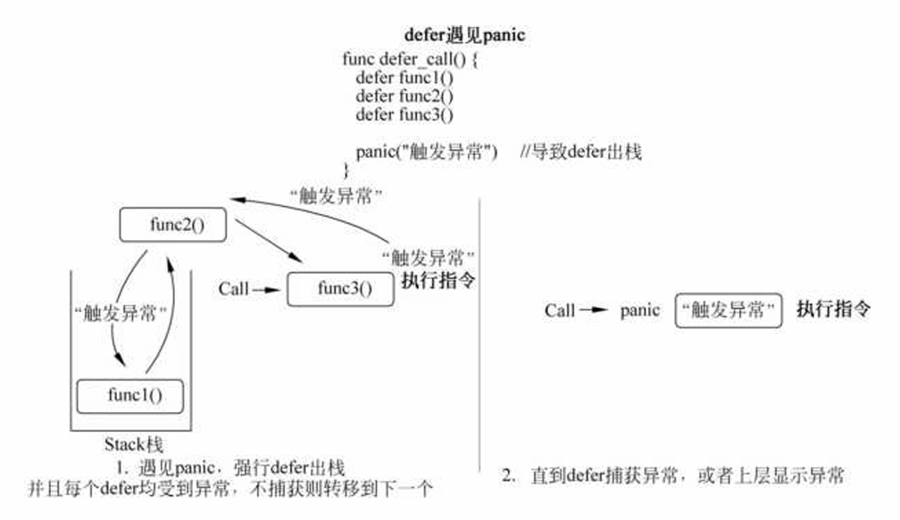

# 错误和异常

- Go语言基于错误值比较的错误处理方式，而不是基于异常捕获的方式
- 必须显示地进行错误检查

- error接口

  - ```go
    type error interface {
        Error() string
    }
    ```

- syscall.Errno
- err.Error()
- panic
- recover

  - ```go
        defer func() {
            if r := recover(); r != nil {
                switch x := r.(type) {
                case string:
                    err = errors.New(x)
                case error:
                    err = x
                default:
                    err = fmt.Errorf("Unknown panic: %v", r)
                }
            }
        }()

        panic("TODO")
    }

    ```

