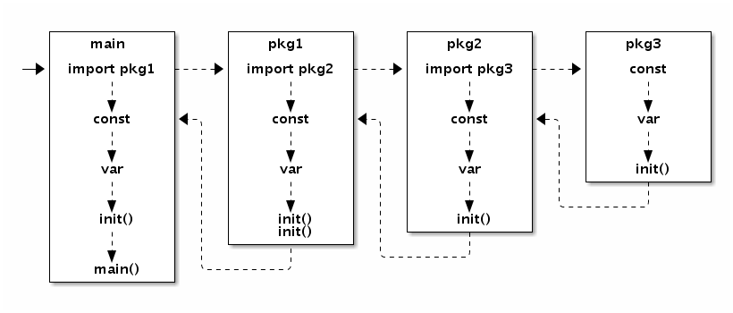

# 并发

- Goroutine和系统线程
- 原子操作
  
  - ```go
    import (
        "sync"
    )

    var total struct {
        sync.Mutex
        value int
    }

    func worker(wg *sync.WaitGroup) {
        defer wg.Done()

        for i := 0; i <= 100; i++ {
            total.Lock()
            total.value += i
            total.Unlock()
        }
    }

    func main() {
        var wg sync.WaitGroup
        wg.Add(2)
        go worker(&wg)
        go worker(&wg)
        wg.Wait()

        fmt.Println(total.value)
    }
    ```

  - sync.Mutex
  - sync.WaitGroup
  - sync/atomic
    - sync/atomic 包对基本的数值类型及复杂对象的读写都提供了原子操作的支持。atomic.Value 原子对象提供了 Load 和 Store 两个原子方法，分别用于加载和保存数据，返回值和参数都是 interface{} 类型，因此可以用于任意的自定义复杂类型。
    - atomic.Value
      - Store
      - Load

    - ```go
        import (
            "sync"
            "sync/atomic"
        )

        var total uint64

        func worker(wg *sync.WaitGroup) {
            defer wg.Done()

            var i uint64
            for i = 0; i <= 100; i++ {
                atomic.AddUint64(&total, i)
            }
        }

        func main() {
            var wg sync.WaitGroup
            wg.Add(2)

            go worker(&wg)
            go worker(&wg)
            wg.Wait()
        }
      ```

      - ```go
        // 原子操作配合互斥锁可以实现非常高效的单例模式。互斥锁的代价比普通整数的原子读写高很多，在性能敏感的地方可以增加一个数字型的标志位，通过原子检测标志位状态降低互斥锁的使用次数来提高性能。
        type singleton struct {}

        var (
            instance    *singleton
            initialized uint32
            mu          sync.Mutex
        )

        func Instance() *singleton {
            if atomic.LoadUint32(&initialized) == 1 {
                return instance
            }

            mu.Lock()
            defer mu.Unlock()

            if instance == nil {
                defer atomic.StoreUint32(&initialized, 1)
                instance = &singleton{}
            }
            return instance
        }
        ```

    - ```go
        var config atomic.Value // 保存当前配置信息

        // 初始化配置信息
        config.Store(loadConfig())

        // 启动一个后台线程, 加载更新后的配置信息
        go func() {
            for {
                time.Sleep(time.Second)
                config.Store(loadConfig())
            }
        }()

        // 用于处理请求的工作者线程始终采用最新的配置信息
        for i := 0; i < 10; i++ {
            go func() {
                for r := range requests() {
                    c := config.Load()
                    // ...
                }
            }()
        }

        ```

  - sync.Once

    - ```go
        var (
            instance *singleton
            once     sync.Once
        )

        func Instance() *singleton {
            once.Do(func() {
                instance = &singleton{}
            })
            return instance
        }
      ```

    - ```go
        type Once struct {
            m    Mutex
            done uint32
        }

        func (o *Once) Do(f func()) {
            if atomic.LoadUint32(&o.done) == 1 {
                return
            }

            o.m.Lock()
            defer o.m.Unlock()

            if o.done == 0 {
                defer atomic.StoreUint32(&o.done, 1)
                f()
            }
        }
      ```

- sync.Cond
  - sync.Cond 条件变量用来协调想要访问共享资源的那些 goroutine，当共享资源的状态发生变化的时候，它可以用来通知被互斥锁阻塞的 goroutine。
- 顺序一致性内存模型

- 
- go func()

## channel

```go
// 无缓存的 Channel 上的发送操作总在对应的接收操作完成前发生.
var done = make(chan bool)
var msg string

func aGoroutine() {
    msg = "你好, 世界"
    done <- true
}

func main() {
    go aGoroutine()
    <-done
    println(msg)
}

// 若在关闭 Channel 后继续从中接收数据，接收者就会收到该 Channel 返回的零值。
var done = make(chan bool)
var msg string

func aGoroutine() {
    msg = "你好, 世界"
    close(done)
}

func main() {
    go aGoroutine()
    <-done
    println(msg)
}

```

```go
// 根据控制 Channel 的缓存大小来控制并发执行的 Goroutine 的最大数目,
var limit = make(chan int, 3)
var work = []func(){
    func() { println("1"); time.Sleep(1 * time.Second) },
    func() { println("2"); time.Sleep(1 * time.Second) },
    func() { println("3"); time.Sleep(1 * time.Second) },
    func() { println("4"); time.Sleep(1 * time.Second) },
    func() { println("5"); time.Sleep(1 * time.Second) },
}

func main() {
    for _, w := range work {
        go func(w func()) {
            limit <- 1
            w()
            <-limit
        }(w)
    }
    select{}
}

```

### 三个协程按顺序打印

```go
package main

import (
    "sync"
)

var count = 5
func main(){

    wg:=sync.WaitGroup{}
    chanA :=make(chan struct{},1)
    chanB :=make(chan struct{},1)
    chanC :=make(chan struct{},1)


    chanA<- struct{}{}
    wg.Add(3)

    go printA(&wg,chanA,chanB)
    go printB(&wg,chanB,chanC)
    go printC(&wg,chanC,chanA)
    wg.Wait()
}

func printA(wg *sync.WaitGroup, chanA chan struct{}, chanB chan struct{}) {
    defer wg.Done()

    for i:=0;i<count;i++{
        <-chanA
        println("A")
        chanB<- struct{}{}
    }
}

func printB(wg *sync.WaitGroup, chanB chan struct{}, chanC chan struct{}) {
    defer wg.Done()

    for i:=0;i<count;i++{
        <-chanB
        println("B")
        chanC<- struct{}{}
    }
}

func printC(wg *sync.WaitGroup, chanC chan struct{}, chanA chan struct{}) {
    defer wg.Done()

    for i:=0;i<count;i++{
        <-chanC
        println("C")
        chanA<- struct{}{}
    }
}
```

## 常见的并发模式

- CSP（Communicating Sequential Process，通讯顺序进程）
- 不要通过共享内存来通信，而应通过通信来共享内存。

- ```go
    func main() {
        var mu sync.Mutex

        mu.Lock()
        go func(){
            fmt.Println("你好, 世界")
            mu.Unlock()
        }()

        mu.Lock()
    }
    ```

- ```go
    func main() {
        done := make(chan int, 1) // 带缓存的管道

        go func(){
            fmt.Println("你好, 世界")
            done <- 1
        }()

        <-done
    }
    ```

- ```go
    func main() {
        done := make(chan int, 10) // 带 10 个缓存

        // 开 N 个后台打印线程
        for i := 0; i < cap(done); i++ {
            go func(){
                fmt.Println("你好, 世界")
                done <- 1
            }()
        }

        // 等待 N 个后台线程完成
        for i := 0; i < cap(done); i++ {
            <-done
        }
    }
    ```

- ```go
    // sync.WaitGroup
    func main() {
        var wg sync.WaitGroup

        // 开 N 个后台打印线程
        for i := 0; i < 10; i++ {
            wg.Add(1)

            go func() {
                fmt.Println("你好, 世界")
                wg.Done()
            }()
        }

        // 等待 N 个后台线程完成
        wg.Wait()
    }
    ```

### 生产者消费者模型

- ```go
  // 生产者: 生成 factor 整数倍的序列
  func Producer(factor int, out chan<- int) {
      for i := 0; ; i++ {
          out <- i*factor
      }
  }

  // 消费者
  func Consumer(in <-chan int) {
      for v := range in {
          fmt.Println(v)
      }
  }
  func main() {
      ch := make(chan int, 64) // 成果队列

      go Producer(3, ch) // 生成 3 的倍数的序列
      go Producer(5, ch) // 生成 5 的倍数的序列
      go Consumer(ch)    // 消费 生成的队列

      // 运行一定时间后退出
      // time.Sleep(5 * time.Second)

      // Ctrl+C 退出
      sig := make(chan os.Signal, 1)
      signal.Notify(sig, syscall.SIGINT, syscall.SIGTERM)
      fmt.Printf("quit (%v)\n", <-sig)
  }
  ```

### 发布订阅模型

- ```go
  // Package pubsub implements a simple multi-topic pub-sub library.
  package pubsub

  import (
      "sync"
      "time"
  )

  type (
      subscriber chan interface{}         // 订阅者为一个管道
      topicFunc  func(v interface{}) bool // 主题为一个过滤器
  )

  // 发布者对象
  type Publisher struct {
      m           sync.RWMutex             // 读写锁
      buffer      int                      // 订阅队列的缓存大小
      timeout     time.Duration            // 发布超时时间
      subscribers map[subscriber]topicFunc // 订阅者信息
  }

  // 构建一个发布者对象, 可以设置发布超时时间和缓存队列的长度
  func NewPublisher(publishTimeout time.Duration, buffer int) *Publisher {
      return &Publisher{
          buffer:      buffer,
          timeout:     publishTimeout,
          subscribers: make(map[subscriber]topicFunc),
      }
  }

  // 添加一个新的订阅者，订阅全部主题
  func (p *Publisher) Subscribe() chan interface{} {
      return p.SubscribeTopic(nil)
  }

  // 添加一个新的订阅者，订阅过滤器筛选后的主题
  func (p *Publisher) SubscribeTopic(topic topicFunc) chan interface{} {
      ch := make(chan interface{}, p.buffer)
      p.m.Lock()
      p.subscribers[ch] = topic
      p.m.Unlock()
      return ch
  }

  // 退出订阅
  func (p *Publisher) Evict(sub chan interface{}) {
      p.m.Lock()
      defer p.m.Unlock()

      delete(p.subscribers, sub)
      close(sub)
  }

  // 发布一个主题
  func (p *Publisher) Publish(v interface{}) {
      p.m.RLock()
      defer p.m.RUnlock()

      var wg sync.WaitGroup
      for sub, topic := range p.subscribers {
          wg.Add(1)
          go p.sendTopic(sub, topic, v, &wg)
      }
      wg.Wait()
  }

  // 关闭发布者对象，同时关闭所有的订阅者管道。
  func (p *Publisher) Close() {
      p.m.Lock()
      defer p.m.Unlock()

      for sub := range p.subscribers {
          delete(p.subscribers, sub)
          close(sub)
      }
  }

  // 发送主题，可以容忍一定的超时
  func (p *Publisher) sendTopic(
      sub subscriber, topic topicFunc, v interface{}, wg *sync.WaitGroup,
  ) {
      defer wg.Done()
      if topic != nil && !topic(v) {
          return
      }

      select {
      case sub <- v:
      case <-time.After(p.timeout):
      }
  }
  ```

- ```go
    import "path/to/pubsub"

    func main() {
        p := pubsub.NewPublisher(100*time.Millisecond, 10)
        defer p.Close()

        all := p.Subscribe() //订阅了全部主题
        golang := p.SubscribeTopic(func(v interface{}) bool { // 订阅包含golang的主题
            if s, ok := v.(string); ok {
                return strings.Contains(s, "golang")
            }
            return false
        })

        p.Publish("hello,  world!")
        p.Publish("hello, golang!")

        go func() {
            for  msg := range all {
                fmt.Println("all:", msg)
            }
        } ()

        go func() {
            for  msg := range golang {
                fmt.Println("golang:", msg)
            }
        } ()

        // 运行一定时间后退出
        time.Sleep(3 * time.Second)
    }

    ```

## 并发的安全退出

- 基于 select 实现的管道的超时判断

  - ```go
    select {
    case v := <-in:
        fmt.Println(v)
    case <-time.After(time.Second):
        return // 超时
    }
    ```

- ```go
  func worker(wg *sync.WaitGroup, cannel chan bool) {
      defer wg.Done()

      for {
          select {
          default:
              fmt.Println("hello")
          case <-cannel:
              return
          }
      }
  }

  func main() {
      cancel := make(chan bool)

      var wg sync.WaitGroup
      for i := 0; i < 10; i++ {
          wg.Add(1)
          go worker(&wg, cancel)
      }

      time.Sleep(time.Second)
      close(cancel)
      wg.Wait()
  }

  ```

## context包

- ```go
   // 用 context 包来重新实现线程安全退出或超时的控制:
  func worker(ctx context.Context, wg *sync.WaitGroup) error {
      defer wg.Done()

      for {
          select {
          default:
              fmt.Println("hello")
          case <-ctx.Done():
              return ctx.Err()
          }
      }
  }

  func main() {
      ctx, cancel := context.WithTimeout(context.Background(), 10*time.Second)

      var wg sync.WaitGroup
      for i := 0; i < 10; i++ {
          wg.Add(1)
          go worker(ctx, &wg)
      }

      time.Sleep(time.Second)
      cancel()

      wg.Wait()
  }
  ```

- ```go
    package main

    import (
        "context"
        "fmt"
        "sync"
    )

    // 返回生成自然数序列的管道: 2, 3, 4, ...
    func GenerateNatural(ctx context.Context, wg *sync.WaitGroup) chan int {
        ch := make(chan int)
        go func() {
            defer wg.Done()
            defer close(ch)
            for i := 2; ; i++ {
                select {
                case <-ctx.Done():
                    return
                case ch <- i:
                }
            }
        }()
        return ch
    }

    // 管道过滤器: 删除能被素数整除的数
    func PrimeFilter(ctx context.Context, in <-chan int, prime int, wg *sync.WaitGroup) chan int {
        out := make(chan int)
        go func() {
            defer wg.Done()
            defer close(out)
            for i := range in {
                if i%prime != 0 {
                    select {
                    case <-ctx.Done():
                        return
                    case out <- i:
                    }
                }
            }
        }()
        return out
    }

    func main() {
        wg := sync.WaitGroup{}
        // 通过 Context 控制后台 Goroutine 状态
        ctx, cancel := context.WithCancel(context.Background())
        wg.Add(1)
        ch := GenerateNatural(ctx, &wg) // 自然数序列: 2, 3, 4, ...
        for i := 0; i < 100; i++ {
            prime := <-ch // 新出现的素数
            fmt.Printf("%v: %v\n", i+1, prime)
            wg.Add(1)
            ch = PrimeFilter(ctx, ch, prime, &wg) // 基于新素数构造的过滤器
        }

        cancel()
        wg.Wait()
    }
        
    ```

