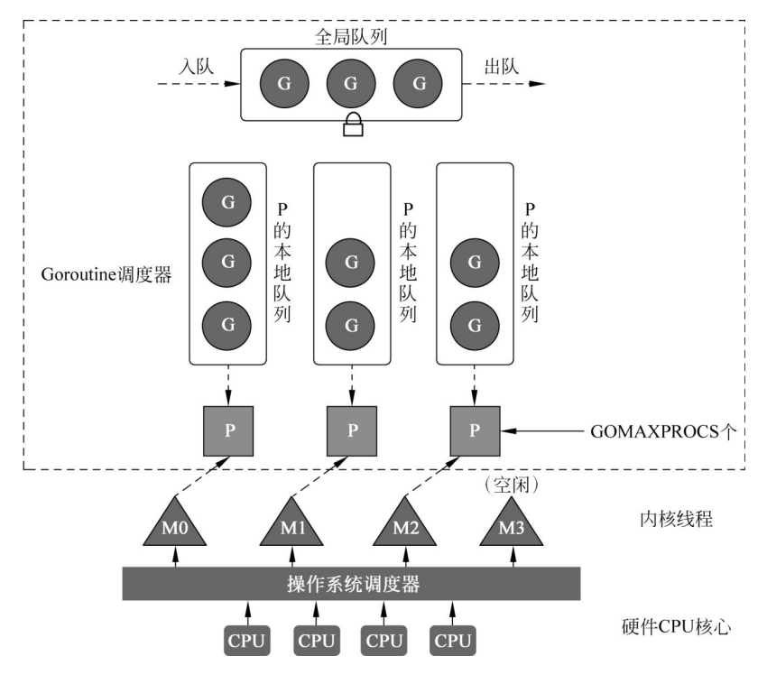
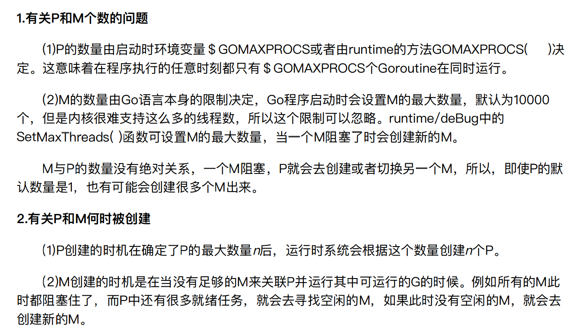

# Golang协程调度器原理 GMP模型

- g 是指 go 协程，m 指 操作系统的工作线程，p 代表协程的调度器。
- GMP 的调度思想主要是指 p 怎么高效的让 m 执行 g。

- 全局队列(Global Queue)：存放等待运⾏的G。全局队列可能被任意的P去获取⾥⾯的G，
所以全局队列相当于整个模型中的全局资源，那么⾃然对于队列的读写操作是要加⼊互斥动作
的。
- P的本地队列：同全局队列类似，存放的也是等待运⾏的G，但存放的数ᰁ有限，不超过256个。新建G′时，G′优先加⼊P的本地队列，如果队列满了，则会把本地队列中⼀半的G移动到全局队列。
- P列表：所有的P都在程序启动时创建，并保存在数组中，最多有GOMAXPROCS（可配置）个。
- M：线程想运⾏任务就得获取P，从P的本地队列获取G，当P队列为空时，M也会尝试从全局队列获得⼀批G放到P的本地队列，或从其他P的本地队列“偷”⼀半放到⾃⼰P的本地队列。M运⾏G，G执⾏之后，M会从P获取下⼀个G，不断᯿复下去。
- Goroutine调度器和OS调度器是通过M结合起来的，每个M都代表了1个内核线程，OS调度器负责把内核线程分配到CPU的核上执⾏。

- 调度器的设计策略
  - 复用线程：避免频繁的创建、销毁线程
  - 工作窃取（work stealing 机制）：当本线程无可运行的G时，尝试从其他线程绑定的P偷取G，而不是销毁线程
  - 系统调用 hand off 机制：G进行系统调用阻塞时，线程释放绑定的 P，把 P 转移给其他空闲的线程执行
  - 设置P的数量，提高并行能力
  - 抢占式调度
  
- 1.14 前有局限性，在函数调用中时检查的是否需要抢占 （一个goroutine最多占用 CPU 10 ms）
- 调度器每调度 61 次的时候，都会尝试从全局队列里取出待运行的 goroutine 来运行
