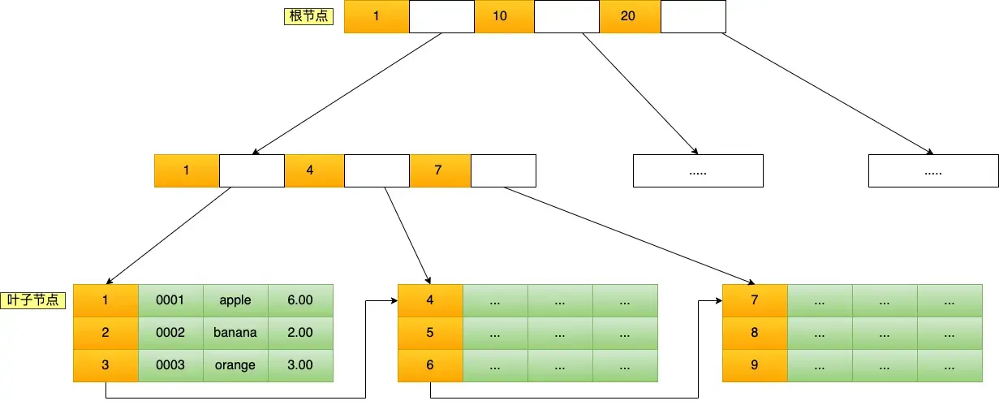
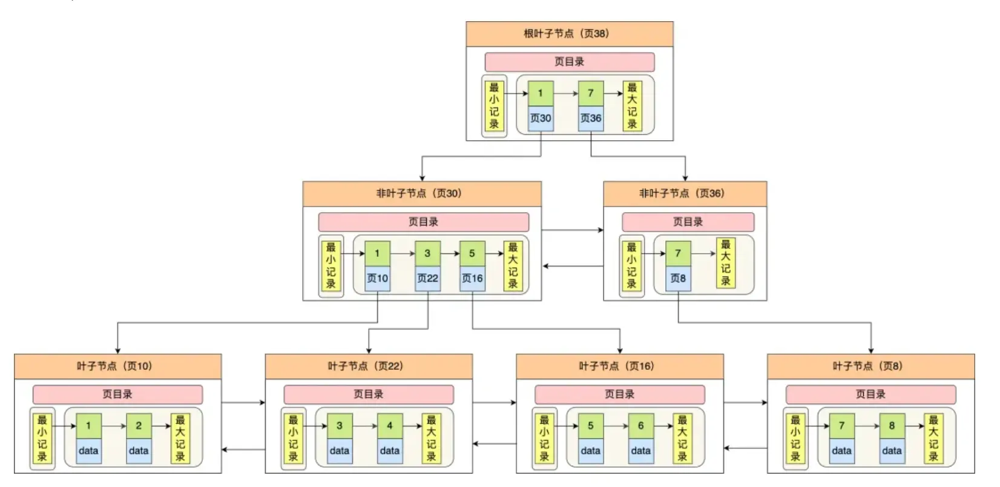

# mysql

1. 数据库三大范式
   1. 第一范式：列不可再分
   2. 第二范式：非主属性完全依赖于主键
   3. 第三范式：非主属性不依赖于其他非主属性
2. 事务的原理、特性，事务并发控制
   1. 事务时数据库并发控制的基本单位
   2. 事务可以看作是一系列SQL语句的集合
   3. 事务要么全部执行成功，要么全部执行失败（回滚）
   4. ACID特性:
      1. 原子性：一个事务中所有操作全部完成或失败
      2. 一致性：事务开始和结束之后数据完整性没有被破坏
      3. 隔离性：允许多个事务同时对数据库读取和修改
      4. 持久性：事务结束之后，修改是永久的不会丢失
   5. 事务隔离级别
      1. 读未提交
      2. 读已提交
      3. 可重复读
      4. 串行化
   6. 如何解决高并发场景下的插入重复
      1. 使用数据库唯一索引
      2. 使用队列异步写入
      3. 使用redis等实现分布式锁
   7. 乐观锁
      1. 先修改,更新时发现数据已经变了就回滚check and set
      2. 通过版本号或者时间戳
   8. 悲观锁
      1. 先获取锁再执行操作。一锁二查三更新select for update
3. 常用的字段、含义和区别
   1. CHAR[Length]
   2. VARCHAR[Length]
   3. TINYTEXT
      1. 最大255字节
   4. TEXT
      1. 最大64kb
   5. MEDIUMTEXT
      1. 最大16mb
   6. LONGTEXT
      1. 最大4gb
   7. TINYINT
   8. INT
   9.  BIGINT
   10. FLOAT
   11. DOUBLE
   12. DATE
   13. DATETIME
   14. TIMESTAMP
4. InnoDB vs MyISAM
   1. InnoDB支持事务、外键、行锁和表锁
   2. MyISAM只支持表锁，不支持事务、外键、行锁
   3. MyISAM支持全文索引，InnoDB不支持全文索引
5. 索引
   1. 索引时数据表中一个或者多个列进行排序的数据结构
   2. 索引能够大幅度提升检索速度
   3. 创建、更新索引本身也会耗费空间和时间
6. 查找结构进化史
   1. 线性查找：一个一个找，实现简单，慢
   2. 二分查找：有序；简单；要求是有序的，插入特别慢
   3. HASH: 查询快；占用空间；不太适合存储大规模数据
   4. 二分查找树： 插入和查询很快（log(n));无法存大规模数据，复杂度退化
   5. 平衡树：解决bst退化的问题，树是平衡的；节点非常多的时候，依然树高很高
   6. 多路查找树：一个父亲多个孩子节点（度）；节点过多树高不会特别深
   7. 多路平衡查找树：B-Tree
      1. 每个节点最多M(m>=2)个孩子，称为m阶或者度
      2. 叶节点具有相同的深度
      3. 节点中的数据key从左到右是递增的
   8. B+Tree
      1. B+树是B-Tree的变形
      2. mysql实际使用B+Tree作为索引的数据结构
      3. 只有叶子节点带指向记录的指针（为什么？可以增加数的度）
      4. 叶子节点通过指针相连(为什么？实现范围查询)
      5. 
      6. 
7. 避免插入重复数据
   1. 使用数据库唯一索引unique
   2. `insert ... on duplicate key update` 插入重复数据时，更新指定字段
   3. `insert ignore` 插入重复数据时，忽略错误继续插入
8. Mysql索引的类型
   1. 普通索引CREATE INDEX
   2. 唯一索引，索引列的值必须唯一 CREATE UNIQUE INDEX
   3. 多列索引
   4. 主键索引PRIMARY KEY,一个表只能有一个
   5. 全文索引FULLTEXT INDEX，InnoDB不支持
9.  什么时候创建索引
   1. 建表的时候根据查询的需求来创建索引
      1. 经常用作查询条件的字段（WHERE条件）
      2. 经常用作表连接的字段
      3. 经常出现在order by, group by之后的字段
10. 创建索引时有哪些需要注意的
   1. 非空字段 NOT NULL， Mysql很难对空值作查询优化
   2. 区分度高，离散度大，作为索引的字段值尽量不要有大量相同值
   3. 索引的长度不要太长（比较耗费时间）
11. 索引什么时候会失效？
   1. 模糊匹配 已%开头的LIKE语句，模糊搜索
   2. 出现了 类型隐转
   3. 没有满足最左前缀原则
   4. 当mysql B+Tree的key没有办法直接比较的时候
12. 什么是聚集索引？什么是非聚集索引
    1. 聚集还是非聚集指的是B+Tree叶节点存的是指针还是数据记录
    2. MyISAM索引和数据分离->非聚集索引
    3. InnoDB数据文件就是索引文件->主键索引就是聚集索引
13. 如何排查慢查询
    1. 慢查询通常是缺少索引，索引不合理或者业务代码实现导致
    2. slow_query_log_file开启并且查询慢查询日志
    3. 通过explain排查索引问题
    4. 调整数据修改索引;业务代码层限制不合理访问
14. 连表查询
    1. 内连接（INNER JOIN）：两个表都匹配时，才会返回匹配行
       1. 将左表和右表能够关联起来的数据连接后返回
       2. 类似求两个表的“交集”
       3. `select * from A inner join B on a.id=b.id;`
    2. 外连接（LEFT/RIGHT JOIN）：返回一个表的行，即使另一个没有匹配
       1. `select * from A left join B on a.id=b.id;`
       2. `select * from A right join B on a.id=b.id;`
    3. 全连接（FULL JOIN）：只要一个表存在匹配就返回
15. ip地址如何存储
    1.  可以使用无符号的32位整数存储IP地址
    2.  也可以使用字符串存储IP地址，例如CHAR(15)或VARCHAR(15)
16. IN与EXISTS的区别
    1. IN适用于小数据量的查询，EXISTS适用于大数据量的查询
    2. IN会将子查询结果集加载到内存中进行比较，EXISTS会逐行检查子查询结果集是否存在匹配
    3. IN在子查询结果集中查找匹配项，EXISTS在外部查询中查找匹配项
17. mysql常用函数
    1.  字符串函数
        1.  CONCAT(str1, str2, ...): 将多个字符串连接成一个字符串
        2.  SUBSTRING(str, pos, len): 从字符串str的第pos
        3.  UPPER(str): 将字符串str转换为大写
        4.  LOWER(str): 将字符串str转换为小写
        5.  LENGTH(str): 返回字符串str的长度
        6.  REPLACE(str, from_str, to_str): 将字符串str中的from_str替换为to_str
    2.  数值函数
        1.  ABS(x): 返回数值x的绝对值
        2.  POWER(x, y): 返回x的y次幂
    3.  日期函数
        1.  NOW(): 返回当前的日期和时间
        2.  CURDATE(): 返回当前的日期
        3.  CURTIME(): 返回当前的时间
    4.  聚合函数
        1.  COUNT(expr): 返回expr的行数
        2.  SUM(expr): 返回expr的总和
        3.  AVG(expr): 返回expr的平均值
        4.  MAX(expr): 返回expr的最大值
        5.  MIN(expr): 返回expr的最小值
18. MYSQL实现一个可重入锁
    1. 可重入锁：同一个线程可以多次获取同一个锁，而不会死锁
    2. 实现思路：使用一个表来存储锁的状态，包括锁的名称、持有锁的线程ID和锁的重入次数
    3. 获取锁时，首先检查锁的状态，如果锁未被持有，或者锁被当前线程持有，则可以获取锁并更新锁的状态；否则，需要等待锁被释放
    4. 释放锁时，检查锁的状态，如果锁的重入次数为0，则释放锁；否则，减少锁的重入次数
19. 执行一条SQL请求的过程
    1.  客户端发送SQL请求到MySQL服务器
    2.  建立连接、管理连接、校验用户身份
    3.  解析SQL，词法分析、语法分析、构建语法树
    4.  执行SQL
        1.  预处理
        2.  优化
        3.  执行
20. 什么事覆盖索引
    1.  一个索引包含了查询所需要的所有列（包括查询条件和返回的列），就称为覆盖索引
21. 同时处理多个事务的问题
    1.  脏读：一个事务读取了另一个事务未提交的数据
    2.  不可重复读：在一个事务中，多次读取同一数据，结果不同，因为另一个事务修改了数据并提交了
    3.  幻读：一个事务内多次查询符合查询条件的记录数量不同，因为另一个事务插入了符合查询条件的新记录并提交了
    4.  解决方法：使用适当的事务隔离级别，